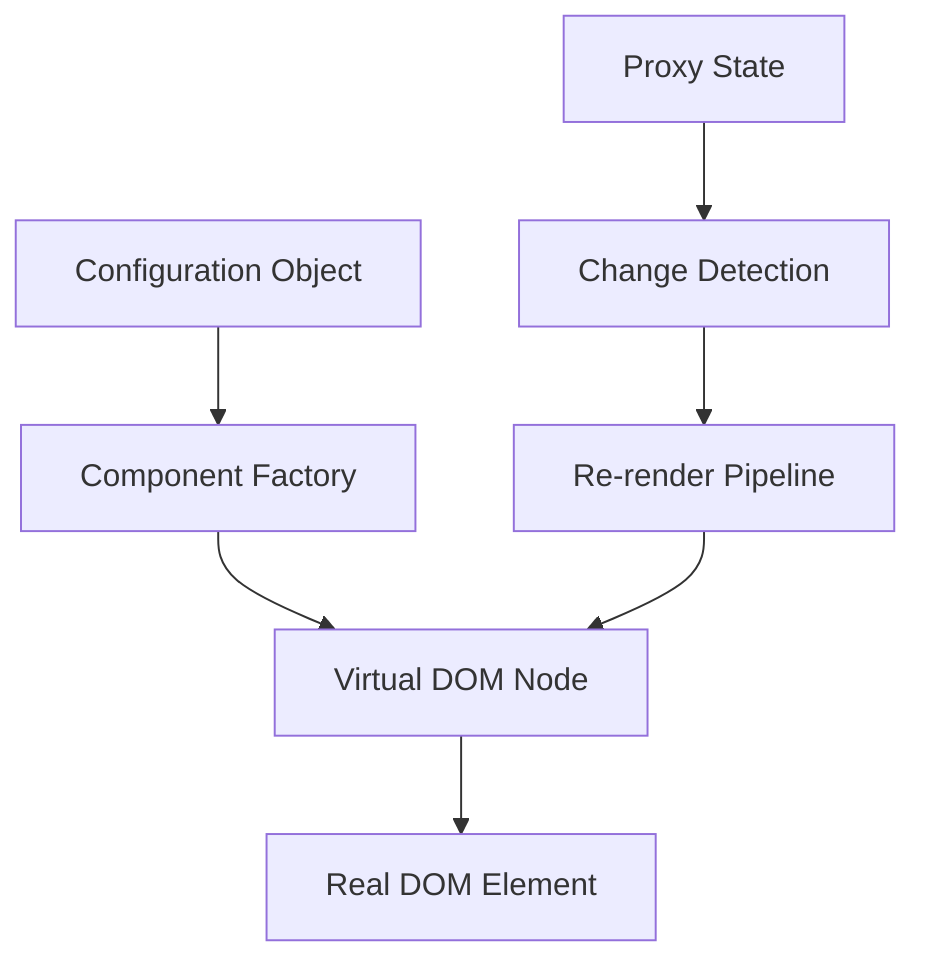
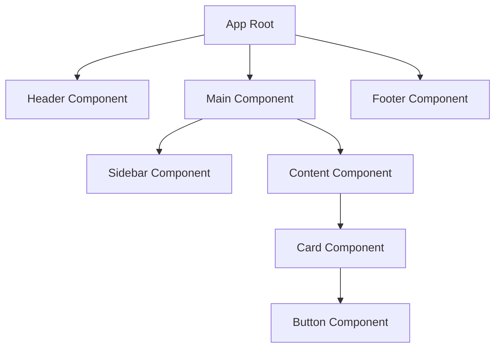
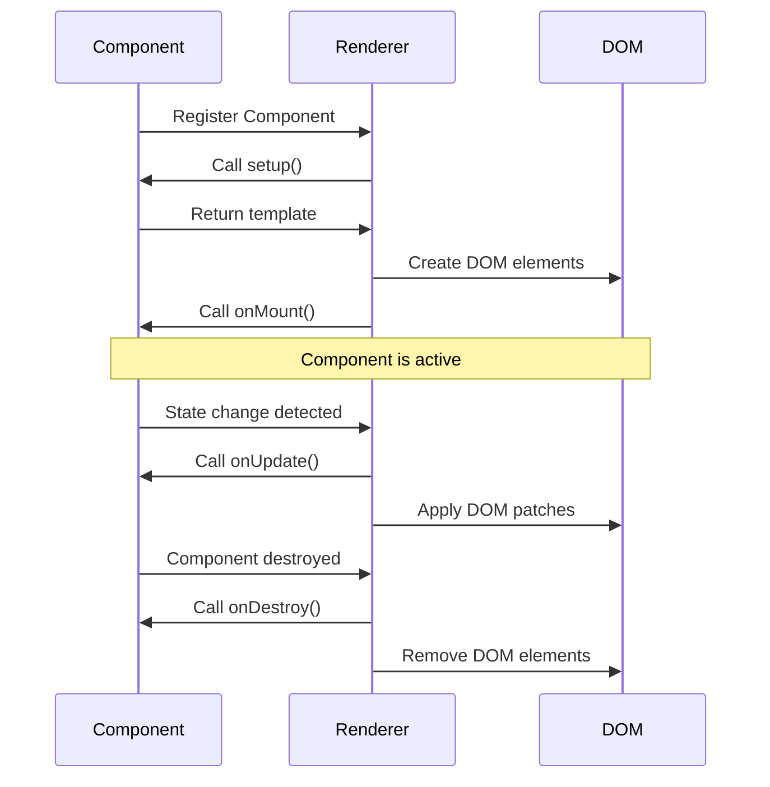

# Custom JavaScript Framework - Extended Specification

## Overview

A lightweight, TypeScript-based JavaScript framework for declarative HTML rendering with reactive updates. The framework uses configuration objects to define component structure and leverages Proxy-based reactivity for dynamic DOM updates.

## Technology Stack & Dependencies

- **Language**: TypeScript
- **Build Tool**: Vite
- **Reactivity**: ES6 Proxy
- **Target**: Modern browsers with ES6+ support
- **Output**: Single bundled file for web integration

## Core Architecture

### Component System



### Configuration Schema

```typescript
interface ComponentConfig {
  tag: string;
  props?: {
    class?: string;
    id?: string;
    style?: Record<string, string>;
    [key: string]: any;
  };
  children?: (ComponentConfig | string)[];
  events?: Record<string, Function>;
  state?: Record<string, any>;
}
```

### Framework Core Components

#### 1. Renderer Engine
- **Virtual DOM Implementation**: Lightweight virtual DOM for efficient updates
- **Diff Algorithm**: Compare previous and current component trees
- **Patch System**: Apply minimal changes to real DOM

#### 2. Reactivity System
- **Proxy-based State Management**: Track property access and mutations
- **Dependency Collection**: Automatic dependency tracking during render
- **Change Propagation**: Efficient update scheduling and batching

#### 3. Component Factory
- **Component Registration**: Register reusable components
- **Props Validation**: Type checking and validation
- **Lifecycle Hooks**: onCreate, onMount, onUpdate, onDestroy

#### 4. Build System Integration
- **Vite Plugin**: Custom Vite plugin for component file processing
- **TypeScript Compilation**: Type-safe component development
- **Bundle Optimization**: Tree-shaking and code splitting

## Component Architecture

### Component Definition Structure

```typescript
// Component file structure
export interface Component {
  name: string;
  config: ComponentConfig;
  setup?: (props: any) => any;
  template: ComponentConfig;
}
```

### Component Hierarchy



### State Management

#### Local State
- Component-scoped reactive state
- Automatic re-rendering on state changes
- Nested object reactivity support

#### Global State
- Application-wide state management
- Event-driven state updates
- State persistence options

### Lifecycle Management



## API Reference

### Core Framework API

#### Framework.render()
```typescript
Framework.render(config: ComponentConfig, container: HTMLElement): void
```

#### Framework.component()
```typescript
Framework.component(name: string, definition: Component): void
```

#### Framework.createState()
```typescript
Framework.createState<T>(initialState: T): ReactiveState<T>
```

### Reactive State API

#### State Creation
```typescript
const state = Framework.createState({
  count: 0,
  items: []
});
```

#### State Access and Mutation
```typescript
// Reactive read
const count = state.count;

// Reactive write (triggers re-render)
state.count = 10;
```

### Event Handling

```typescript
const buttonConfig: ComponentConfig = {
  tag: "button",
  props: {
    class: "btn-primary"
  },
  children: ["Click me"],
  events: {
    click: (event: MouseEvent) => {
      state.count++;
    }
  }
};
```

## Configuration Capabilities

### Theme Configuration

```typescript
interface FrameworkConfig {
  theme: {
    cssVariables: Record<string, string>;
    globalStyles: string;
  };
  runtime: {
    devMode: boolean;
    strictMode: boolean;
    performanceMonitoring: boolean;
  };
  plugins: PluginDefinition[];
}
```

### Plugin System

```typescript
interface PluginDefinition {
  name: string;
  install: (framework: Framework) => void;
  dependencies?: string[];
}
```

### Build Configuration

```typescript
// vite.config.ts
export default defineConfig({
  plugins: [
    customFramework({
      componentDir: './src/components',
      outputFormat: 'iife',
      minify: true,
      sourcemap: false
    })
  ]
});
```

## Advanced Features

### Component Composition

```typescript
// Higher-order components
const withLoading = (component: Component) => {
  return {
    ...component,
    template: {
      tag: "div",
      children: [
        {
          tag: "div",
          props: { class: "loading" },
          children: ["Loading..."]
        },
        component.template
      ]
    }
  };
};
```

### Conditional Rendering

```typescript
const conditionalConfig: ComponentConfig = {
  tag: "div",
  children: [
    state.showHeader && {
      tag: "header",
      children: ["Header Content"]
    },
    {
      tag: "main",
      children: ["Main Content"]
    }
  ].filter(Boolean)
};
```

### Dynamic Lists

```typescript
const listConfig: ComponentConfig = {
  tag: "ul",
  children: state.items.map((item, index) => ({
    tag: "li",
    props: { key: index },
    children: [item.name]
  }))
};
```

## Performance Considerations

### Optimization Strategies
- **Lazy Loading**: Dynamic component imports
- **Memoization**: Cache expensive computations
- **Bundle Splitting**: Separate vendor and application code
- **Tree Shaking**: Remove unused code

### Memory Management
- **Automatic Cleanup**: Remove event listeners on component destruction
- **Weak References**: Prevent memory leaks in large applications
- **Garbage Collection**: Efficient disposal of unused components

## Testing Strategy

### Unit Testing
- Component rendering tests
- State management tests
- Event handling tests
- Lifecycle method tests

### Integration Testing
- Component interaction tests
- State synchronization tests
- Build process validation

### End-to-End Testing
- Complete application workflows
- Cross-browser compatibility
- Performance benchmarks

## Error Handling

### Development Mode
- Detailed error messages
- Component tree inspection
- State debugging tools
- Performance warnings

### Production Mode
- Graceful error recovery
- Minimal error reporting
- Fallback component rendering
- User-friendly error messages

## Framework Extensibility

### Custom Directives
```typescript
Framework.directive('show', (element: HTMLElement, value: boolean) => {
  element.style.display = value ? 'block' : 'none';
});
```

### Custom Components
```typescript
Framework.component('my-button', {
  name: 'my-button',
  template: {
    tag: 'button',
    props: { class: 'custom-btn' },
    children: ['{{slot}}']
  }
});
```

### Middleware System
```typescript
Framework.use((context, next) => {
  // Pre-render logic
  console.log('Before render');
  next();
  // Post-render logic
  console.log('After render');
});
```