# Проектный документ: Реализация Спринта 3 - Продвинутые возможности JS фреймворка

## Обзор

Данный документ описывает архитектуру и план реализации продвинутых возможностей для JavaScript фреймворка в рамках Спринта 3. Основная цель - расширить функциональность фреймворка для создания многокомпонентных приложений с однофайловыми компонентами, добавить систему плагинов, двустороннюю привязку данных и подготовить стабильный релиз версии 1.0.

## Технологический стек

### Основные технологии
- **Язык**: TypeScript 5.3.0+
- **Сборка**: Vite 5.0.0 + TypeScript Compiler
- **Тестирование**: Jest 29.7.0 с jsdom окружением
- **Линтинг**: ESLint 8.55.0 + TypeScript ESLint
- **Форматирование**: Prettier 3.1.0

### Архитектурные решения
- **Модульная архитектура**: Разделение на core, директивы, утилиты
- **Реактивность**: Proxy-based система с эффектами и планировщиком
- **Компонентная система**: Single File Components с жизненным циклом
- **Система плагинов**: Расширяемая архитектура для добавления функциональности

## Архитектура системы

### Диаграмма компонентов

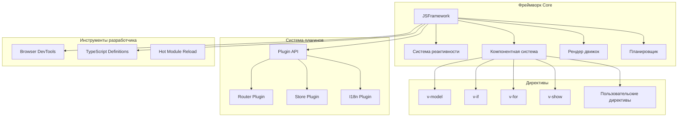

### Структура Single File Components

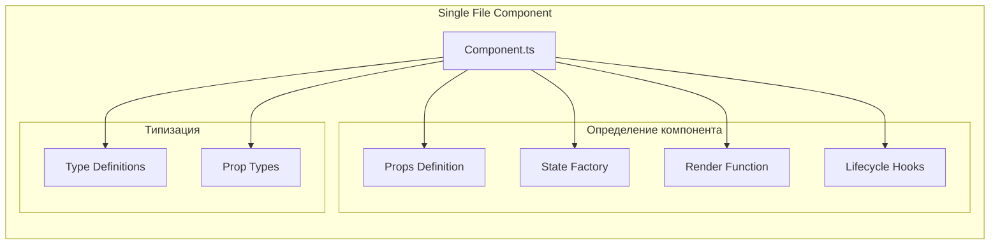

## Ключевые функциональности

### 1. Директива v-model (Двусторонняя привязка данных)

**Архитектура v-model:**

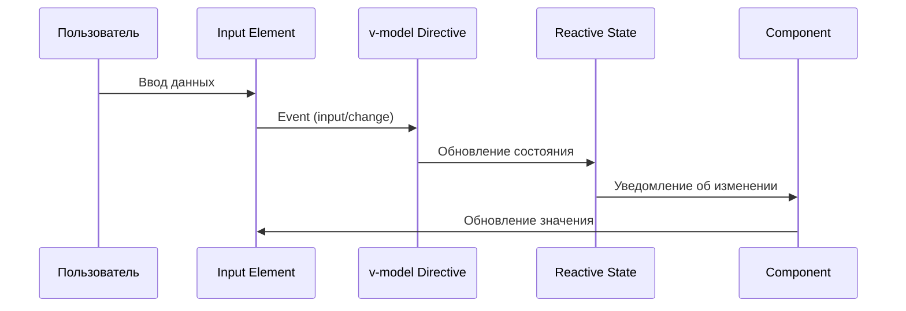

**Поддерживаемые элементы:**
- `<input type="text">` - текстовые поля
- `<input type="checkbox">` - чекбоксы
- `<input type="radio">` - радиокнопки
- `<select>` - выпадающие списки
- `<textarea>` - многострочные текстовые поля

### 2. Computed свойства

**Архитектура вычисляемых свойств:**

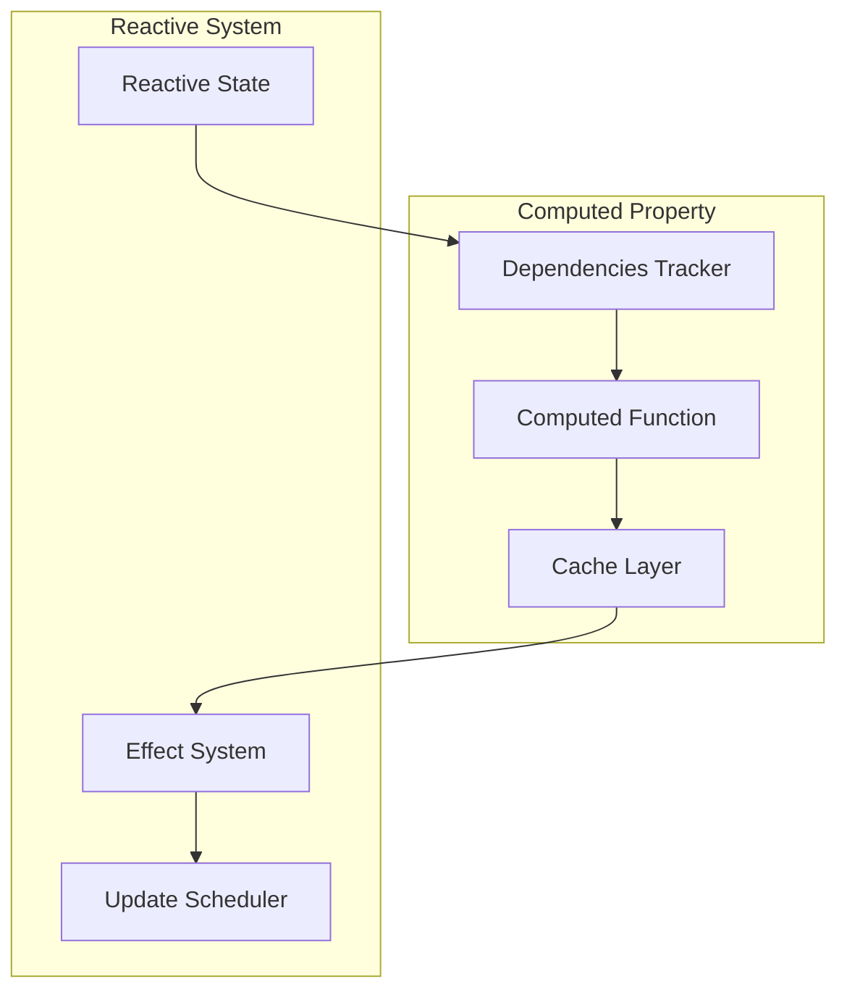

### 3. Система плагинов

**API плагинов:**

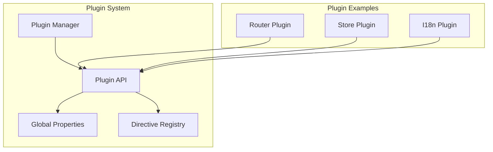

### 4. Пользовательские директивы

**Жизненный цикл директив:**

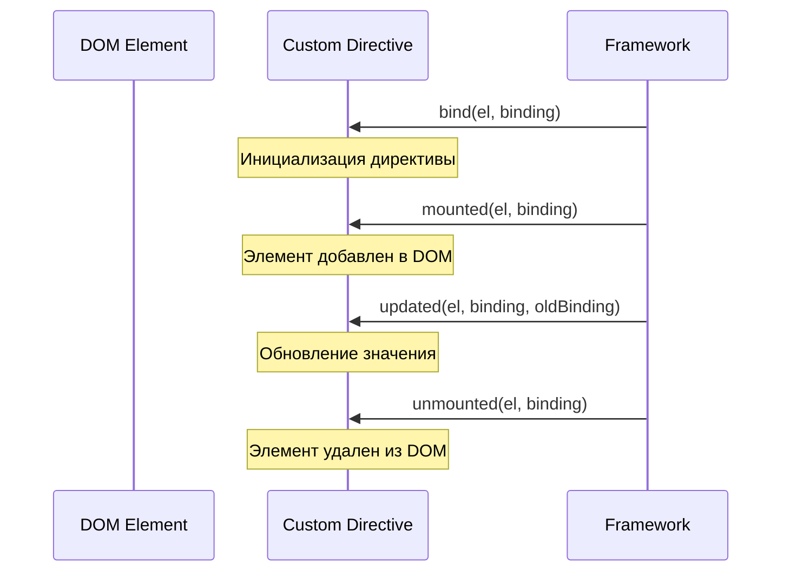

## Многокомпонентное приложение

### Пример архитектуры приложения

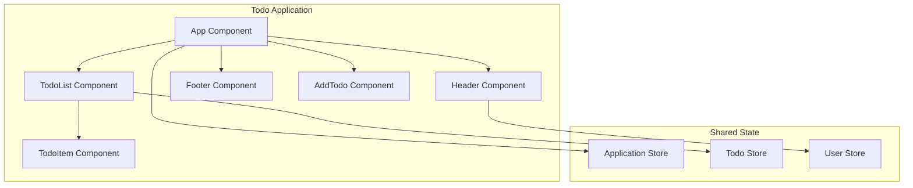

### Структура однофайлового компонента

**TodoItem.component.ts:**
```typescript
import { Component } from '../framework';

export const TodoItemComponent: Component = {
  name: 'TodoItem',
  
  props: {
    todo: { type: 'object', required: true },
    onToggle: { type: 'function', required: true },
    onDelete: { type: 'function', required: true }
  },
  
  state: () => ({
    isEditing: false,
    editText: ''
  }),
  
  render(props, state) {
    return {
      tag: 'li',
      props: {
        class: `todo-item ${props.todo.completed ? 'completed' : ''}`
      },
      children: [
        // Checkbox
        {
          tag: 'input',
          props: {
            type: 'checkbox',
            checked: props.todo.completed
          },
          events: {
            change: () => props.onToggle(props.todo.id)
          }
        },
        // Текст или поле редактирования
        state.isEditing ? {
          tag: 'input',
          model: 'editText',
          props: {
            value: state.editText,
            class: 'edit-input'
          },
          events: {
            blur: () => this.saveEdit(props, state),
            keydown: (e) => {
              if (e.key === 'Enter') this.saveEdit(props, state);
              if (e.key === 'Escape') this.cancelEdit(state);
            }
          }
        } : {
          tag: 'span',
          props: { class: 'todo-text' },
          children: [props.todo.text],
          events: {
            dblclick: () => this.startEdit(props, state)
          }
        },
        // Кнопка удаления
        {
          component: 'Button',
          props: {
            text: '×',
            variant: 'danger',
            size: 'small',
            onClick: () => props.onDelete(props.todo.id)
          }
        }
      ]
    };
  },
  
  methods: {
    startEdit(props, state) {
      state.isEditing = true;
      state.editText = props.todo.text;
    },
    
    saveEdit(props, state) {
      if (state.editText.trim()) {
        props.onUpdate(props.todo.id, state.editText.trim());
      }
      state.isEditing = false;
    },
    
    cancelEdit(state) {
      state.isEditing = false;
      state.editText = '';
    }
  }
};
```

## Система тестирования

### Компонентное тестирование

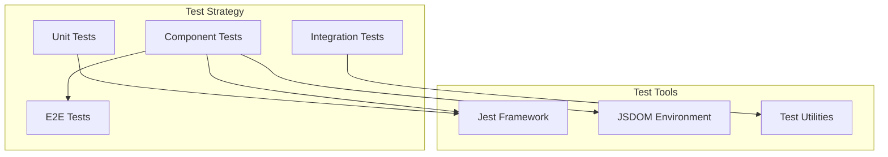

### Пример теста компонента

**TodoItem.test.ts:**
```typescript
import { Framework } from '../src';
import { TodoItemComponent } from './TodoItem.component';

describe('TodoItem Component', () => {
  beforeEach(() => {
    Framework.registerComponent(TodoItemComponent);
  });

  test('рендерит todo элемент', () => {
    const container = document.createElement('div');
    const todo = { id: 1, text: 'Тестовая задача', completed: false };
    
    const config = {
      component: 'TodoItem',
      props: {
        todo,
        onToggle: jest.fn(),
        onDelete: jest.fn()
      }
    };
    
    Framework.render(config, container);
    
    expect(container.querySelector('.todo-text')).toHaveTextContent('Тестовая задача');
    expect(container.querySelector('input[type="checkbox"]')).not.toBeChecked();
  });

  test('обрабатывает переключение состояния', () => {
    const onToggle = jest.fn();
    const container = document.createElement('div');
    
    const config = {
      component: 'TodoItem',
      props: {
        todo: { id: 1, text: 'Задача', completed: false },
        onToggle,
        onDelete: jest.fn()
      }
    };
    
    Framework.render(config, container);
    
    const checkbox = container.querySelector('input[type="checkbox"]');
    checkbox.click();
    
    expect(onToggle).toHaveBeenCalledWith(1);
  });
});
```

## План оптимизации производительности

### Стратегии оптимизации

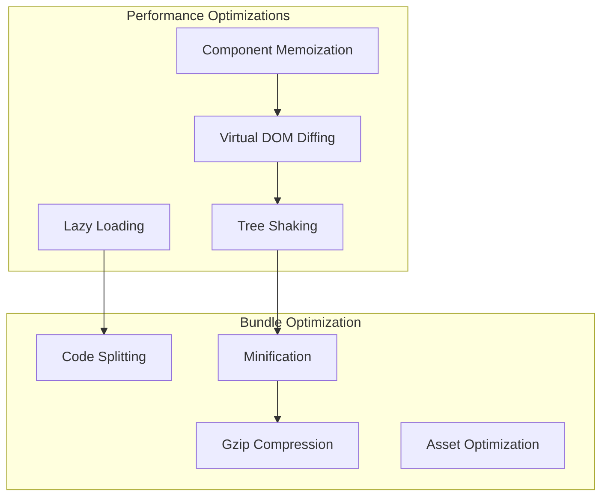

### Метрики производительности

| Метрика | Целевое значение | Текущее значение |
|---------|------------------|------------------|
| Bundle Size (gzipped) | < 30KB | TBD |
| Initial Render | < 16ms | TBD |
| Update Performance | < 8ms | TBD |
| Memory Usage | < 10MB для 1000 компонентов | TBD |
| Tree Shaking | 90%+ неиспользуемого кода | TBD |

## TypeScript интеграция

### Система типов

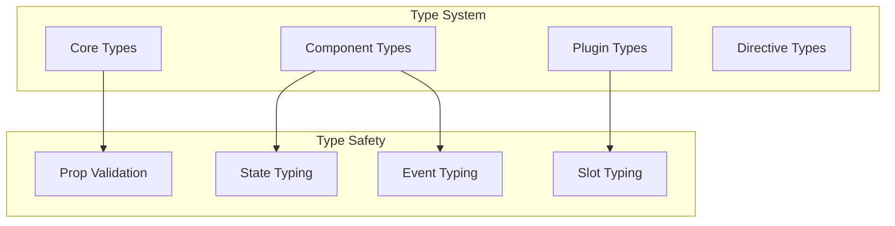

### Генерация типов

**Автоматическая генерация .d.ts файлов:**
- Экспорт всех публичных API
- Type guards для runtime проверок
- JSDoc документация с примерами
- Совместимость с IDE автодополнением

## Инструменты разработчика

### Browser DevTools Extension

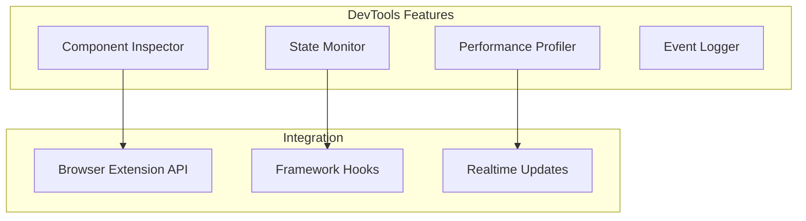

### Возможности DevTools

1. **Инспектор компонентов**: Просмотр иерархии компонентов в реальном времени
2. **Монитор состояния**: Отслеживание изменений state и props
3. **Профилировщик**: Анализ производительности рендеринга
4. **Логгер событий**: Отслеживание жизненного цикла и событий
5. **Time Travel Debugging**: Возможность "отмотать" состояние назад

## Документация и примеры

### Структура документации

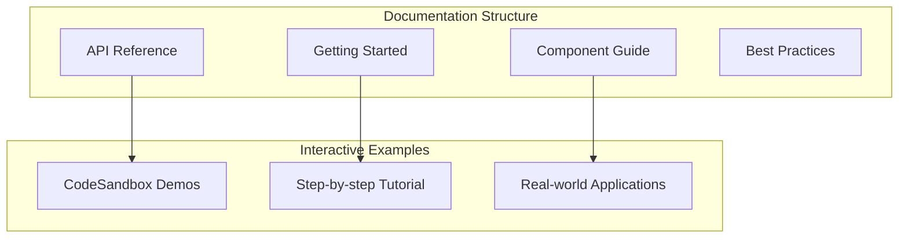

### Демо приложения

1. **Todo Application**: Классическое приложение для демонстрации CRUD операций
2. **Blog Platform**: Многостраничное приложение с роутингом
3. **Dashboard**: Интерактивные графики и виджеты
4. **E-commerce**: Каталог товаров с корзиной и фильтрацией

## Этапы реализации

### Неделя 1: Продвинутые возможности

#### День 1-2: v-model и computed свойства
- Реализация директивы v-model для всех типов input
- Система computed свойств с кэшированием
- Автоматическое отслеживание зависимостей

#### День 3-4: Система плагинов и хуки
- API для создания плагинов
- Хуки жизненного цикла приложения
- Примеры плагинов (router, store, i18n)

#### День 5-7: Пользовательские директивы и слоты
- API для создания собственных директив
- Система слотов для композиции компонентов
- Scoped слоты с передачей данных

### Неделя 2: Оптимизация и финализация

#### День 8-9: Оптимизация производительности
- Advanced мемоизация компонентов
- Bundle size оптимизация
- Tree-shaking и code splitting

#### День 10-11: Developer Experience
- Browser DevTools extension
- Полная TypeScript интеграция
- Генерация .d.ts файлов

#### День 12-14: Документация и релиз
- Создание полной документации
- Демо приложения и примеры
- Подготовка к релизу v1.0