# Техническая документация: Реализация Спринта 3 - Продвинутые возможности JS Framework

## Обзор

Данный документ описывает техническую реализацию продвинутых возможностей JavaScript фреймворка в рамках Спринта 3. Цель спринта - создание полнофункционального framework'а готового к production с поддержкой двусторонней привязки данных, системы плагинов, оптимизации производительности и полной документации.

## Архитектура системы

### Диаграмма архитектуры

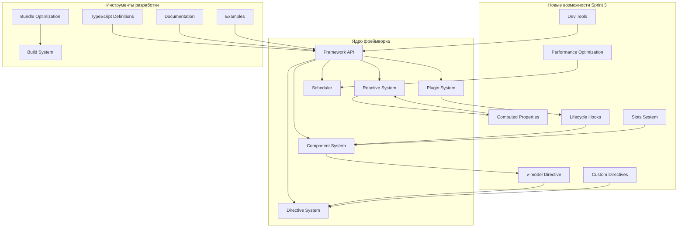
```mermaid
graph TB
    subgraph "Ядро фреймворка"
        A[Framework API] --> B[Plugin System]
        A --> C[Component System]
        A --> D[Reactive System]
        A --> E[Directive System]
        A --> F[Scheduler]
    end
    
    subgraph "Новые возможности Sprint 3"
        G[v-model Directive] --> E
        H[Computed Properties] --> D
        I[Lifecycle Hooks] --> C
        J[Custom Directives] --> E
        K[Slots System] --> C
        L[Dev Tools] --> A
        M[Performance Optimization] --> F
    end
    
    subgraph "Инструменты разработки"
        N[TypeScript Definitions] --> A
        O[Bundle Optimization] --> P[Build System]
        Q[Documentation] --> A
        R[Examples] --> A
    end
    
    B --> I
    C --> G
    D --> H
```

### Технологический стек

- **Язык**: TypeScript 5.3+
- **Сборка**: Vite 5.0 + TypeScript компилятор
- **Тестирование**: Jest + jsdom
- **Валидация кода**: ESLint + Prettier
- **Производительность**: Proxy-based реактивность + оптимизированный scheduler

## Компонентная архитектура

### Расширенная система компонентов

#### Иерархия компонентов

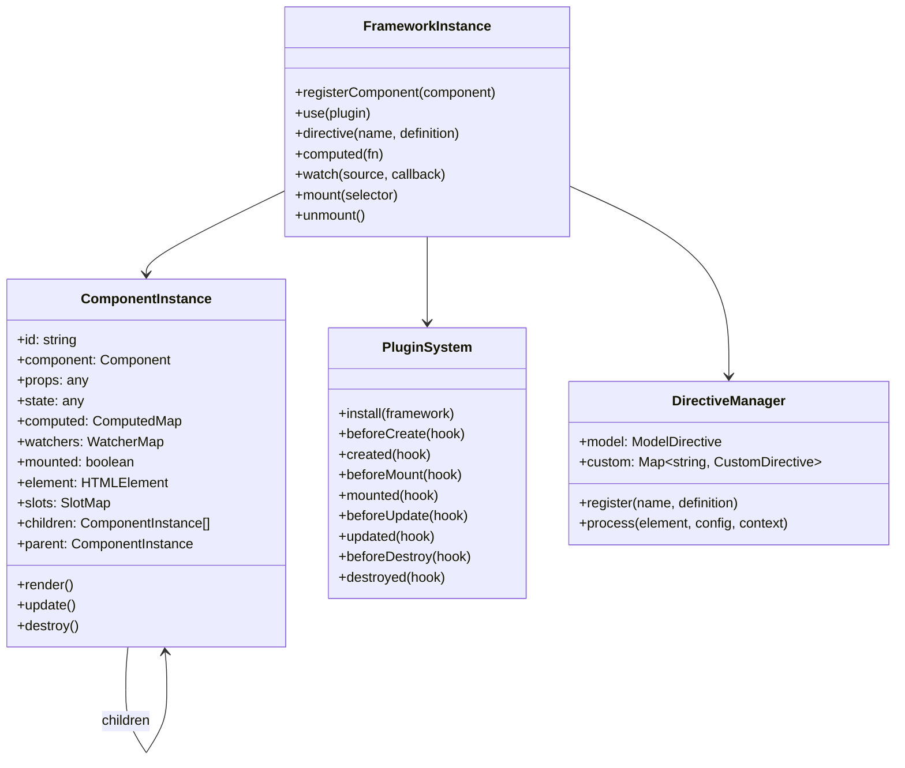
```mermaid
classDiagram
    class FrameworkInstance {
        +registerComponent(component)
        +use(plugin)
        +directive(name, definition)
        +computed(fn)
        +watch(source, callback)
        +mount(selector)
        +unmount()
    }
    
    class ComponentInstance {
        +id: string
        +component: Component
        +props: any
        +state: any
        +computed: ComputedMap
        +watchers: WatcherMap
        +mounted: boolean
        +element: HTMLElement
        +slots: SlotMap
        +children: ComponentInstance[]
        +parent: ComponentInstance
        +render()
        +update()
        +destroy()
    }
    
    class PluginSystem {
        +install(framework)
        +beforeCreate(hook)
        +created(hook)
        +beforeMount(hook)
        +mounted(hook)
        +beforeUpdate(hook)
        +updated(hook)
        +beforeDestroy(hook)
        +destroyed(hook)
    }
    
    class DirectiveManager {
        +register(name, definition)
        +process(element, config, context)
        +model: ModelDirective
        +custom: Map~string, CustomDirective~
    }
    
    FrameworkInstance --> ComponentInstance
    FrameworkInstance --> PluginSystem
    FrameworkInstance --> DirectiveManager
    ComponentInstance --> ComponentInstance : children
```

### Жизненный цикл компонентов с хуками

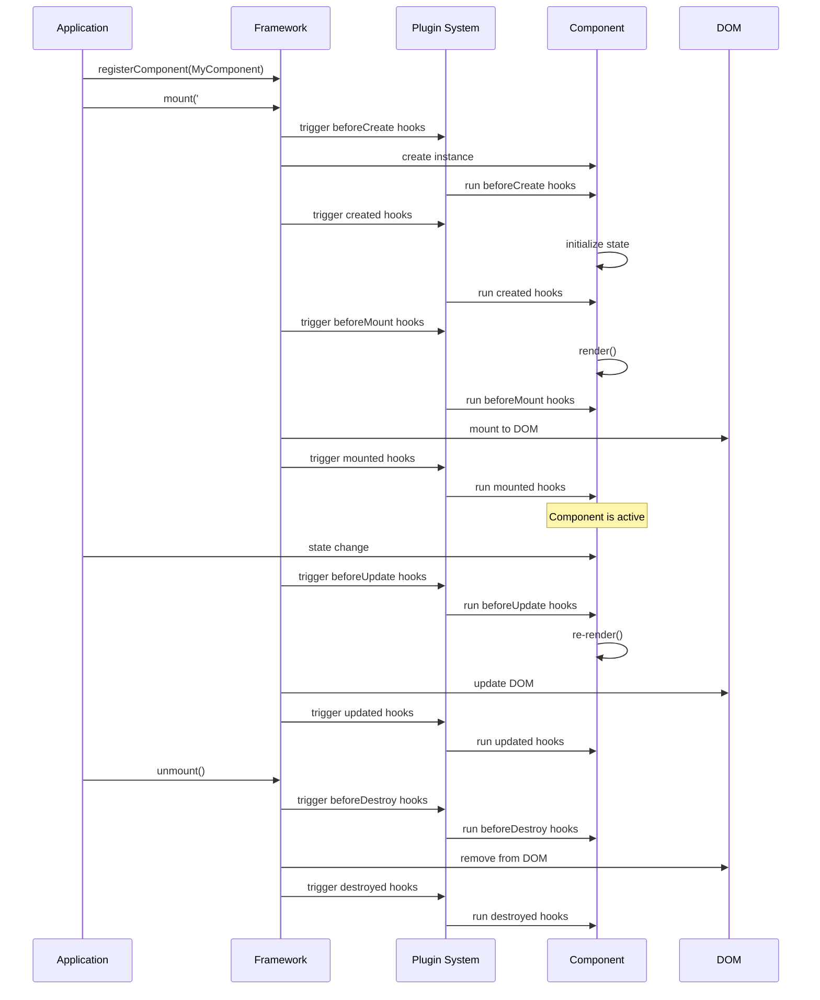
```mermaid
sequenceDiagram
    participant App as Application
    participant F as Framework
    participant P as Plugin System
    participant C as Component
    participant D as DOM
    
    App->>F: registerComponent(MyComponent)
    App->>F: mount('#app')
    
    F->>P: trigger beforeCreate hooks
    F->>C: create instance
    P->>C: run beforeCreate hooks
    
    F->>P: trigger created hooks
    C->>C: initialize state
    P->>C: run created hooks
    
    F->>P: trigger beforeMount hooks
    C->>C: render()
    P->>C: run beforeMount hooks
    
    F->>D: mount to DOM
    F->>P: trigger mounted hooks
    P->>C: run mounted hooks
    
    Note over C: Component is active
    
    App->>C: state change
    F->>P: trigger beforeUpdate hooks
    P->>C: run beforeUpdate hooks
    C->>C: re-render()
    F->>D: update DOM
    F->>P: trigger updated hooks
    P->>C: run updated hooks
    
    App->>F: unmount()
    F->>P: trigger beforeDestroy hooks
    P->>C: run beforeDestroy hooks
    F->>D: remove from DOM
    F->>P: trigger destroyed hooks
    P->>C: run destroyed hooks
```

## Двусторонняя привязка данных (v-model)

### Архитектура v-model

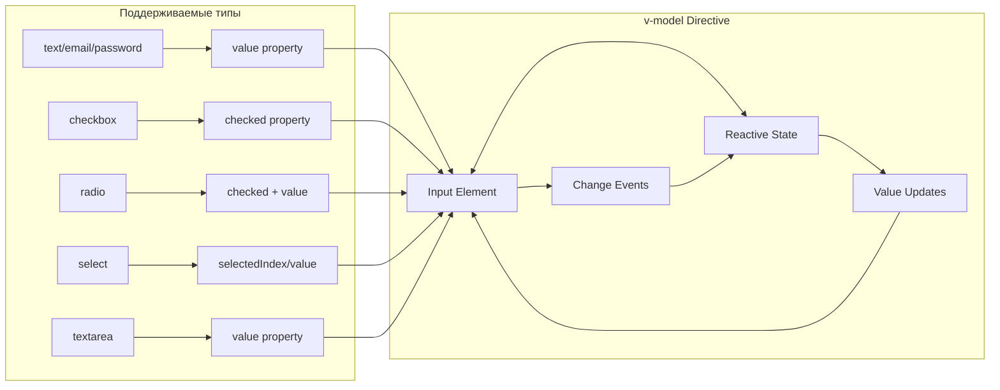
```mermaid
graph LR
    subgraph "v-model Directive"
        A[Input Element] <--> B[Reactive State]
        B --> C[Value Updates]
        A --> D[Change Events]
        D --> B
        C --> A
    end
    
    subgraph "Поддерживаемые типы"
        E[text/email/password] --> F[value property]
        G[checkbox] --> H[checked property]
        I[radio] --> J[checked + value]
        K[select] --> L[selectedIndex/value]
        M[textarea] --> N[value property]
    end
    
    F --> A
    H --> A
    J --> A
    L --> A
    N --> A
```

### Реализация ModelDirective

```typescript
interface ModelDirectiveConfig {
  // Путь к свойству в состоянии
  statePath: string;
  // Тип элемента для определения логики привязки
  inputType: 'text' | 'checkbox' | 'radio' | 'select' | 'textarea';
  // Модификаторы (lazy, number, trim)
  modifiers?: ModelModifiers;
}

interface ModelModifiers {
  lazy?: boolean;    // Обновление на change вместо input
  number?: boolean;  // Автоматическое преобразование в число
  trim?: boolean;    // Удаление пробелов
}
```

### Схема обработки событий

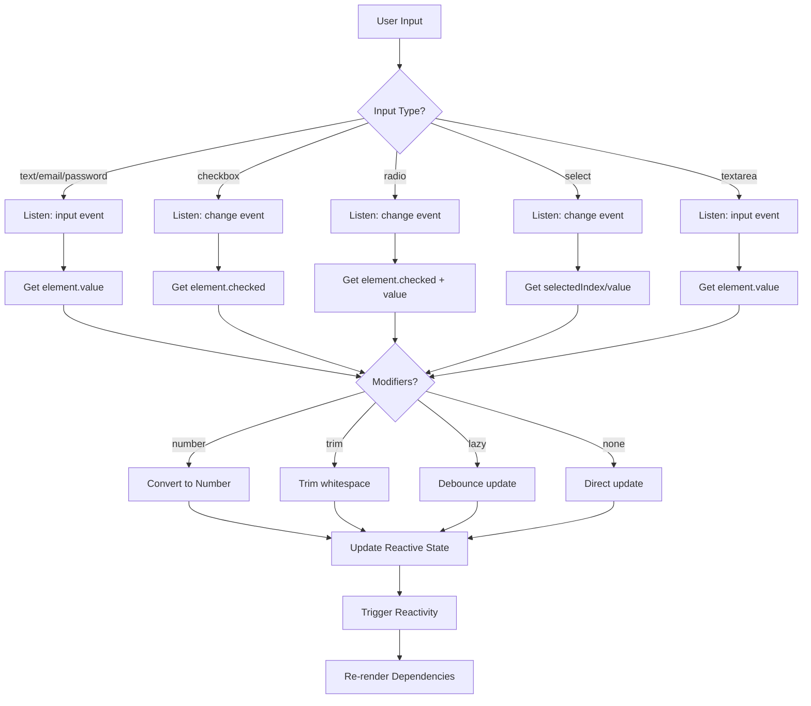
```mermaid
flowchart TD
    A[User Input] --> B{Input Type?}
    
    B -->|text/email/password| C[Listen: input event]
    B -->|checkbox| D[Listen: change event]
    B -->|radio| E[Listen: change event]
    B -->|select| F[Listen: change event]
    B -->|textarea| G[Listen: input event]
    
    C --> H[Get element.value]
    D --> I[Get element.checked]
    E --> J[Get element.checked + value]
    F --> K[Get selectedIndex/value]
    G --> L[Get element.value]
    
    H --> M{Modifiers?}
    I --> M
    J --> M
    K --> M
    L --> M
    
    M -->|number| N[Convert to Number]
    M -->|trim| O[Trim whitespace]
    M -->|lazy| P[Debounce update]
    M -->|none| Q[Direct update]
    
    N --> R[Update Reactive State]
    O --> R
    P --> R
    Q --> R
    
    R --> S[Trigger Reactivity]
    S --> T[Re-render Dependencies]
```

## Computed свойства и Watchers

### Архитектура вычисляемых свойств

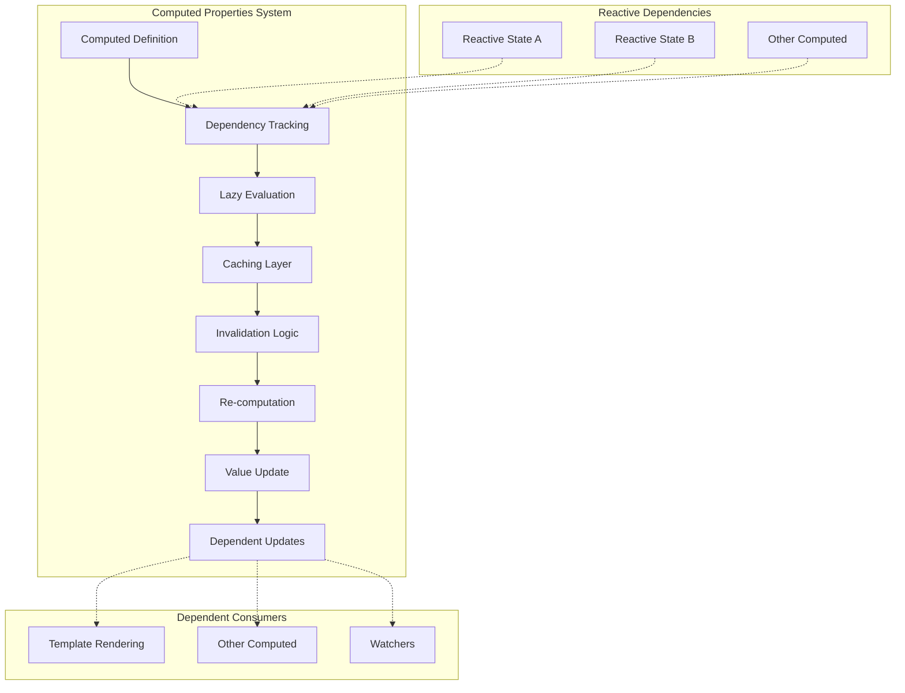
```mermaid
graph TB
    subgraph "Computed Properties System"
        A[Computed Definition] --> B[Dependency Tracking]
        B --> C[Lazy Evaluation]
        C --> D[Caching Layer]
        D --> E[Invalidation Logic]
        E --> F[Re-computation]
        F --> G[Value Update]
        G --> H[Dependent Updates]
    end
    
    subgraph "Reactive Dependencies"
        I[Reactive State A] -.-> B
        J[Reactive State B] -.-> B
        K[Other Computed] -.-> B
    end
    
    subgraph "Dependent Consumers"
        H -.-> L[Template Rendering]
        H -.-> M[Other Computed]
        H -.-> N[Watchers]
    end
```

### Структура данных Computed

```typescript
interface ComputedProperty<T> {
  // Функция вычисления
  getter: () => T;
  // Кешированное значение
  value: T;
  // Флаг валидности кеша
  dirty: boolean;
  // Зависимости
  deps: Set<ReactiveProperty>;
  // Подписчики на изменения
  subscribers: Set<ReactiveEffect>;
  // Отладочная информация
  debugInfo?: {
    name: string;
    computeCount: number;
    lastComputed: Date;
  };
}
```

### Алгоритм оптимизации вычислений

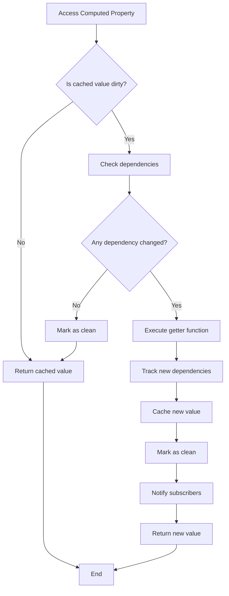
```mermaid
flowchart TD
    A[Access Computed Property] --> B{Is cached value dirty?}
    
    B -->|No| C[Return cached value]
    B -->|Yes| D[Check dependencies]
    
    D --> E{Any dependency changed?}
    
    E -->|No| F[Mark as clean]
    E -->|Yes| G[Execute getter function]
    
    F --> C
    G --> H[Track new dependencies]
    H --> I[Cache new value]
    I --> J[Mark as clean]
    J --> K[Notify subscribers]
    K --> L[Return new value]
    
    C --> M[End]
    L --> M
```

## Система плагинов

### Архитектура плагинов

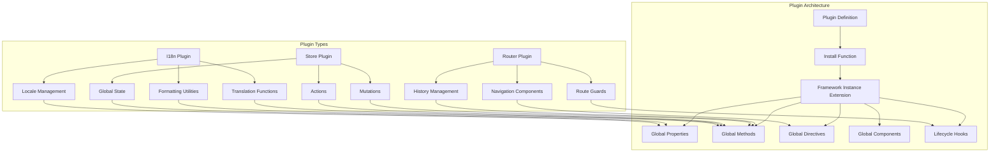
```mermaid
graph TB
    subgraph "Plugin Architecture"
        A[Plugin Definition] --> B[Install Function]
        B --> C[Framework Instance Extension]
        C --> D[Global Properties]
        C --> E[Global Methods]
        C --> F[Global Directives]
        C --> G[Global Components]
        C --> H[Lifecycle Hooks]
    end
    
    subgraph "Plugin Types"
        I[Router Plugin] --> J[Navigation Components]
        I --> K[Route Guards]
        I --> L[History Management]
        
        M[Store Plugin] --> N[Global State]
        M --> O[Mutations]
        M --> P[Actions]
        
        Q[I18n Plugin] --> R[Translation Functions]
        Q --> S[Locale Management]
        Q --> T[Formatting Utilities]
    end
    
    J --> F
    K --> H
    L --> E
    N --> D
    O --> E
    P --> E
    R --> E
    S --> D
    T --> E
```

### API системы плагинов

```typescript
interface Plugin {
  // Основная функция установки
  install(framework: FrameworkInstance, options?: any): void;
  
  // Метаинформация о плагине
  name: string;
  version: string;
  dependencies?: string[];
  
  // Хуки плагина
  beforeInstall?(): void;
  afterInstall?(): void;
}

interface PluginInstallContext {
  // Расширение глобального API
  globalProperties: Record<string, any>;
  globalMethods: Record<string, Function>;
  
  // Регистрация компонентов и директив
  component(name: string, definition: Component): void;
  directive(name: string, definition: DirectiveDefinition): void;
  
  // Добавление хуков жизненного цикла
  mixin(hooks: LifecycleHooks): void;
  
  // Предоставление зависимостей
  provide(key: string, value: any): void;
}
```

### Примеры плагинов

#### Router Plugin

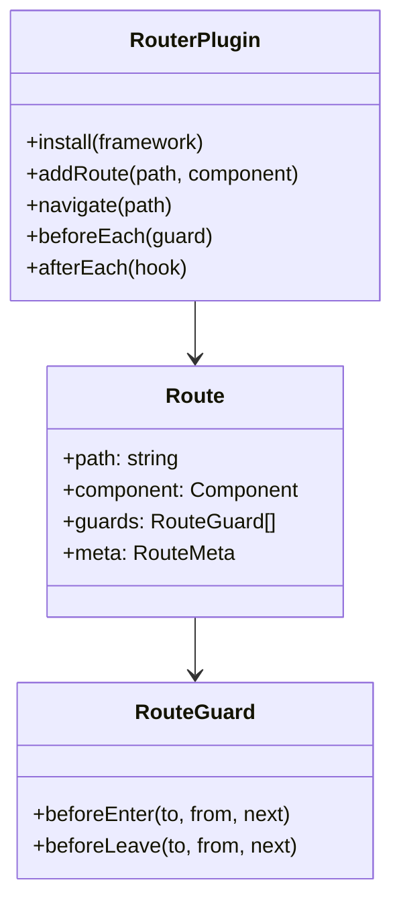
```mermaid
classDiagram
    class RouterPlugin {
        +install(framework)
        +addRoute(path, component)
        +navigate(path)
        +beforeEach(guard)
        +afterEach(hook)
    }
    
    class Route {
        +path: string
        +component: Component
        +guards: RouteGuard[]
        +meta: RouteMeta
    }
    
    class RouteGuard {
        +beforeEnter(to, from, next)
        +beforeLeave(to, from, next)
    }
    
    RouterPlugin --> Route
    Route --> RouteGuard
```

#### Store Plugin (State Management)

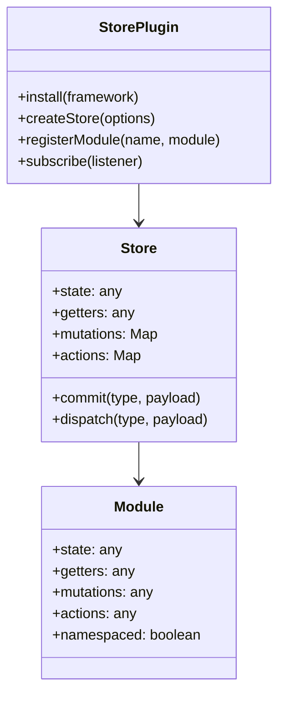
```mermaid
classDiagram
    class StorePlugin {
        +install(framework)
        +createStore(options)
        +registerModule(name, module)
        +subscribe(listener)
    }
    
    class Store {
        +state: any
        +getters: any
        +mutations: Map
        +actions: Map
        +commit(type, payload)
        +dispatch(type, payload)
    }
    
    class Module {
        +state: any
        +getters: any
        +mutations: any
        +actions: any
        +namespaced: boolean
    }
    
    StorePlugin --> Store
    Store --> Module
```

## Пользовательские директивы

### Архитектура директив

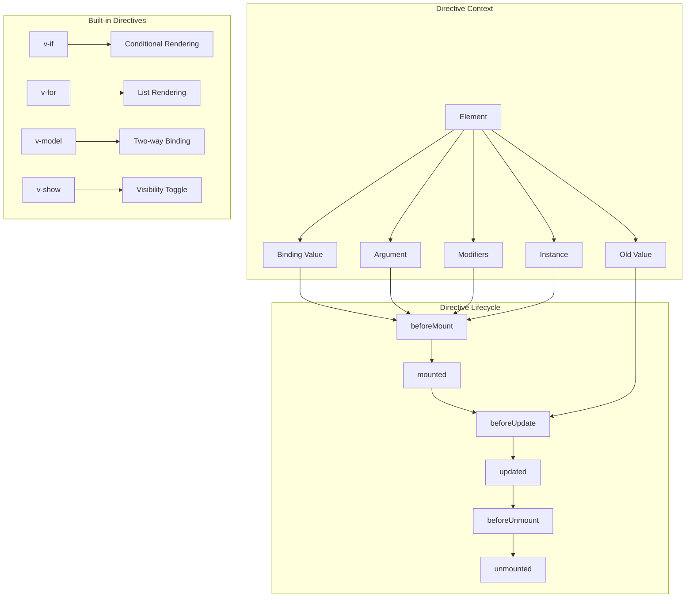
```mermaid
graph TB
    subgraph "Directive Lifecycle"
        A[beforeMount] --> B[mounted] 
        B --> C[beforeUpdate]
        C --> D[updated]
        D --> E[beforeUnmount]
        E --> F[unmounted]
    end
    
    subgraph "Directive Context"
        G[Element] --> H[Binding Value]
        G --> I[Old Value]
        G --> J[Argument]
        G --> K[Modifiers]
        G --> L[Instance]
    end
    
    subgraph "Built-in Directives"
        M[v-if] --> N[Conditional Rendering]
        O[v-for] --> P[List Rendering]
        Q[v-model] --> R[Two-way Binding]
        S[v-show] --> T[Visibility Toggle]
    end
    
    H --> A
    I --> C
    J --> A
    K --> A
    L --> A
```

### API пользовательских директив

```typescript
interface DirectiveDefinition {
  // Жизненный цикл директивы
  beforeMount?(el: Element, binding: DirectiveBinding, vnode: VNode): void;
  mounted?(el: Element, binding: DirectiveBinding, vnode: VNode): void;
  beforeUpdate?(el: Element, binding: DirectiveBinding, vnode: VNode, prevVNode: VNode): void;
  updated?(el: Element, binding: DirectiveBinding, vnode: VNode, prevVNode: VNode): void;
  beforeUnmount?(el: Element, binding: DirectiveBinding, vnode: VNode): void;
  unmounted?(el: Element, binding: DirectiveBinding, vnode: VNode): void;
}

interface DirectiveBinding {
  // Значение директивы
  value: any;
  // Предыдущее значение
  oldValue: any;
  // Аргумент директивы (например, 'foo' в v-my-directive:foo)
  arg?: string;
  // Модификаторы (например, {prevent: true} в v-my-directive.prevent)
  modifiers: Record<string, boolean>;
  // Экземпляр компонента
  instance: ComponentInstance | null;
  // Директория
  dir: DirectiveDefinition;
}
```

### Примеры пользовательских директив

#### Focus Directive

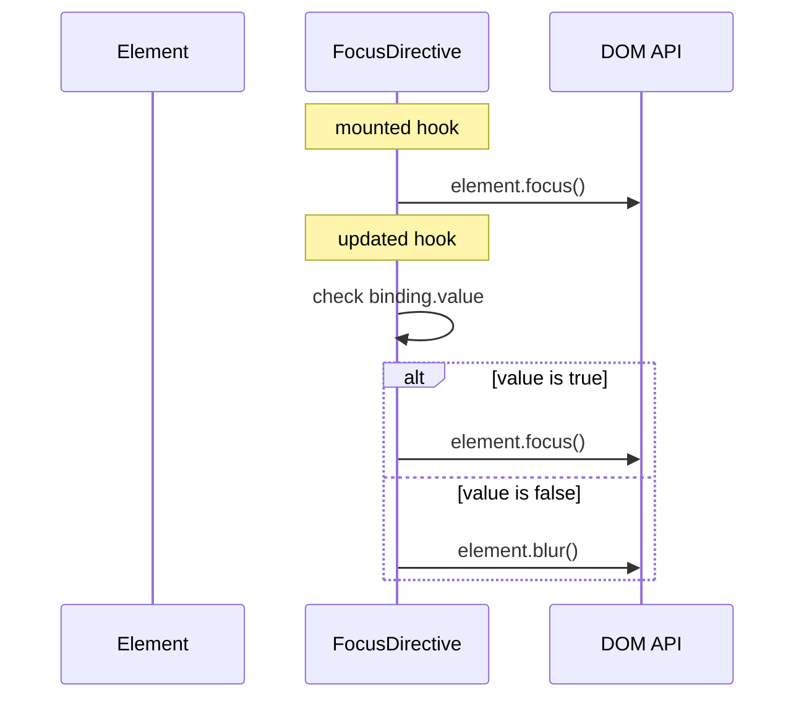
```mermaid
sequenceDiagram
    participant E as Element
    participant D as FocusDirective
    participant DOM as DOM API
    
    Note over D: mounted hook
    D->>DOM: element.focus()
    
    Note over D: updated hook
    D->>D: check binding.value
    alt value is true
        D->>DOM: element.focus()
    else value is false
        D->>DOM: element.blur()
    end
```

#### Click Outside Directive

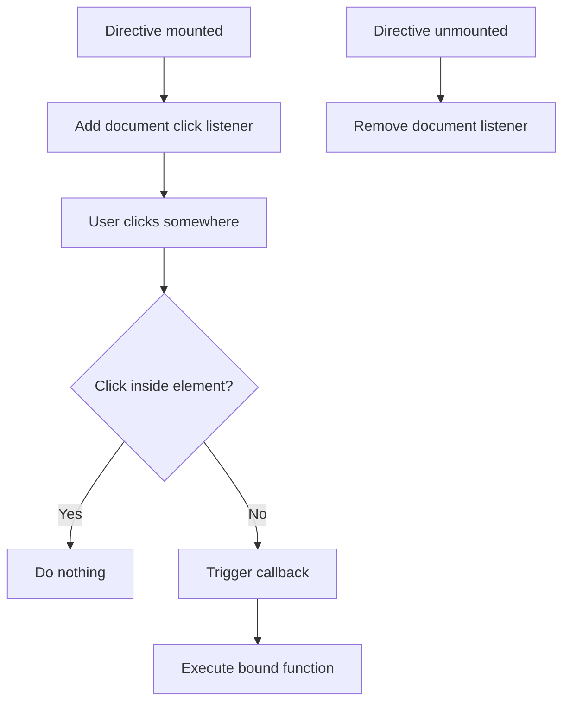
```mermaid
flowchart TD
    A[Directive mounted] --> B[Add document click listener]
    B --> C[User clicks somewhere]
    C --> D{Click inside element?}
    D -->|Yes| E[Do nothing]
    D -->|No| F[Trigger callback]
    F --> G[Execute bound function]
    
    H[Directive unmounted] --> I[Remove document listener]
```

## Система слотов и композиция

### Архитектура слотов

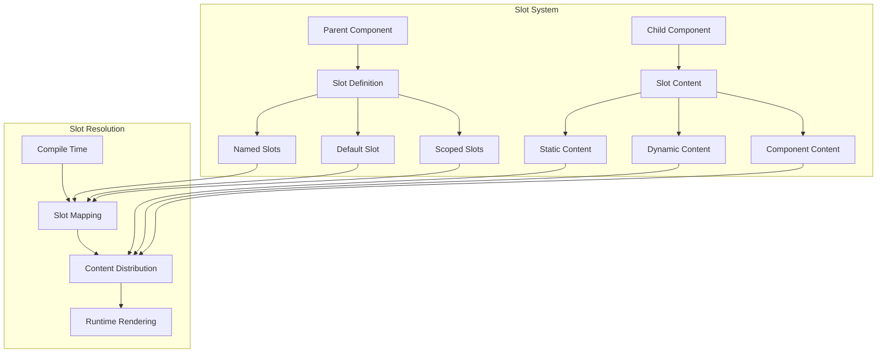
```mermaid
graph TB
    subgraph "Slot System"
        A[Parent Component] --> B[Slot Definition]
        B --> C[Named Slots]
        B --> D[Default Slot]
        B --> E[Scoped Slots]
        
        F[Child Component] --> G[Slot Content]
        G --> H[Static Content]
        G --> I[Dynamic Content]
        G --> J[Component Content]
    end
    
    subgraph "Slot Resolution"
        K[Compile Time] --> L[Slot Mapping]
        L --> M[Content Distribution]
        M --> N[Runtime Rendering]
    end
    
    C --> L
    D --> L
    E --> L
    H --> M
    I --> M
    J --> M
```

### Типы слотов

```typescript
interface SlotDefinition {
  // Именованные слоты
  named: Record<string, SlotContent>;
  // Слот по умолчанию
  default?: SlotContent;
  // Скопированные слоты с данными
  scoped: Record<string, ScopedSlotContent>;
}

interface SlotContent {
  // Статическое содержимое
  static?: ElementChild[];
  // Динамическое содержимое (функция)
  dynamic?: (data?: any) => ElementChild[];
}

interface ScopedSlotContent {
  // Функция рендеринга с данными от дочернего компонента
  render: (data: any) => ElementChild[];
  // Резервное содержимое
  fallback?: ElementChild[];
}
```

### Пример использования слотов

```typescript
// Компонент Modal с именованными слотами
const ModalComponent: Component = {
  name: 'Modal',
  props: {
    visible: { type: 'boolean', default: false }
  },
  
  render(props, state) {
    return {
      tag: 'div',
      props: { 
        class: 'modal',
        style: { display: props.visible ? 'block' : 'none' }
      },
      children: [
        {
          tag: 'div',
          props: { class: 'modal-header' },
          children: [
            // Слот header
            { slot: 'header', fallback: [{ tag: 'h3', children: ['Modal Title'] }] }
          ]
        },
        {
          tag: 'div',
          props: { class: 'modal-body' },
          children: [
            // Слот по умолчанию
            { slot: 'default', fallback: [{ tag: 'p', children: ['Modal content'] }] }
          ]
        },
        {
          tag: 'div',
          props: { class: 'modal-footer' },
          children: [
            // Слот footer с данными
            { 
              slot: 'footer', 
              data: { closeModal: () => state.visible = false },
              fallback: [
                { 
                  tag: 'button', 
                  events: { click: () => state.visible = false },
                  children: ['Close'] 
                }
              ]
            }
          ]
        }
      ]
    };
  }
};
```

## Оптимизация производительности

### Advanced мемоизация

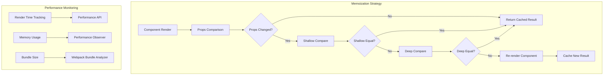
```mermaid
graph TB
    subgraph "Memoization Strategy"
        A[Component Render] --> B[Props Comparison]
        B --> C{Props Changed?}
        C -->|No| D[Return Cached Result]
        C -->|Yes| E[Shallow Compare]
        E --> F{Shallow Equal?}
        F -->|Yes| D
        F -->|No| G[Deep Compare]
        G --> H{Deep Equal?}
        H -->|Yes| D
        H -->|No| I[Re-render Component]
        I --> J[Cache New Result]
    end
    
    subgraph "Performance Monitoring"
        K[Render Time Tracking] --> L[Performance API]
        M[Memory Usage] --> N[Performance Observer]
        O[Bundle Size] --> P[Webpack Bundle Analyzer]
    end
```

### shouldComponentUpdate логика

```typescript
interface MemoizationOptions {
  // Стратегия сравнения props
  compareProps?: 'shallow' | 'deep' | ((prev: any, next: any) => boolean);
  // Стратегия сравнения state
  compareState?: 'shallow' | 'deep' | ((prev: any, next: any) => boolean);
  // Максимальное время на сравнение (мс)
  maxCompareTime?: number;
  // Отладочная информация
  debug?: boolean;
}

interface PerformanceMetrics {
  renderCount: number;
  totalRenderTime: number;
  averageRenderTime: number;
  lastRenderTime: number;
  memoryUsage: number;
  skipCount: number; // Количество пропущенных рендеров благодаря мемоизации
}
```

### Bundle размер оптимизация

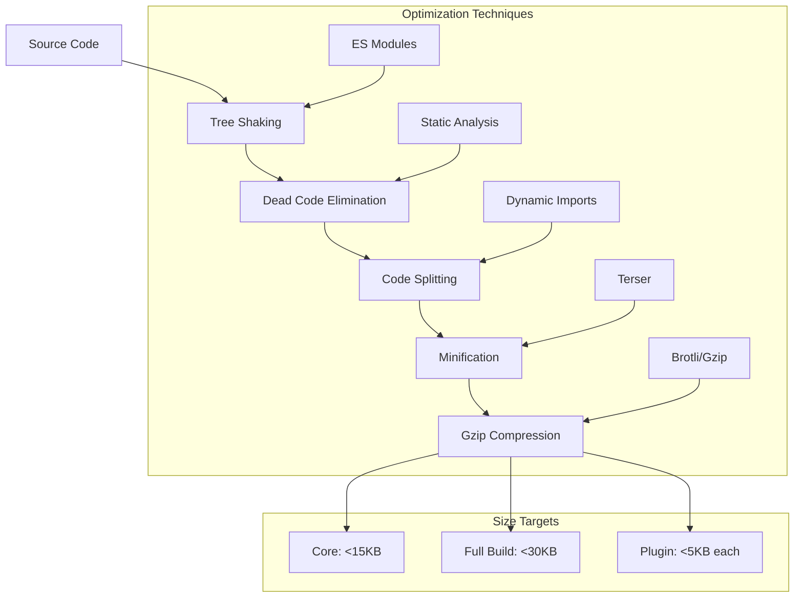
```mermaid
flowchart TD
    A[Source Code] --> B[Tree Shaking]
    B --> C[Dead Code Elimination]
    C --> D[Code Splitting]
    D --> E[Minification]
    E --> F[Gzip Compression]
    
    subgraph "Optimization Techniques"
        G[ES Modules] --> B
        H[Static Analysis] --> C
        I[Dynamic Imports] --> D
        J[Terser] --> E
        K[Brotli/Gzip] --> F
    end
    
    subgraph "Size Targets"
        L[Core: <15KB]
        M[Full Build: <30KB]
        N[Plugin: <5KB each]
    end
    
    F --> L
    F --> M
    F --> N
```

## Developer Experience инструменты

### Архитектура Dev Tools

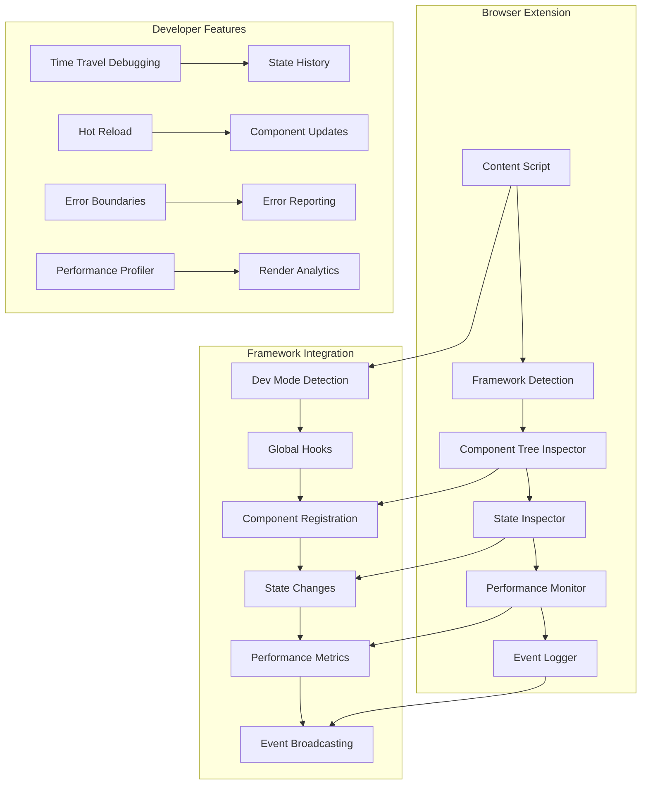
```mermaid
graph TB
    subgraph "Browser Extension"
        A[Content Script] --> B[Framework Detection]
        B --> C[Component Tree Inspector]
        C --> D[State Inspector]
        D --> E[Performance Monitor]
        E --> F[Event Logger]
    end
    
    subgraph "Framework Integration"
        G[Dev Mode Detection] --> H[Global Hooks]
        H --> I[Component Registration]
        I --> J[State Changes]
        J --> K[Performance Metrics]
        K --> L[Event Broadcasting]
    end
    
    subgraph "Developer Features"
        M[Time Travel Debugging] --> N[State History]
        O[Hot Reload] --> P[Component Updates]
        Q[Error Boundaries] --> R[Error Reporting]
        S[Performance Profiler] --> T[Render Analytics]
    end
    
    A --> G
    C --> I
    D --> J
    E --> K
    F --> L
```

### TypeScript интеграция

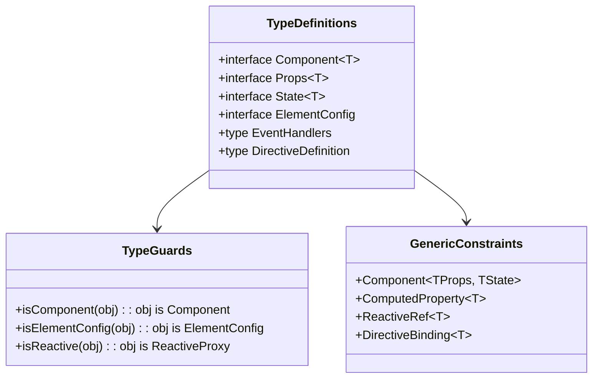
```mermaid
classDiagram
    class TypeDefinitions {
        +interface Component~T~
        +interface Props~T~
        +interface State~T~
        +interface ElementConfig
        +type EventHandlers
        +type DirectiveDefinition
    }
    
    class TypeGuards {
        +isComponent(obj): obj is Component
        +isElementConfig(obj): obj is ElementConfig
        +isReactive(obj): obj is ReactiveProxy
    }
    
    class GenericConstraints {
        +Component~TProps, TState~
        +ComputedProperty~T~
        +ReactiveRef~T~
        +DirectiveBinding~T~
    }
    
    TypeDefinitions --> TypeGuards
    TypeDefinitions --> GenericConstraints
```

### Структура типов для полной типизации

```typescript
// Строго типизированный компонент
interface TypedComponent<TProps = {}, TState = {}> {
  name: string;
  props?: PropDefinitions<TProps>;
  state?: () => TState;
  render(props: TProps, state: TState): ElementConfig;
  
  // Типизированные хуки
  onCreate?(this: ComponentInstance<TProps, TState>): void;
  onMount?(this: ComponentInstance<TProps, TState>): void;
  onUpdate?(
    this: ComponentInstance<TProps, TState>,
    changedProps: (keyof TProps)[],
    changedState: (keyof TState)[]
  ): void;
  onDestroy?(this: ComponentInstance<TProps, TState>): void;
}

// Типизированные computed свойства
type ComputedProperty<T> = {
  readonly value: T;
  readonly effect: ReactiveEffect;
  readonly dependencies: Set<string>;
};

// Типизированные watchers
type Watcher<T> = {
  source: () => T;
  callback: (newValue: T, oldValue: T) => void;
  options?: WatcherOptions;
  stop(): void;
};
```

## Примеры приложений

### Многокомпонентная архитектура

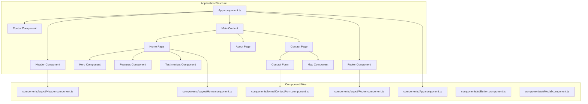
```mermaid
graph TB
    subgraph "Application Structure"
        A[App.component.ts] --> B[Router Component]
        A --> C[Header Component]
        A --> D[Main Content]
        A --> E[Footer Component]
        
        D --> F[Home Page]
        D --> G[About Page]
        D --> H[Contact Page]
        
        F --> I[Hero Component]
        F --> J[Features Component]
        F --> K[Testimonials Component]
        
        H --> L[Contact Form]
        H --> M[Map Component]
    end
    
    subgraph "Component Files"
        N[components/App.component.ts]
        O[components/layout/Header.component.ts]
        P[components/layout/Footer.component.ts]
        Q[components/pages/Home.component.ts]
        R[components/forms/ContactForm.component.ts]
        S[components/ui/Button.component.ts]
        T[components/ui/Modal.component.ts]
    end
    
    A --> N
    C --> O
    E --> P
    F --> Q
    L --> R
```

### Структура финального приложения

```
demo-app/
├── index.html                 # Точка входа
├── main.ts                   # Инициализация приложения
├── framework.js              # Скомпилированный фреймворк
└── components/
    ├── App.component.ts      # Главный компонент
    ├── layout/
    │   ├── Header.component.ts
    │   ├── Footer.component.ts
    │   └── Navigation.component.ts
    ├── pages/
    │   ├── Home.component.ts
    │   ├── About.component.ts
    │   ├── Contact.component.ts
    │   └── Dashboard.component.ts
    ├── ui/
    │   ├── Button.component.ts
    │   ├── Modal.component.ts
    │   ├── Input.component.ts
    │   └── Card.component.ts
    └── features/
        ├── TodoList.component.ts
        ├── UserProfile.component.ts
        └── Analytics.component.ts
```

### Пример главного компонента

```typescript
// components/App.component.ts
import { Component } from '../framework.js';

export const AppComponent: Component = {
  name: 'App',
  
  state: () => ({
    currentRoute: 'home',
    user: null,
    theme: 'light'
  }),
  
  render(props, state) {
    return {
      tag: 'div',
      props: { 
        class: `app app--${state.theme}`,
        id: 'app'
      },
      children: [
        // Header с навигацией
        {
          component: 'Header',
          props: {
            currentRoute: state.currentRoute,
            user: state.user,
            onNavigate: (route) => state.currentRoute = route,
            onThemeToggle: () => state.theme = state.theme === 'light' ? 'dark' : 'light'
          }
        },
        
        // Основной контент с роутингом
        {
          tag: 'main',
          props: { class: 'main-content' },
          children: [
            // Условный рендеринг страниц
            {
              if: "state.currentRoute === 'home'",
              component: 'HomePage'
            },
            {
              if: "state.currentRoute === 'about'", 
              component: 'AboutPage'
            },
            {
              if: "state.currentRoute === 'contact'",
              component: 'ContactPage' 
            },
            {
              if: "state.currentRoute === 'dashboard'",
              component: 'DashboardPage',
              props: {
                user: state.user
              }
            }
          ]
        },
        
        // Footer
        {
          component: 'Footer',
          props: {
            theme: state.theme
          }
        }
      ]
    };
  }
};
```

## Тестирование

### Стратегия тестирования

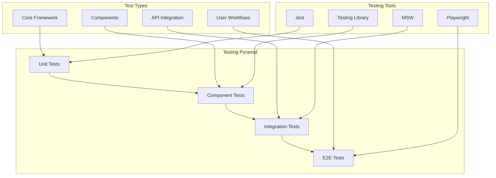
```mermaid
graph TB
    subgraph "Testing Pyramid"
        A[Unit Tests] --> B[Component Tests]
        B --> C[Integration Tests]
        C --> D[E2E Tests]
    end
    
    subgraph "Test Types"
        E[Core Framework] --> A
        F[Components] --> B
        G[User Workflows] --> D
        H[API Integration] --> C
    end
    
    subgraph "Testing Tools"
        I[Jest] --> A
        J[Testing Library] --> B
        K[Playwright] --> D
        L[MSW] --> C
    end
```

### Покрытие тестами

```typescript
// Требования к покрытию кода
interface CoverageRequirements {
  overall: 95; // Общее покрытие
  statements: 95;
  branches: 90;
  functions: 95;
  lines: 95;
  
  // Критические модули
  core: 98;
  reactive: 98;
  components: 95;
  directives: 95;
  
  // Менее критические
  utils: 85;
  examples: 70;
}
```

## Метрики производительности

### Целевые показатели

| Метрика | Целевое значение | Критическое значение |
|---------|------------------|---------------------|
| Bundle Size (gzipped) | < 25KB | < 30KB |
| First Paint | < 100ms | < 200ms |
| Interactive | < 300ms | < 500ms |
| Memory Usage | < 50MB | < 100MB |
| Render 1000 elements | < 16ms | < 50ms |
| State update latency | < 1ms | < 5ms |

### Мониторинг производительности

```mermaid
flowchart TD
    A[Performance Monitoring] --> B[Bundle Analyzer]
    A --> C[Runtime Profiler]
    A --> D[Memory Profiler]
    A --> E[Network Monitor]
    
    B --> F[Size Report]
    C --> G[Render Times]
    D --> H[Memory Leaks]
    E --> I[Load Times]
    
    F --> J[Optimization Recommendations]
    G --> J
    H --> J
    I --> J
```

## Развертывание и интеграция

### Сценарии развертывания

```mermaid
graph TB
    subgraph "Distribution Formats"
        A[ES Modules] --> B[Modern Browsers]
        C[UMD Bundle] --> D[Legacy Browsers]
        E[CommonJS] --> F[Node.js]
        G[TypeScript] --> H[Development]
    end
    
    subgraph "Integration Methods"
        I[NPM Package] --> J[npm install]
        K[CDN] --> L[<script> tag]
        M[Local Build] --> N[Custom build]
    end
    
    subgraph "Framework Integration"
        O[Standalone] --> P[Pure Framework]
        Q[React Integration] --> R[React Wrapper]
        S[Vue Integration] --> T[Vue Plugin]
    end
```

### Миграционные стратегии

```typescript
interface MigrationGuide {
  // Миграция с других фреймворков
  fromVue: {
    components: 'Direct mapping possible';
    directives: 'Similar syntax with adaptation';
    state: 'Requires reactive system adjustment';
  };
  
  fromReact: {
    components: 'Functional to class-based mapping';
    hooks: 'Lifecycle method equivalents';
    state: 'useState to reactive state';
  };
  
  // Поэтапная миграция
  incremental: {
    step1: 'Replace leaf components';
    step2: 'Migrate to framework state management';
    step3: 'Convert parent components';
    step4: 'Full framework adoption';
  };
}
```

## Детальный план реализации

### Неделя 1: Продвинутые возможности (дни 1-7)

#### День 1-2: Директива v-model

**Файлы для создания/модификации:**

```
src/core/directives/
├── model.ts              # Новая директива v-model
├── model-handlers.ts     # Обработчики для разных типов input
└── model-modifiers.ts    # Модификаторы (.lazy, .number, .trim)

src/core/
├── directives.ts         # Добавить ModelDirective в экспорт
└── types.ts             # Добавить типы для v-model

src/__tests__/
└── model.test.ts        # Тесты для v-model
```

**Пример реализации ModelDirective:**

```typescript
// src/core/directives/model.ts
export interface ModelDirectiveOptions {
  lazy?: boolean;    // Обновлять на change вместо input
  number?: boolean;  // Преобразовать в число
  trim?: boolean;    // Удалить пробелы
}

export class ModelDirective {
  process(element: HTMLElement, binding: DirectiveBinding, context: DirectiveContext) {
    const { value: statePath, modifiers } = binding;
    
    if (element instanceof HTMLInputElement) {
      this.handleInputElement(element, statePath, modifiers, context);
    } else if (element instanceof HTMLSelectElement) {
      this.handleSelectElement(element, statePath, modifiers, context);
    } else if (element instanceof HTMLTextAreaElement) {
      this.handleTextAreaElement(element, statePath, modifiers, context);
    }
  }
  
  private handleInputElement(
    element: HTMLInputElement, 
    statePath: string, 
    modifiers: ModelDirectiveOptions,
    context: DirectiveContext
  ) {
    const { type } = element;
    
    switch (type) {
      case 'checkbox':
        this.bindCheckbox(element, statePath, context);
        break;
      case 'radio':
        this.bindRadio(element, statePath, context);
        break;
      default:
        this.bindTextInput(element, statePath, modifiers, context);
    }
  }
  
  private bindTextInput(
    element: HTMLInputElement,
    statePath: string,
    modifiers: ModelDirectiveOptions,
    context: DirectiveContext
  ) {
    // Установка начального значения
    const initialValue = this.getStateValue(statePath, context.state);
    element.value = String(initialValue || '');
    
    // Выбор события для прослушивания
    const eventType = modifiers.lazy ? 'change' : 'input';
    
    // Обработчик изменений
    const handler = (event: Event) => {
      const target = event.target as HTMLInputElement;
      let value: any = target.value;
      
      // Применение модификаторов
      if (modifiers.trim) {
        value = value.trim();
      }
      if (modifiers.number && !isNaN(Number(value))) {
        value = Number(value);
      }
      
      // Обновление состояния
      this.setStateValue(statePath, value, context.state);
    };
    
    element.addEventListener(eventType, handler);
    
    // Сохранение обработчика для очистки
    this.storeEventHandler(element, eventType, handler);
  }
}
```

#### День 3-4: Computed свойства

**Файлы для создания/модификации:**

```
src/core/
├── computed.ts           # Система computed свойств
├── dependency-tracker.ts # Отслеживание зависимостей
└── cache-manager.ts      # Кеширование результатов

src/core/reactive.ts      # Интеграция с реактивной системой

src/__tests__/
└── computed.test.ts      # Тесты computed свойств
```

**Пример реализации Computed:**

```typescript
// src/core/computed.ts
export class ComputedProperty<T> {
  private _value: T | undefined;
  private _dirty = true;
  private _deps = new Set<ReactiveProperty>();
  private _subscribers = new Set<ReactiveEffect>();
  
  constructor(
    private getter: () => T,
    private debugOptions?: ComputedDebugOptions
  ) {}
  
  get value(): T {
    // Отслеживание доступа к computed свойству
    if (activeEffect) {
      this._subscribers.add(activeEffect);
      activeEffect.deps.add(this);
    }
    
    // Пересчет если необходимо
    if (this._dirty) {
      this._recompute();
    }
    
    return this._value!;
  }
  
  private _recompute(): void {
    const prevDeps = this._deps;
    this._deps = new Set();
    
    // Запуск геттера с отслеживанием зависимостей
    const prevEffect = activeEffect;
    activeEffect = {
      fn: this.getter,
      deps: this._deps,
      computed: this
    };
    
    try {
      this._value = this.getter();
      this._dirty = false;
      
      // Отладочная информация
      if (this.debugOptions?.onCompute) {
        this.debugOptions.onCompute(this._value, Array.from(this._deps));
      }
    } finally {
      activeEffect = prevEffect;
    }
    
    // Отписка от старых зависимостей
    prevDeps.forEach(dep => {
      if (!this._deps.has(dep)) {
        dep.effects.delete(this as any);
      }
    });
    
    // Подписка на новые зависимости
    this._deps.forEach(dep => {
      dep.effects.add(this as any);
    });
  }
  
  invalidate(): void {
    if (!this._dirty) {
      this._dirty = true;
      
      // Уведомление подписчиков
      this._subscribers.forEach(effect => {
        if (effect.scheduler) {
          effect.scheduler(effect);
        } else {
          effect.fn();
        }
      });
    }
  }
}

// Функция создания computed свойства
export function computed<T>(getter: () => T, options?: ComputedOptions): ComputedRef<T> {
  const computedProperty = new ComputedProperty(getter, options);
  
  return {
    get value() {
      return computedProperty.value;
    },
    
    // Дополнительные методы для отладки
    _computed: computedProperty,
    dependencies: () => Array.from(computedProperty._deps),
    invalidate: () => computedProperty.invalidate()
  };
}
```

#### День 5-7: Система плагинов и хуков

**Файлы для создания/модификации:**

```
src/core/
├── plugin-system.ts      # Основная система плагинов
├── lifecycle-hooks.ts    # Хуки жизненного цикла
└── plugin-context.ts     # Контекст для плагинов

src/plugins/              # Новая папка для встроенных плагинов
├── router.plugin.ts      # Плагин роутера
├── store.plugin.ts       # Плагин управления состоянием
└── i18n.plugin.ts        # Плагин интернационализации

src/__tests__/
├── plugin-system.test.ts
└── lifecycle.test.ts
```

**Пример системы плагинов:**

```typescript
// src/core/plugin-system.ts
export interface Plugin {
  name: string;
  version: string;
  dependencies?: string[];
  install(framework: FrameworkInstance, options?: any): void;
  beforeInstall?(): void;
  afterInstall?(): void;
}

export class PluginSystem {
  private plugins = new Map<string, Plugin>();
  private installedPlugins = new Set<string>();
  private globalProperties = new Map<string, any>();
  private globalMethods = new Map<string, Function>();
  private lifecycleHooks = new Map<string, Function[]>();
  
  use(plugin: Plugin, options?: any): void {
    if (this.installedPlugins.has(plugin.name)) {
      console.warn(`Плагин ${plugin.name} уже установлен`);
      return;
    }
    
    // Проверка зависимостей
    if (plugin.dependencies) {
      for (const dep of plugin.dependencies) {
        if (!this.installedPlugins.has(dep)) {
          throw new Error(`Плагин ${plugin.name} требует ${dep}`);
        }
      }
    }
    
    // Хуки до установки
    if (plugin.beforeInstall) {
      plugin.beforeInstall();
    }
    
    // Создание контекста установки
    const installContext = this.createInstallContext();
    
    // Установка плагина
    plugin.install(installContext as any, options);
    
    // Регистрация плагина
    this.plugins.set(plugin.name, plugin);
    this.installedPlugins.add(plugin.name);
    
    // Хуки после установки
    if (plugin.afterInstall) {
      plugin.afterInstall();
    }
  }
  
  private createInstallContext(): PluginInstallContext {
    return {
      globalProperties: this.globalProperties,
      globalMethods: this.globalMethods,
      
      // Регистрация компонентов
      component: (name: string, definition: Component) => {
        registerComponent(definition);
      },
      
      // Регистрация директив
      directive: (name: string, definition: DirectiveDefinition) => {
        directiveManager.register(name, definition);
      },
      
      // Добавление хуков жизненного цикла
      mixin: (hooks: LifecycleHooks) => {
        Object.entries(hooks).forEach(([hookName, hookFn]) => {
          if (!this.lifecycleHooks.has(hookName)) {
            this.lifecycleHooks.set(hookName, []);
          }
          this.lifecycleHooks.get(hookName)!.push(hookFn);
        });
      },
      
      // Предоставление зависимостей
      provide: (key: string, value: any) => {
        this.globalProperties.set(key, value);
      }
    };
  }
  
  // Выполнение хуков жизненного цикла
  executeHook(hookName: string, context: any, ...args: any[]): void {
    const hooks = this.lifecycleHooks.get(hookName);
    if (hooks) {
      hooks.forEach(hook => {
        try {
          hook.call(context, ...args);
        } catch (error) {
          console.error(`Ошибка в хуке ${hookName}:`, error);
        }
      });
    }
  }
}
```

### Неделя 2: Оптимизация и финализация (дни 8-14)

#### День 8-9: Оптимизация производительности

**Файлы для создания/модификации:**

```
src/core/
├── performance.ts        # Система мониторинга производительности
├── memoization.ts        # Мемоизация компонентов
└── bundle-optimizer.ts   # Оптимизация размера bundle

src/utils/
├── performance-monitor.ts # Утилиты мониторинга
└── memory-profiler.ts    # Профилирование памяти

vite.config.ts            # Обновление конфигурации сборки
package.json              # Добавление скриптов анализа bundle
```

**Пример системы мемоизации:**

```typescript
// src/core/memoization.ts
export interface MemoOptions {
  compareProps?: 'shallow' | 'deep' | ((prev: any, next: any) => boolean);
  compareState?: 'shallow' | 'deep' | ((prev: any, next: any) => boolean);
  maxCompareTime?: number;
  debug?: boolean;
}

export function memo<TProps = {}, TState = {}>(
  component: Component<TProps, TState>,
  options: MemoOptions = {}
): Component<TProps, TState> {
  const {
    compareProps = 'shallow',
    compareState = 'shallow',
    maxCompareTime = 5,
    debug = false
  } = options;
  
  let cachedResult: ElementConfig | null = null;
  let prevProps: TProps | null = null;
  let prevState: TState | null = null;
  
  return {
    ...component,
    name: `Memo(${component.name})`,
    
    render(props: TProps, state: TState): ElementConfig {
      const startTime = performance.now();
      
      // Проверяем, нужно ли пересчитывать
      const shouldUpdate = this.shouldComponentUpdate(
        props, state, prevProps, prevState,
        compareProps, compareState
      );
      
      const compareTime = performance.now() - startTime;
      
      if (compareTime > maxCompareTime && debug) {
        console.warn(
          `Долгое сравнение в ${component.name}: ${compareTime.toFixed(2)}ms`
        );
      }
      
      if (!shouldUpdate && cachedResult) {
        if (debug) {
          console.log(`Мемоизация сработала для ${component.name}`);
        }
        return cachedResult;
      }
      
      // Пересчитываем результат
      const renderStart = performance.now();
      cachedResult = component.render(props, state);
      const renderTime = performance.now() - renderStart;
      
      if (debug) {
        console.log(
          `${component.name} re-rendered in ${renderTime.toFixed(2)}ms`
        );
      }
      
      // Сохраняем текущие значения
      prevProps = this.deepClone(props);
      prevState = this.deepClone(state);
      
      return cachedResult;
    },
    
    shouldComponentUpdate(
      nextProps: TProps,
      nextState: TState,
      prevProps: TProps | null,
      prevState: TState | null,
      propsCompare: MemoOptions['compareProps'],
      stateCompare: MemoOptions['compareState']
    ): boolean {
      if (!prevProps || !prevState) {
        return true;
      }
      
      const propsChanged = !this.compareValues(
        prevProps, nextProps, propsCompare
      );
      const stateChanged = !this.compareValues(
        prevState, nextState, stateCompare
      );
      
      return propsChanged || stateChanged;
    }
  };
}
```

#### День 10-11: Developer Tools

**Файлы для создания:**

```
src/devtools/
├── devtools.ts           # Основной API dev tools
├── component-inspector.ts # Инспектор компонентов
├── state-monitor.ts      # Мониторинг состояния
├── performance-profiler.ts # Профилировщик
└── browser-extension/    # Расширение для браузера
    ├── manifest.json
    ├── content-script.js
    ├── devtools-panel.html
    └── devtools-panel.js

src/core/types.ts         # Добавить типы для dev tools
```

**Пример dev tools API:**

```typescript
// src/devtools/devtools.ts
export interface DevToolsAPI {
  // Инспектирование компонентов
  inspectComponent(componentId: string): ComponentInspection;
  getComponentTree(): ComponentTreeNode[];
  
  // Мониторинг состояния
  getGlobalState(): any;
  watchStateChanges(callback: (changes: StateChange[]) => void): () => void;
  
  // Профилирование производительности
  startProfiling(): void;
  stopProfiling(): PerformanceProfile;
  
  // Отладка событий
  logEvents(enabled: boolean): void;
  getEventHistory(): EventLogEntry[];
}

export class DevTools implements DevToolsAPI {
  private componentInstances = new Map<string, ComponentInstance>();
  private stateWatchers = new Set<(changes: StateChange[]) => void>();
  private eventLog: EventLogEntry[] = [];
  private profilingSession: ProfilingSession | null = null;
  
  constructor(private framework: FrameworkInstance) {
    this.setupGlobalHooks();
  }
  
  private setupGlobalHooks(): void {
    // Хук создания компонента
    this.framework.pluginSystem.mixin({
      created(this: ComponentInstance) {
        devTools.registerComponent(this);
      },
      
      updated(this: ComponentInstance, changedProps, changedState) {
        devTools.logStateChange(this.id, changedProps, changedState);
      },
      
      destroyed(this: ComponentInstance) {
        devTools.unregisterComponent(this.id);
      }
    });
  }
  
  inspectComponent(componentId: string): ComponentInspection {
    const instance = this.componentInstances.get(componentId);
    if (!instance) {
      throw new Error(`Компонент ${componentId} не найден`);
    }
    
    return {
      id: instance.id,
      name: instance.component.name,
      props: { ...instance.props },
      state: { ...instance.state },
      computed: this.getComputedValues(instance),
      element: instance.element,
      children: instance.children.map(child => child.id),
      parent: instance.parent?.id || null,
      renderCount: instance.renderCount || 0,
      lastRenderTime: instance.lastRenderTime || 0
    };
  }
  
  startProfiling(): void {
    this.profilingSession = {
      startTime: performance.now(),
      renders: [],
      stateChanges: [],
      memorySnapshots: []
    };
    
    // Начинаем сбор метрик
    this.collectMemorySnapshot();
  }
  
  stopProfiling(): PerformanceProfile {
    if (!this.profilingSession) {
      throw new Error('Профилирование не запущено');
    }
    
    const session = this.profilingSession;
    this.profilingSession = null;
    
    const totalTime = performance.now() - session.startTime;
    
    return {
      duration: totalTime,
      renders: session.renders,
      stateChanges: session.stateChanges,
      memoryUsage: session.memorySnapshots,
      summary: {
        totalRenders: session.renders.length,
        averageRenderTime: session.renders.reduce((sum, r) => sum + r.duration, 0) / session.renders.length,
        peakMemory: Math.max(...session.memorySnapshots.map(s => s.usedJSHeapSize))
      }
    };
  }
}
```

#### День 12-14: Финальное демо-приложение

**Структура демо-приложения:**

```
demo-app/                 # Изолированное демо-приложение
├── index.html           # Главная страница
├── main.ts             # Точка входа
├── framework.js        # Скомпилированный фреймворк (копия из dist/)
├── styles/
│   ├── main.css        # Основные стили
│   ├── components.css  # Стили компонентов
│   └── themes.css      # Темы
└── components/
    ├── App.component.ts              # Главный компонент приложения
    ├── layout/
    │   ├── Header.component.ts       # Хедер с навигацией
    │   ├── Footer.component.ts       # Футер
    │   ├── Sidebar.component.ts      # Боковое меню
    │   └── Navigation.component.ts   # Навигационное меню
    ├── pages/
    │   ├── HomePage.component.ts     # Главная страница
    │   ├── AboutPage.component.ts    # О нас
    │   ├── ContactPage.component.ts  # Контакты с формой
    │   ├── DashboardPage.component.ts # Дашборд с графиками
    │   └── BlogPage.component.ts     # Блог со статьями
    ├── ui/
    │   ├── Button.component.ts       # Кнопка
    │   ├── Modal.component.ts        # Модальное окно
    │   ├── Input.component.ts        # Поле ввода
    │   ├── Card.component.ts         # Карточка
    │   ├── Table.component.ts        # Таблица
    │   └── Chart.component.ts        # График
    └── features/
        ├── TodoList.component.ts     # Список задач
        ├── UserProfile.component.ts  # Профиль пользователя
        ├── ShoppingCart.component.ts # Корзина покупок
        └── CommentSystem.component.ts # Система комментариев
```

**Пример главного компонента демо-приложения:**

```typescript
// demo-app/components/App.component.ts
import { Component } from '../framework.js';

export const AppComponent: Component = {
  name: 'App',
  
  state: () => ({
    // Роутинг
    currentRoute: 'home',
    
    // Пользователь
    user: {
      id: 1,
      name: 'Дмитрий',
      email: 'dmitrii@example.com',
      avatar: '/images/avatar.jpg',
      role: 'admin'
    },
    
    // Настройки UI
    theme: 'light',
    sidebarOpen: false,
    notifications: [],
    
    // Данные для демонстрации
    todos: [
      { id: 1, text: 'Изучить фреймворк', completed: false },
      { id: 2, text: 'Создать компонент', completed: true },
      { id: 3, text: 'Написать тесты', completed: false }
    ],
    
    // Блог статьи
    articles: [
      {
        id: 1,
        title: 'Введение в наш фреймворк',
        excerpt: 'Узнайте основы работы с новым JS фреймворком',
        content: 'Полный текст статьи...',
        author: 'Дмитрий',
        date: '2024-01-15',
        tags: ['JavaScript', 'Framework', 'Tutorial']
      }
    ],
    
    // Данные для дашборда
    analytics: {
      pageViews: 1250,
      users: 89,
      conversion: 12.5,
      revenue: 15430
    }
  }),
  
  render(props, state) {
    return {
      tag: 'div',
      props: { 
        class: `app app--${state.theme}`,
        id: 'app'
      },
      children: [
        // Хедер
        {
          component: 'Header',
          props: {
            user: state.user,
            currentRoute: state.currentRoute,
            theme: state.theme,
            notifications: state.notifications,
            onNavigate: (route) => {
              state.currentRoute = route;
              state.sidebarOpen = false; // Закрываем сайдбар при навигации
            },
            onThemeToggle: () => {
              state.theme = state.theme === 'light' ? 'dark' : 'light';
            },
            onSidebarToggle: () => {
              state.sidebarOpen = !state.sidebarOpen;
            }
          }
        },
        
        // Основной контент с сайдбаром
        {
          tag: 'div',
          props: { class: 'app-body' },
          children: [
            // Сайдбар
            {
              component: 'Sidebar',
              props: {
                open: state.sidebarOpen,
                currentRoute: state.currentRoute,
                user: state.user,
                onNavigate: (route) => {
                  state.currentRoute = route;
                  state.sidebarOpen = false;
                },
                onClose: () => state.sidebarOpen = false
              }
            },
            
            // Главный контент
            {
              tag: 'main',
              props: { 
                class: `main-content ${state.sidebarOpen ? 'main-content--with-sidebar' : ''}`
              },
              children: [
                // Роутинг страниц с передачей состояния
                {
                  if: "state.currentRoute === 'home'",
                  component: 'HomePage',
                  props: {
                    user: state.user,
                    articles: state.articles.slice(0, 3), // Последние 3 статьи
                    analytics: state.analytics
                  }
                },
                {
                  if: "state.currentRoute === 'about'",
                  component: 'AboutPage'
                },
                {
                  if: "state.currentRoute === 'contact'",
                  component: 'ContactPage',
                  props: {
                    onSubmit: (formData) => {
                      // Обработка отправки формы
                      state.notifications.push({
                        id: Date.now(),
                        type: 'success',
                        message: 'Сообщение отправлено!'
                      });
                    }
                  }
                },
                {
                  if: "state.currentRoute === 'dashboard'",
                  component: 'DashboardPage',
                  props: {
                    user: state.user,
                    analytics: state.analytics,
                    todos: state.todos,
                    onTodoToggle: (id) => {
                      const todo = state.todos.find(t => t.id === id);
                      if (todo) {
                        todo.completed = !todo.completed;
                      }
                    },
                    onTodoAdd: (text) => {
                      state.todos.push({
                        id: Date.now(),
                        text,
                        completed: false
                      });
                    }
                  }
                },
                {
                  if: "state.currentRoute === 'blog'",
                  component: 'BlogPage',
                  props: {
                    articles: state.articles,
                    onArticleSelect: (id) => {
                      // Переход к статье (можно расширить роутинг)
                      console.log('Выбрана статья:', id);
                    }
                  }
                }
              ]
            }
          ]
        },
        
        // Футер
        {
          component: 'Footer',
          props: {
            theme: state.theme
          }
        },
        
        // Глобальные компоненты
        {
          component: 'NotificationCenter',
          props: {
            notifications: state.notifications,
            onDismiss: (id) => {
              state.notifications = state.notifications.filter(n => n.id !== id);
            }
          }
        }
      ]
    };
  },
  
  // Хуки жизненного цикла
  onMount() {
    console.log('🚀 Приложение запущено!');
    
    // Инициализация данных (имитация загрузки)
    setTimeout(() => {
      this.state.notifications.push({
        id: Date.now(),
        type: 'info',
        message: 'Добро пожаловать в демо-приложение!'
      });
    }, 1000);
  },
  
  onDestroy() {
    console.log('👋 Приложение завершено');
  }
};
```

## Очистка отладочных файлов

### Файлы для удаления после разработки:

```
# Отладочные HTML файлы
test-build.html
test-debug.html
test-simple.html

# Временные файлы сборки
tsconfig.tsbuildinfo

# Логи и временные файлы
*.log
.DS_Store
Thumbs.db

# Папки покрытия тестов (оставить для CI/CD)
# coverage/ - можно очистить локально, но оставить в .gitignore
```

### Скрипт очистки:

```json
// package.json - добавить скрипт
{
  "scripts": {
    "clean": "rm -f test-*.html tsconfig.tsbuildinfo && rm -rf coverage",
    "clean:win": "del test-*.html tsconfig.tsbuildinfo && rmdir /s coverage",
    "build:clean": "npm run clean && npm run build"
  }
}
```

## Документация

### Структура документации

```
docs/
├── getting-started/          # Быстрый старт
│   ├── installation.md       # Установка и настройка
│   ├── your-first-app.md     # Первое приложение
│   └── concepts.md           # Основные концепции
├── guide/                    # Подробное руководство
│   ├── components.md         # Компоненты
│   ├── reactivity.md         # Реактивность и состояние
│   ├── directives.md         # Директивы
│   ├── plugins.md            # Система плагинов
│   ├── computed.md           # Computed свойства
│   ├── lifecycle.md          # Жизненный цикл
│   └── performance.md        # Оптимизация производительности
├── api/                      # Справочник API
│   ├── framework.md          # Основной API фреймворка
│   ├── component-api.md      # API компонентов
│   ├── directive-api.md      # API директив
│   ├── plugin-api.md         # API плагинов
│   └── typescript.md         # TypeScript типы
├── examples/                 # Примеры кода
│   ├── todo-app/            # Приложение списка задач
│   ├── blog/                # Простой блог
│   ├── dashboard/           # Дашборд с графиками
│   └── e-commerce/          # Интернет-магазин
├── migration/               # Руководства по миграции
│   ├── from-vue.md          # Миграция с Vue.js
│   ├── from-react.md        # Миграция с React
│   └── from-vanilla.md      # Миграция с Vanilla JS
└── contributing/            # Для разработчиков
    ├── development.md       # Настройка среды разработки
    ├── testing.md           # Написание тестов
    ├── architecture.md      # Архитектура фреймворка
    └── release-process.md   # Процесс релиза
```