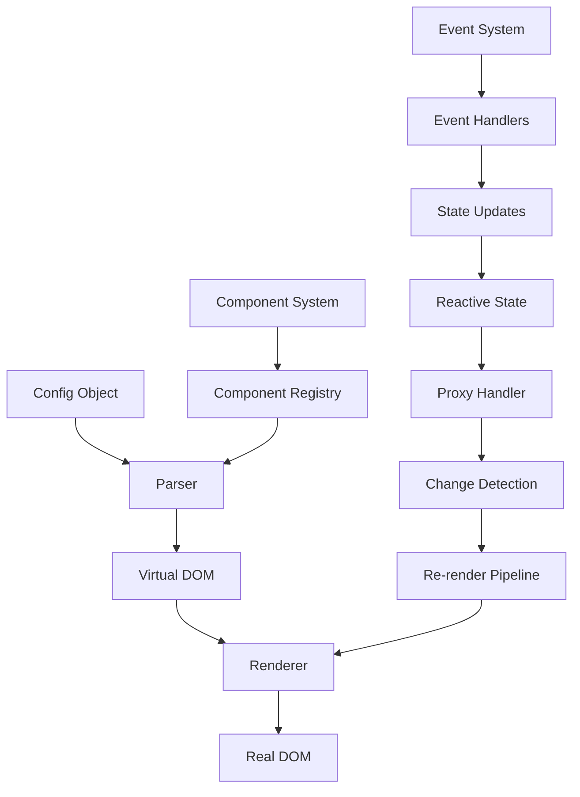
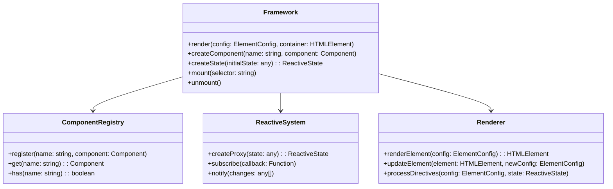
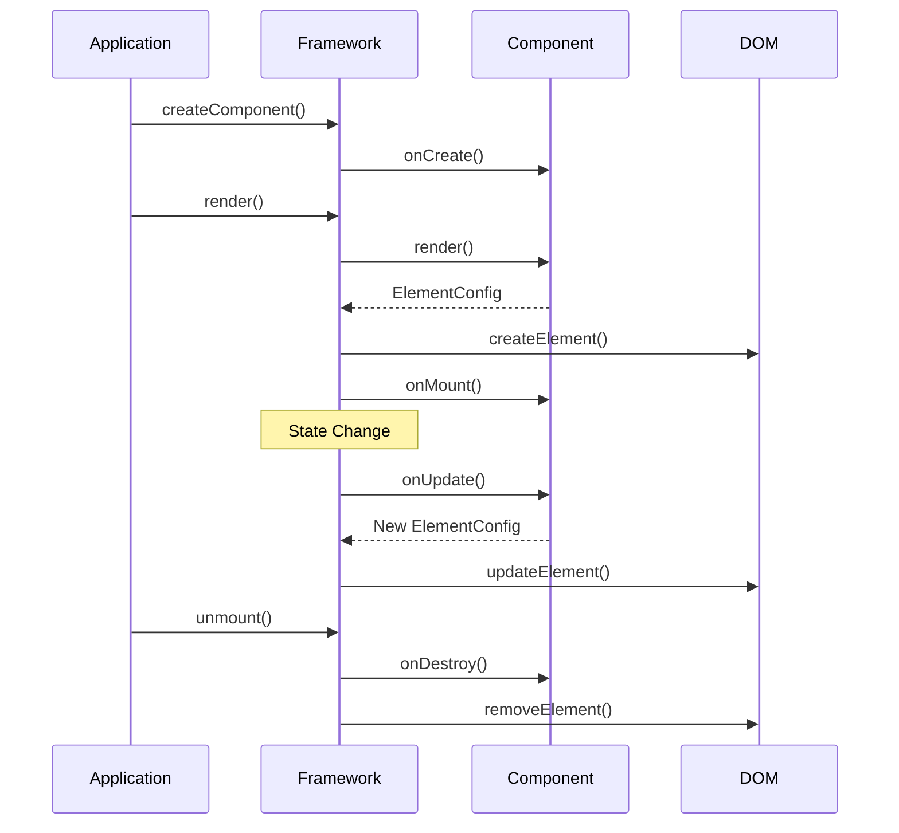
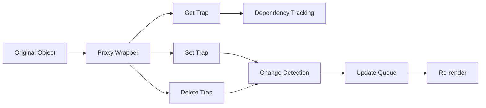
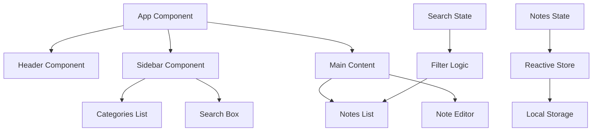

# Дизайн JS Framework - Реактивный Фреймворк Рендеринга

## Обзор

Мини JS-фреймворк для рендеринга HTML из конфигурационных объектов с поддержкой реактивности на основе Proxy. Фреймворк обеспечивает декларативное создание пользовательских интерфейсов через JSON-конфигурацию и автоматическое обновление DOM при изменении данных.

### Основные возможности
- Рендеринг HTML из JSON-конфигурации
- Реактивность на основе Proxy API
- Компонентная архитектура
- TypeScript поддержка
- Сборка через Vite в единый файл
- Динамическое обновление DOM

## Технологический стек

| Технология | Назначение |
|------------|------------|
| TypeScript | Основной язык разработки |
| Vite | Сборщик и dev-сервер |
| Proxy API | Система реактивности |
| DOM API | Манипуляции с DOM |

## Архитектура фреймворка



### Ядро фреймворка

#### 1. Система конфигурации
```typescript
interface ElementConfig {
  tag: string;
  props?: {
    class?: string;
    id?: string;
    style?: Record<string, string>;
    [key: string]: any;
  };
  children?: (ElementConfig | string)[];
  component?: string;
  events?: Record<string, Function>;
}
```

#### 2. Система реактивности
```typescript
interface ReactiveState {
  [key: string]: any;
}

interface ProxyHandler {
  get(target: any, prop: string): any;
  set(target: any, prop: string, value: any): boolean;
  deleteProperty(target: any, prop: string): boolean;
}
```

#### 3. Компонентная система
```typescript
interface Component {
  name: string;
  render(props: any, state: ReactiveState): ElementConfig;
  onCreate?(): void;
  onMount?(): void;
  onUpdate?(): void;
  onDestroy?(): void;
}
```

## Спецификация конфигурирования

### Базовая конфигурация элементов

#### HTML элементы
```json
{
  "tag": "div",
  "props": {
    "class": "container",
    "id": "main-wrapper",
    "style": {
      "background": "#f0f0f0",
      "padding": "20px"
    }
  },
  "children": [
    {
      "tag": "h1",
      "props": {
        "class": "title"
      },
      "children": ["Заголовок страницы"]
    }
  ]
}
```

#### Компоненты
```json
{
  "component": "Button",
  "props": {
    "text": "Нажми меня",
    "variant": "primary",
    "onClick": "handleClick"
  }
}
```

#### События
```json
{
  "tag": "button",
  "props": {
    "class": "btn"
  },
  "events": {
    "click": "handleButtonClick",
    "mouseover": "handleHover"
  },
  "children": ["Кнопка"]
}
```

### Реактивное состояние

```typescript
const state = createReactiveState({
  user: {
    name: "Иван",
    age: 25
  },
  items: [
    { id: 1, title: "Элемент 1" },
    { id: 2, title: "Элемент 2" }
  ],
  isLoading: false
});
```

### Привязка данных
```json
{
  "tag": "div",
  "props": {
    "class": "user-info"
  },
  "children": [
    {
      "tag": "span",
      "children": ["{{state.user.name}}"]
    },
    {
      "tag": "span",
      "children": ["Возраст: {{state.user.age}}"]
    }
  ]
}
```

### Условный рендеринг
```json
{
  "tag": "div",
  "if": "state.isLoading",
  "children": ["Загрузка..."]
}
```

### Циклы
```json
{
  "tag": "ul",
  "children": {
    "for": "item in state.items",
    "template": {
      "tag": "li",
      "props": {
        "key": "{{item.id}}"
      },
      "children": ["{{item.title}}"]
    }
  }
}
```

## Архитектура компонентов

### Структура компонентов



### Жизненный цикл компонентов



## API фреймворка

### Основные методы

#### Framework.render()
```typescript
Framework.render(config: ElementConfig, container: HTMLElement | string): void
```

#### Framework.createComponent()
```typescript
Framework.createComponent(name: string, component: Component): void
```

#### Framework.createState()
```typescript
Framework.createState<T>(initialState: T): ReactiveState<T>
```

#### Framework.mount()
```typescript
Framework.mount(selector: string): void
```

### Хуки и утилиты

#### useState()
```typescript
function useState<T>(initialValue: T): [T, (newValue: T) => void]
```

#### useEffect()
```typescript
function useEffect(callback: () => void, dependencies?: any[]): void
```

#### createElement()
```typescript
function createElement(tag: string, props?: any, ...children: any[]): ElementConfig
```

## Система сборки

### Конфигурация Vite
```typescript
// vite.config.ts
export default defineConfig({
  build: {
    lib: {
      entry: 'src/index.ts',
      name: 'JSFramework',
      fileName: 'js-framework',
      formats: ['iife']
    },
    rollupOptions: {
      output: {
        inlineDynamicImports: true
      }
    }
  }
});
```

### Структура проекта
```
src/
├── core/
│   ├── framework.ts
│   ├── renderer.ts
│   ├── reactive.ts
│   └── component.ts
├── utils/
│   ├── parser.ts
│   ├── helpers.ts
│   └── types.ts
├── components/
│   ├── base/
│   └── index.ts
└── index.ts

dist/
└── js-framework.js

examples/
├── basic/
├── todo-app/
└── notes-app/
```

## Система реактивности

### Proxy-based реактивность



### Отслеживание зависимостей
```typescript
interface Dependency {
  target: any;
  key: string;
  component?: Component;
  callback?: Function;
}

interface ReactiveEffect {
  fn: Function;
  deps: Set<Dependency>;
  active: boolean;
}
```

## Тестирование

### Модульные тесты
- Тестирование системы реактивности
- Тестирование рендерера
- Тестирование компонентной системы
- Тестирование парсера конфигурации

### Интеграционные тесты
- Тестирование полного цикла рендеринга
- Тестирование взаимодействия компонентов
- Тестирование обновления состояния

### End-to-End тесты
- Тестирование примеров приложений
- Тестирование производительности
- Тестирование совместимости браузеров

## Производительность

### Оптимизации
- Батчинг обновлений DOM
- Мемоизация рендера компонентов
- Lazy loading компонентов
- Оптимизация сравнения состояний

### Метрики
- Время первого рендера
- Время обновления состояния
- Размер bundle
- Потребление памяти

## Примеры использования

### Базовый пример
```typescript
import { Framework } from './js-framework';

const app = new Framework();

const config = {
  tag: 'div',
  props: { class: 'app' },
  children: [
    {
      tag: 'h1',
      children: ['Мой фреймворк']
    }
  ]
};

app.render(config, '#app');
```

### Компонент с состоянием
```typescript
const CounterComponent = {
  name: 'Counter',
  render(props, state) {
    return {
      tag: 'div',
      children: [
        {
          tag: 'span',
          children: [`Счетчик: ${state.count}`]
        },
        {
          tag: 'button',
          events: {
            click: () => state.count++
          },
          children: ['Увеличить']
        }
      ]
    };
  }
};
```

## Планирование спринтов

### Спринт 1: Базовая инфраструктура (2 недели)

#### Цели спринта
- Создать основу фреймворка с базовым рендерингом
- Реализовать систему конфигурации
- Настроить сборку через Vite

#### Задачи

**Неделя 1:**
1. **Настройка проекта**
   - Инициализация TypeScript проекта
   - Настройка Vite конфигурации
   - Создание базовой структуры папок
   - Настройка ESLint и Prettier

2. **Базовый парсер конфигурации**
   - Создание типов для ElementConfig
   - Реализация валидации конфигурации
   - Обработка ошибок парсинга

3. **Простой рендерер**
   - Создание HTML элементов из конфигурации
   - Применение атрибутов и классов
   - Рендеринг текстового содержимого

**Неделя 2:**
4. **Система событий**
   - Привязка обработчиков событий
   - Контекст выполнения событий
   - Очистка слушателей при размонтировании

5. **Базовые тесты**
   - Unit тесты для парсера
   - Unit тесты для рендерера
   - Интеграционные тесты рендеринга

6. **Первая сборка**
   - Создание entry point
   - Сборка в один файл
   - Тестирование в браузере

#### Критерии готовности
- [x] Проект собирается без ошибок
- [x] Можно отрендерить простую HTML структуру
- [x] События корректно привязываются
- [x] Покрытие тестами >80%
- [x] Документация API

#### Результат
Рабочий MVP фреймворка, способный рендерить статические HTML структуры с событиями.

---

### Спринт 2: Реактивность и компоненты (3 недели)

#### Цели спринта
- Реализовать систему реактивности на Proxy
- Добавить компонентную архитектуру
- Реализовать динамическое обновление DOM

#### Задачи

**Неделя 1: Система реактивности**
1. **Proxy-based реактивность**
   - Создание reactive proxy обертки
   - Отслеживание изменений состояния
   - Система подписок на изменения

2. **Dependency tracking**
   - Отслеживание зависимостей компонентов
   - Сбор зависимостей при рендеринге
   - Инвалидация при изменениях

3. **Update queue**
   - Батчинг обновлений
   - Приоритизация обновлений
   - Предотвращение циклических обновлений

**Неделя 2: Компонентная система**
4. **Component registry**
   - Регистрация компонентов
   - Поиск и инстанцирование
   - Валидация компонентов

5. **Жизненный цикл**
   - onCreate, onMount, onUpdate, onDestroy
   - Управление состоянием компонента
   - Очистка ресурсов

6. **Props и State**
   - Передача свойств компонентам
   - Изоляция состояния компонентов
   - Реактивность состояния

**Неделя 3: Динамические обновления**
7. **DOM diffing**
   - Сравнение старого и нового состояния
   - Минимальные изменения DOM
   - Сохранение состояния элементов

8. **Template directives**
   - Условный рендеринг (v-if)
   - Циклы (v-for)
   - Привязка данных ({{}})

9. **Оптимизации**
   - Мемоизация компонентов
   - Lazy loading
   - Debouncing обновлений

#### Критерии готовности
- [x] Состояние автоматически обновляет DOM
- [x] Компоненты корректно монтируются/размонтируются
- [x] Жизненный цикл компонентов работает
- [x] Директивы v-if и v-for функциональны
- [x] Производительность: <16мс на обновление

#### Результат
Полнофункциональный реактивный фреймворк с компонентной архитектурой.

---

### Спринт 3: Продвинутые возможности и оптимизации (2 недели)

#### Цели спринта
- Добавить продвинутые возможности
- Оптимизировать производительность
- Подготовить к production использованию

#### Задачи

**Неделя 1: Продвинутые возможности**
1. **Routing система**
   - Клиентский роутинг
   - История навигации
   - Lazy loading маршрутов

2. **Хуки системы**
   - useState хук
   - useEffect хук
   - Custom hooks поддержка

3. **Продвинутые директивы**
   - v-model (двусторонняя привязка)
   - v-show/v-hide
   - Custom directives API

4. **Slot система**
   - Named slots
   - Scoped slots
   - Fallback content

**Неделя 2: Оптимизации и production ready**
5. **Performance оптимизации**
   - Virtual scrolling
   - Component memoization
   - Bundle size оптимизация

6. **Developer experience**
   - TypeScript декларации
   - Dev tools поддержка
   - Error boundaries
   - Hot module replacement

7. **Production готовность**
   - Minification и tree shaking
   - Source maps
   - Полная документация
   - Migration guide

8. **Тестирование и примеры**
   - E2E тесты
   - Performance тесты
   - Создание примеров приложений
   - Бенчмарки производительности

#### Критерии готовности
- [x] Полная TypeScript поддержка
- [x] Bundle size <50KB gzipped
- [x] Performance: 60fps при сложных обновлениях
- [x] Полная документация и примеры
- [x] Production ready сборка

#### Результат
Готовый к production использованию JS фреймворк с полным набором возможностей.

---

## Пример приложения: Текстовые заметки

### Описание идеи
Приложение для создания и управления текстовыми заметками, демонстрирующее возможности нашего фреймворка. Приложение включает создание, редактирование, удаление заметок, поиск и категоризацию.

### Функциональные требования

#### Основные возможности
1. **Управление заметками**
   - Создание новой заметки
   - Редактирование существующей заметки
   - Удаление заметки
   - Автосохранение при вводе

2. **Организация**
   - Группировка по категориям
   - Теги для заметок
   - Поиск по содержимому
   - Сортировка по дате/названию

3. **Интерфейс**
   - Список всех заметок
   - Редактор заметок
   - Боковая панель категорий
   - Поисковая строка

### Архитектура приложения



### Компонентная структура

#### App Component
```typescript
const App = {
  name: 'App',
  render(props, state) {
    return {
      tag: 'div',
      props: { class: 'notes-app' },
      children: [
        { component: 'Header' },
        {
          tag: 'div',
          props: { class: 'app-body' },
          children: [
            { component: 'Sidebar', props: { categories: state.categories } },
            { component: 'MainContent', props: { notes: state.filteredNotes } }
          ]
        }
      ]
    };
  }
};
```

#### Note Editor Component
```typescript
const NoteEditor = {
  name: 'NoteEditor',
  render(props, state) {
    return {
      tag: 'div',
      props: { class: 'note-editor' },
      children: [
        {
          tag: 'input',
          props: {
            type: 'text',
            class: 'note-title',
            placeholder: 'Заголовок заметки',
            value: state.currentNote.title
          },
          events: {
            input: (e) => {
              state.currentNote.title = e.target.value;
              debounce(() => saveNote(state.currentNote), 500);
            }
          }
        },
        {
          tag: 'textarea',
          props: {
            class: 'note-content',
            placeholder: 'Начните писать...',
            value: state.currentNote.content
          },
          events: {
            input: (e) => {
              state.currentNote.content = e.target.value;
              debounce(() => saveNote(state.currentNote), 500);
            }
          }
        }
      ]
    };
  }
};
```

#### Notes List Component
```typescript
const NotesList = {
  name: 'NotesList',
  render(props, state) {
    return {
      tag: 'div',
      props: { class: 'notes-list' },
      children: {
        for: 'note in props.notes',
        template: {
          component: 'NoteItem',
          props: {
            note: '{{note}}',
            isActive: '{{note.id === state.activeNoteId}}'
          }
        }
      }
    };
  }
};
```

### Состояние приложения

```typescript
const appState = createReactiveState({
  notes: [
    {
      id: 1,
      title: 'Первая заметка',
      content: 'Содержимое первой заметки',
      category: 'личное',
      tags: ['важное', 'идеи'],
      createdAt: new Date(),
      updatedAt: new Date()
    }
  ],
  categories: ['личное', 'работа', 'проекты'],
  currentNote: null,
  activeNoteId: null,
  searchQuery: '',
  selectedCategory: 'all',
  
  // Computed properties
  get filteredNotes() {
    let filtered = this.notes;
    
    if (this.searchQuery) {
      filtered = filtered.filter(note => 
        note.title.includes(this.searchQuery) ||
        note.content.includes(this.searchQuery)
      );
    }
    
    if (this.selectedCategory !== 'all') {
      filtered = filtered.filter(note => 
        note.category === this.selectedCategory
      );
    }
    
    return filtered.sort((a, b) => b.updatedAt - a.updatedAt);
  }
});
```

### Бизнес-логика

```typescript
// Создание новой заметки
function createNote() {
  const newNote = {
    id: Date.now(),
    title: 'Новая заметка',
    content: '',
    category: appState.selectedCategory === 'all' ? 'личное' : appState.selectedCategory,
    tags: [],
    createdAt: new Date(),
    updatedAt: new Date()
  };
  
  appState.notes.push(newNote);
  appState.activeNoteId = newNote.id;
  appState.currentNote = newNote;
}

// Сохранение заметки
function saveNote(note) {
  const existingNote = appState.notes.find(n => n.id === note.id);
  if (existingNote) {
    Object.assign(existingNote, {
      ...note,
      updatedAt: new Date()
    });
  }
  
  // Сохранение в localStorage
  localStorage.setItem('notes', JSON.stringify(appState.notes));
}

// Удаление заметки
function deleteNote(noteId) {
  const index = appState.notes.findIndex(n => n.id === noteId);
  if (index !== -1) {
    appState.notes.splice(index, 1);
    
    if (appState.activeNoteId === noteId) {
      appState.activeNoteId = null;
      appState.currentNote = null;
    }
  }
}

// Поиск заметок
function searchNotes(query) {
  appState.searchQuery = query;
}

// Фильтрация по категории
function filterByCategory(category) {
  appState.selectedCategory = category;
}
```

### Стили приложения

```css
.notes-app {
  display: flex;
  flex-direction: column;
  height: 100vh;
  font-family: -apple-system, BlinkMacSystemFont, 'Segoe UI', Roboto, sans-serif;
}

.app-body {
  display: flex;
  flex: 1;
  overflow: hidden;
}

.sidebar {
  width: 250px;
  background: #f5f5f5;
  border-right: 1px solid #ddd;
  padding: 20px;
}

.notes-list {
  width: 300px;
  border-right: 1px solid #ddd;
  overflow-y: auto;
}

.note-editor {
  flex: 1;
  display: flex;
  flex-direction: column;
  padding: 20px;
}

.note-title {
  font-size: 24px;
  font-weight: bold;
  border: none;
  outline: none;
  margin-bottom: 20px;
  padding: 10px 0;
  border-bottom: 2px solid #eee;
}

.note-content {
  flex: 1;
  border: none;
  outline: none;
  resize: none;
  font-size: 16px;
  line-height: 1.6;
}
```

### Инициализация приложения

```typescript
import { Framework } from './js-framework';

// Создание экземпляра фреймворка
const app = new Framework();

// Регистрация компонентов
app.createComponent('App', App);
app.createComponent('Header', Header);
app.createComponent('Sidebar', Sidebar);
app.createComponent('NotesList', NotesList);
app.createComponent('NoteItem', NoteItem);
app.createComponent('NoteEditor', NoteEditor);

// Загрузка данных из localStorage
const savedNotes = localStorage.getItem('notes');
if (savedNotes) {
  appState.notes = JSON.parse(savedNotes);
}

// Монтирование приложения
app.render(
  { component: 'App' },
  '#app'
);
```

### Демонстрируемые возможности фреймворка

1. **Реактивность**: Автоматическое обновление интерфейса при изменении заметок
2. **Компоненты**: Модульная архитектура с переиспользуемыми компонентами
3. **События**: Обработка пользовательского ввода и взаимодействий
4. **Директивы**: Использование циклов для отображения списков
5. **Computed свойства**: Фильтрация и поиск заметок
6. **Жизненный цикл**: Сохранение данных при изменениях
7. **State management**: Centralized управление состоянием приложения

Это приложение заметок демонстрирует все основные возможности фреймворка и может служить как полноценный пример для изучения и развития.