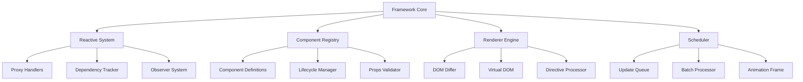
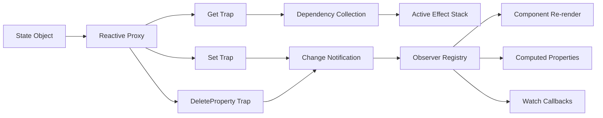
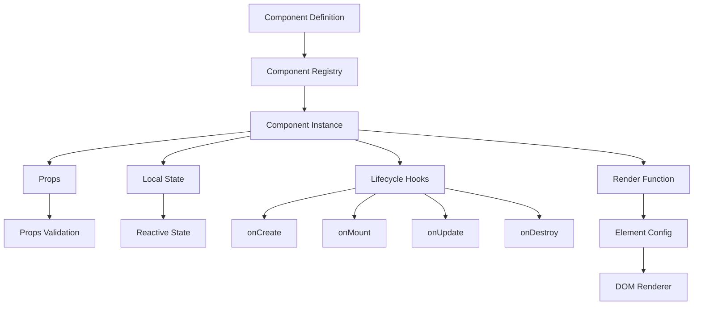
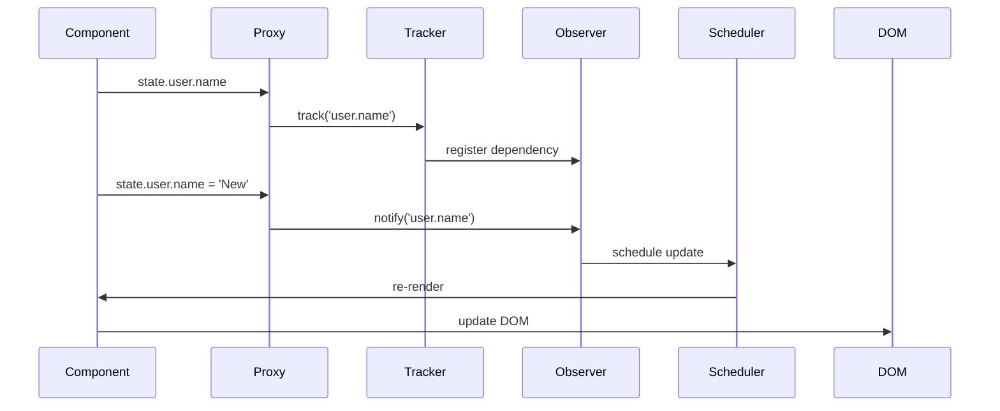
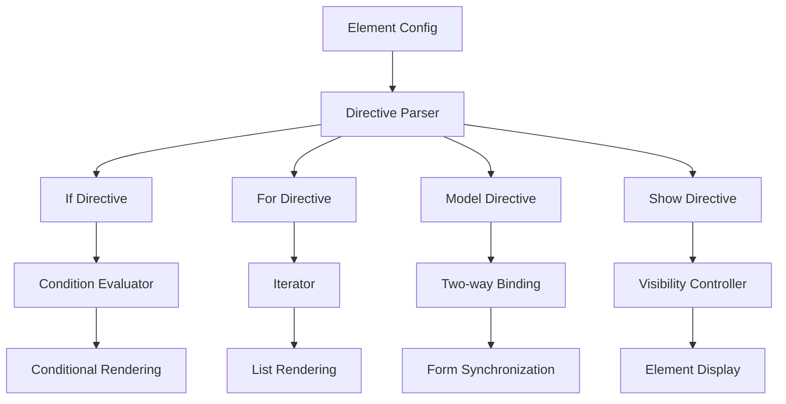
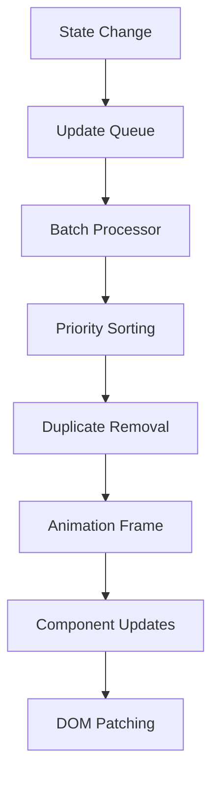
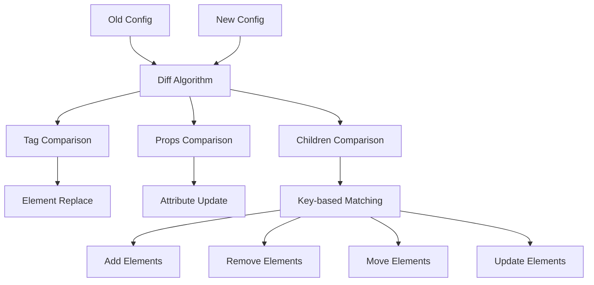
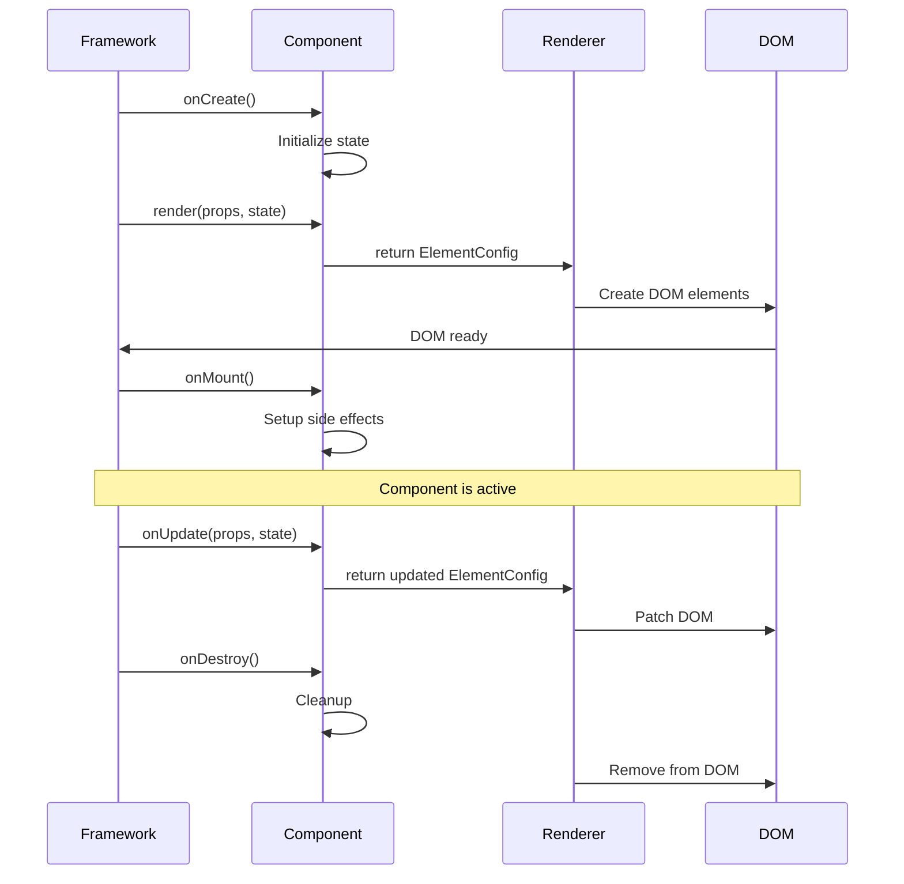

# Дизайн второго спринта: Реактивность и компонентная система

## Обзор

Второй спринт направлен на реализацию ключевых возможностей современного JavaScript фреймворка: реактивной системы состояния на основе Proxy API и полноценной компонентной архитектуры с поддержкой однофайловых компонентов. Это превратит наш базовый рендерер в полнофункциональный фреймворк для создания современных веб-приложений.

## Архитектура системы

### Общая архитектура фреймворка



### Архитектура реактивной системы



## Компонентная система

### Архитектура компонентов



### Структура однофайлового компонента

Каждый компонент может быть определен в отдельном файле следующего формата:

```typescript
// Button.component.ts
export const ButtonComponent: Component = {
  name: 'Button',
  
  props: {
    text: { type: 'string', default: 'Кнопка' },
    variant: { type: 'string', default: 'primary' },
    size: { type: 'string', default: 'medium' },
    disabled: { type: 'boolean', default: false }
  },
  
  state: () => ({
    isPressed: false,
    clickCount: 0
  }),
  
  render(props, state) {
    return {
      tag: 'button',
      props: {
        class: `btn btn-${props.variant} btn-${props.size} ${state.isPressed ? 'pressed' : ''}`,
        disabled: props.disabled
      },
      events: {
        mousedown: () => { state.isPressed = true; },
        mouseup: () => { state.isPressed = false; },
        click: () => { 
          state.clickCount++;
          props.onClick?.(state.clickCount);
        }
      },
      children: [props.text]
    };
  },
  
  onCreate() {
    console.log('Button component created');
  },
  
  onMount() {
    console.log('Button component mounted');
  },
  
  onUpdate(changedProps, changedState) {
    console.log('Button updated:', { changedProps, changedState });
  },
  
  onDestroy() {
    console.log('Button component destroyed');
  }
};
```

### Типы данных компонентной системы

#### Базовые интерфейсы

```typescript
interface Component {
  name: string;
  props?: ComponentProps;
  state?: () => Record<string, any>;
  render(props: any, state: any): ElementConfig;
  
  // Lifecycle hooks
  onCreate?(): void;
  onMount?(): void;
  onUpdate?(changedProps: string[], changedState: string[]): void;
  onDestroy?(): void;
}

interface ComponentProps {
  [key: string]: PropDefinition;
}

interface PropDefinition {
  type: 'string' | 'number' | 'boolean' | 'object' | 'array' | 'function';
  default?: any;
  required?: boolean;
  validator?: (value: any) => boolean;
}

interface ComponentInstance {
  id: string;
  component: Component;
  props: any;
  state: any;
  element: HTMLElement | null;
  mounted: boolean;
  dependencies: Set<string>;
}
```

#### Расширение ElementConfig для поддержки компонентов

```typescript
interface ElementConfig {
  tag?: string;
  component?: string;
  props?: ElementProps;
  children?: ElementChild[];
  events?: EventHandlers;
  
  // Директивы
  if?: string;
  for?: string;
  model?: string;
  show?: boolean;
  
  // Ключ для оптимизации списков
  key?: string | number;
  
  // Слоты для композиции
  slots?: Record<string, ElementChild[]>;
}
```

## Реактивная система состояния

### Архитектура Proxy-based реактивности



### Реализация реактивного состояния

```typescript
class ReactiveState {
  private observers = new Map<string, Set<Function>>();
  private activeEffect: Function | null = null;
  
  createReactive<T extends object>(target: T): T {
    return new Proxy(target, {
      get(obj, prop, receiver) {
        // Отслеживание доступа к свойству
        if (this.activeEffect) {
          this.track(target, prop);
        }
        
        const value = Reflect.get(obj, prop, receiver);
        
        // Рекурсивная реактивность для вложенных объектов
        if (typeof value === 'object' && value !== null) {
          return this.createReactive(value);
        }
        
        return value;
      },
      
      set(obj, prop, value, receiver) {
        const oldValue = obj[prop];
        const result = Reflect.set(obj, prop, value, receiver);
        
        // Уведомление об изменении
        if (oldValue !== value) {
          this.trigger(target, prop);
        }
        
        return result;
      },
      
      deleteProperty(obj, prop) {
        const result = Reflect.deleteProperty(obj, prop);
        this.trigger(target, prop);
        return result;
      }
    });
  }
  
  private track(target: object, prop: string | symbol) {
    const key = this.getKey(target, prop);
    if (!this.observers.has(key)) {
      this.observers.set(key, new Set());
    }
    this.observers.get(key)!.add(this.activeEffect!);
  }
  
  private trigger(target: object, prop: string | symbol) {
    const key = this.getKey(target, prop);
    const effects = this.observers.get(key);
    if (effects) {
      effects.forEach(effect => {
        this.scheduler.schedule(effect);
      });
    }
  }
}
```

## Система директив

### Архитектура директив



### Реализация основных директив

#### Условный рендеринг (v-if)

```typescript
class IfDirective {
  process(config: ElementConfig, context: RenderContext): ElementConfig | null {
    if (!config.if) return config;
    
    const condition = this.evaluateExpression(config.if, context.state);
    
    if (condition) {
      // Удаляем директиву из конфига и возвращаем элемент
      const { if: _, ...cleanConfig } = config;
      return cleanConfig;
    }
    
    return null; // Элемент не рендерится
  }
  
  private evaluateExpression(expression: string, state: any): boolean {
    // Безопасная оценка выражения
    try {
      const func = new Function('state', `return ${expression}`);
      return Boolean(func(state));
    } catch (error) {
      console.warn('Ошибка в выражении if:', expression, error);
      return false;
    }
  }
}
```

#### Рендеринг списков (v-for)

```typescript
class ForDirective {
  process(config: ElementConfig, context: RenderContext): ElementConfig[] {
    if (!config.for) return [config];
    
    const { items, itemName } = this.parseForExpression(config.for);
    const itemsArray = this.evaluateExpression(items, context.state);
    
    if (!Array.isArray(itemsArray)) {
      console.warn('v-for требует массив:', items);
      return [];
    }
    
    return itemsArray.map((item, index) => {
      const itemContext = {
        ...context,
        state: {
          ...context.state,
          [itemName]: item,
          [`${itemName}Index`]: index
        }
      };
      
      return {
        ...config.template,
        key: config.key ? this.evaluateExpression(config.key, itemContext.state) : index
      };
    });
  }
  
  private parseForExpression(expression: string): { items: string, itemName: string } {
    const match = expression.match(/(\w+)\s+in\s+(.+)/);
    if (!match) {
      throw new Error('Неверный синтаксис v-for. Используйте: "item in items"');
    }
    return { itemName: match[1], items: match[2] };
  }
}
```

## Планировщик обновлений

### Архитектура планировщика



### Реализация планировщика

```typescript
class UpdateScheduler {
  private updateQueue = new Set<Function>();
  private isFlushPending = false;
  private isFlushActive = false;
  
  schedule(effect: Function) {
    this.updateQueue.add(effect);
    
    if (!this.isFlushPending) {
      this.isFlushPending = true;
      requestAnimationFrame(() => this.flushUpdates());
    }
  }
  
  private flushUpdates() {
    if (this.isFlushActive) return;
    
    this.isFlushActive = true;
    this.isFlushPending = false;
    
    try {
      const effects = Array.from(this.updateQueue);
      this.updateQueue.clear();
      
      // Выполняем все обновления в одном батче
      effects.forEach(effect => {
        try {
          effect();
        } catch (error) {
          console.error('Ошибка при выполнении эффекта:', error);
        }
      });
    } finally {
      this.isFlushActive = false;
    }
  }
  
  nextTick(callback: Function) {
    if (this.isFlushPending) {
      // Добавляем в очередь после текущих обновлений
      this.updateQueue.add(() => {
        requestAnimationFrame(() => callback());
      });
    } else {
      requestAnimationFrame(() => callback());
    }
  }
}
```

## DOM Diffing и оптимизации

### Алгоритм сравнения конфигураций



### Реализация DOM диффинга

```typescript
class DOMDiffer {
  diff(oldConfig: ElementConfig, newConfig: ElementConfig): DiffResult {
    const patches: Patch[] = [];
    
    // Сравнение тегов
    if (oldConfig.tag !== newConfig.tag) {
      patches.push({
        type: 'REPLACE',
        oldConfig,
        newConfig
      });
      return { patches };
    }
    
    // Сравнение свойств
    const propPatches = this.diffProps(oldConfig.props, newConfig.props);
    patches.push(...propPatches);
    
    // Сравнение дочерних элементов
    const childPatches = this.diffChildren(oldConfig.children, newConfig.children);
    patches.push(...childPatches);
    
    return { patches };
  }
  
  private diffChildren(
    oldChildren: ElementChild[] = [], 
    newChildren: ElementChild[] = []
  ): Patch[] {
    const patches: Patch[] = [];
    const maxLength = Math.max(oldChildren.length, newChildren.length);
    
    for (let i = 0; i < maxLength; i++) {
      const oldChild = oldChildren[i];
      const newChild = newChildren[i];
      
      if (!oldChild && newChild) {
        patches.push({ type: 'ADD', index: i, config: newChild });
      } else if (oldChild && !newChild) {
        patches.push({ type: 'REMOVE', index: i });
      } else if (oldChild && newChild) {
        if (typeof oldChild === 'string' && typeof newChild === 'string') {
          if (oldChild !== newChild) {
            patches.push({ type: 'TEXT_UPDATE', index: i, text: newChild });
          }
        } else if (typeof oldChild === 'object' && typeof newChild === 'object') {
          const childDiff = this.diff(oldChild, newChild);
          if (childDiff.patches.length > 0) {
            patches.push({ type: 'UPDATE', index: i, patches: childDiff.patches });
          }
        }
      }
    }
    
    return patches;
  }
}
```

## Жизненный цикл компонентов

### Последовательность жизненного цикла



### Менеджер жизненного цикла

```typescript
class LifecycleManager {
  private activeComponents = new Map<string, ComponentInstance>();
  
  createComponent(component: Component, props: any): ComponentInstance {
    const instance: ComponentInstance = {
      id: this.generateId(),
      component,
      props: this.validateProps(props, component.props),
      state: this.createComponentState(component.state),
      element: null,
      mounted: false,
      dependencies: new Set()
    };
    
    // Вызов onCreate
    try {
      component.onCreate?.();
    } catch (error) {
      console.error('Ошибка в onCreate:', error);
    }
    
    this.activeComponents.set(instance.id, instance);
    return instance;
  }
  
  mountComponent(instance: ComponentInstance, container: HTMLElement) {
    if (instance.mounted) return;
    
    // Рендеринг компонента
    const config = instance.component.render(instance.props, instance.state);
    instance.element = this.renderer.render(config, container);
    instance.mounted = true;
    
    // Вызов onMount
    try {
      instance.component.onMount?.();
    } catch (error) {
      console.error('Ошибка в onMount:', error);
    }
  }
  
  updateComponent(instance: ComponentInstance, newProps?: any) {
    if (!instance.mounted) return;
    
    const oldProps = instance.props;
    const oldState = { ...instance.state };
    
    if (newProps) {
      instance.props = this.validateProps(newProps, instance.component.props);
    }
    
    // Определение изменений
    const changedProps = this.getChangedKeys(oldProps, instance.props);
    const changedState = this.getChangedKeys(oldState, instance.state);
    
    if (changedProps.length > 0 || changedState.length > 0) {
      // Вызов onUpdate
      try {
        instance.component.onUpdate?.(changedProps, changedState);
      } catch (error) {
        console.error('Ошибка в onUpdate:', error);
      }
      
      // Перерендеринг
      const newConfig = instance.component.render(instance.props, instance.state);
      this.renderer.update(instance.element!, newConfig);
    }
  }
  
  destroyComponent(instance: ComponentInstance) {
    if (!instance.mounted) return;
    
    // Вызов onDestroy
    try {
      instance.component.onDestroy?.();
    } catch (error) {
      console.error('Ошибка в onDestroy:', error);
    }
    
    // Очистка DOM
    if (instance.element) {
      this.renderer.unmount(instance.element);
      instance.element = null;
    }
    
    instance.mounted = false;
    this.activeComponents.delete(instance.id);
  }
}
```

## Интеграция с системой сборки

### Поддержка однофайловых компонентов в Vite

```typescript
// vite.config.ts
import { defineConfig } from 'vite';

export default defineConfig({
  build: {
    lib: {
      entry: 'src/index.ts',
      name: 'JSFramework',
      fileName: 'js-framework',
      formats: ['iife', 'es', 'cjs']
    },
    rollupOptions: {
      external: [],
      output: {
        globals: {}
      }
    }
  },
  plugins: [
    // Плагин для обработки .component.ts файлов
    {
      name: 'component-loader',
      transform(code, id) {
        if (id.endsWith('.component.ts')) {
          // Автоматическая регистрация компонента
          return `${code}\n\nFramework.registerComponent(${getComponentName(id)});`;
        }
      }
    }
  ]
});
```

### Автоматическая регистрация компонентов

```typescript
// src/utils/component-loader.ts
export function loadComponents(componentModules: Record<string, any>) {
  Object.entries(componentModules).forEach(([path, module]) => {
    const component = module.default || module[Object.keys(module)[0]];
    if (component && component.name) {
      Framework.registerComponent(component);
    }
  });
}

// Автоматическое подключение всех компонентов
const components = import.meta.glob('./components/**/*.component.ts', { eager: true });
loadComponents(components);
```

## Тестирование

### Стратегия тестирования

| Компонент | Тип тестов | Покрытие | Инструменты |
|-----------|------------|----------|-------------|
| Reactive System | Unit | 95%+ | Jest, Proxy mocks |
| Component Registry | Unit | 90%+ | Jest |
| Lifecycle Manager | Unit + Integration | 90%+ | Jest, DOM Testing |
| Directives | Unit | 85%+ | Jest |
| DOM Differ | Unit | 95%+ | Jest |
| Scheduler | Unit | 90%+ | Jest, Timer mocks |

### Примеры тестов

```typescript
// reactive.test.ts
describe('Reactive System', () => {
  test('должен отслеживать изменения свойств', () => {
    const state = createReactive({ count: 0 });
    const mockEffect = jest.fn();
    
    effect(() => mockEffect(state.count));
    
    state.count = 1;
    
    expect(mockEffect).toHaveBeenCalledWith(1);
  });
  
  test('должен поддерживать вложенную реактивность', () => {
    const state = createReactive({ 
      user: { name: 'Ivan', age: 25 } 
    });
    const mockEffect = jest.fn();
    
    effect(() => mockEffect(state.user.name));
    
    state.user.name = 'Peter';
    
    expect(mockEffect).toHaveBeenCalledWith('Peter');
  });
});

// component.test.ts
describe('Component System', () => {
  test('должен корректно регистрировать компоненты', () => {
    const TestComponent = {
      name: 'Test',
      render: () => ({ tag: 'div', children: ['Test'] })
    };
    
    Framework.registerComponent(TestComponent);
    
    expect(Framework.getComponent('Test')).toBe(TestComponent);
  });
  
  test('должен вызывать хуки жизненного цикла', () => {
    const hooks = {
      onCreate: jest.fn(),
      onMount: jest.fn(),
      onDestroy: jest.fn()
    };
    
    const TestComponent = {
      name: 'LifecycleTest',
      ...hooks,
      render: () => ({ tag: 'div' })
    };
    
    const instance = Framework.createComponent(TestComponent, {});
    Framework.mountComponent(instance, document.body);
    Framework.destroyComponent(instance);
    
    expect(hooks.onCreate).toHaveBeenCalled();
    expect(hooks.onMount).toHaveBeenCalled();
    expect(hooks.onDestroy).toHaveBeenCalled();
  });
});
```

## Метрики производительности

### Целевые показатели

| Метрика | Цель | Измерение |
|---------|------|-----------|
| Создание реактивного состояния | < 1ms | 1000 свойств |
| Регистрация компонента | < 0.5ms | Один компонент |
| Рендеринг компонента | < 5ms | Простой компонент |
| Обновление состояния | < 16ms | 1000 элементов |
| DOM diffing | < 10ms | 100 изменений |
| Размер bundle | < 15KB | minified + gzip |

### Инструменты профилирования

```typescript
// src/utils/profiler.ts
export class PerformanceProfiler {
  private measurements = new Map<string, number[]>();
  
  measure<T>(name: string, fn: () => T): T {
    const start = performance.now();
    const result = fn();
    const end = performance.now();
    
    if (!this.measurements.has(name)) {
      this.measurements.set(name, []);
    }
    this.measurements.get(name)!.push(end - start);
    
    return result;
  }
  
  getStats(name: string) {
    const times = this.measurements.get(name) || [];
    if (times.length === 0) return null;
    
    const avg = times.reduce((a, b) => a + b) / times.length;
    const min = Math.min(...times);
    const max = Math.max(...times);
    
    return { avg, min, max, count: times.length };
  }
  
  report() {
    console.table(
      Array.from(this.measurements.keys()).map(name => ({
        Operation: name,
        ...this.getStats(name)
      }))
    );
  }
}
```

## Реализация спринта

### День 1-3: Proxy-based реактивность

#### Шаг 1: Расширение типов для реактивности

Добавляем новые типы в `src/core/types.ts`:

```typescript
/**
 * Реактивные типы для системы состояния
 */
export interface ReactiveState<T = any> {
  readonly __isReactive: true;
  readonly __raw: T;
}

export interface EffectFunction {
  (): void;
  deps?: Set<string>;
  cleanup?: () => void;
}

export interface DependencyTracker {
  target: object;
  key: string | symbol;
  effects: Set<EffectFunction>;
}

/**
 * Типы компонентной системы
 */
export interface Component {
  name: string;
  props?: ComponentProps;
  state?: () => Record<string, any>;
  render(props: any, state: any): ElementConfig;
  
  // Lifecycle hooks
  onCreate?(): void;
  onMount?(): void;
  onUpdate?(changedProps: string[], changedState: string[]): void;
  onDestroy?(): void;
}

export interface ComponentProps {
  [key: string]: PropDefinition;
}

export interface PropDefinition {
  type: 'string' | 'number' | 'boolean' | 'object' | 'array' | 'function';
  default?: any;
  required?: boolean;
  validator?: (value: any) => boolean;
}

export interface ComponentInstance {
  id: string;
  component: Component;
  props: any;
  state: any;
  element: HTMLElement | null;
  mounted: boolean;
  dependencies: Set<string>;
}

/**
 * Расширение ElementConfig для поддержки компонентов и директив
 */
export interface ExtendedElementConfig extends ElementConfig {
  component?: string;
  
  // Директивы
  if?: string;
  for?: string;
  model?: string;
  show?: boolean;
  
  // Ключ для оптимизации списков
  key?: string | number;
  
  // Слоты для композиции
  slots?: Record<string, ElementChild[]>;
  
  // Шаблон для директив
  template?: ExtendedElementConfig;
}

/**
 * Результат DOM диффинга
 */
export interface DiffResult {
  patches: Patch[];
}

export interface Patch {
  type: 'REPLACE' | 'ADD' | 'REMOVE' | 'TEXT_UPDATE' | 'UPDATE' | 'PROPS_UPDATE';
  index?: number;
  config?: ExtendedElementConfig;
  text?: string;
  patches?: Patch[];
  props?: Record<string, any>;
  oldConfig?: ExtendedElementConfig;
  newConfig?: ExtendedElementConfig;
}
```

#### Шаг 2: Создание реактивной системы

Создаем файл `src/core/reactive.ts`:

```typescript
/**
 * Реактивная система состояния на основе Proxy API
 */

import type { ReactiveState, EffectFunction, DependencyTracker } from './types';

// Глобальный стек активных эффектов
let activeEffect: EffectFunction | null = null;
const effectStack: EffectFunction[] = [];

// Реестр зависимостей
const targetMap = new WeakMap<object, Map<string | symbol, Set<EffectFunction>>>();

// Набор реактивных объектов
const reactiveMap = new WeakMap<object, any>();
const rawMap = new WeakMap<any, object>();

/**
 * Создает реактивный объект с помощью Proxy
 */
export function createReactive<T extends object>(target: T): T & ReactiveState<T> {
  // Проверяем, не является ли объект уже реактивным
  if (reactiveMap.has(target)) {
    return reactiveMap.get(target);
  }
  
  // Проверяем, не является ли объект уже Proxy другого объекта
  if (rawMap.has(target)) {
    return target as T & ReactiveState<T>;
  }
  
  const proxy = new Proxy(target, {
    get(obj: any, prop: string | symbol, receiver: any) {
      // Специальные свойства реактивного объекта
      if (prop === '__isReactive') {
        return true;
      }
      if (prop === '__raw') {
        return target;
      }
      
      // Отслеживаем доступ к свойству
      track(target, prop);
      
      const value = Reflect.get(obj, prop, receiver);
      
      // Рекурсивно делаем вложенные объекты реактивными
      if (typeof value === 'object' && value !== null) {
        return createReactive(value);
      }
      
      return value;
    },
    
    set(obj: any, prop: string | symbol, value: any, receiver: any) {
      const oldValue = obj[prop];
      const result = Reflect.set(obj, prop, value, receiver);
      
      // Уведомляем об изменении только если значение действительно изменилось
      if (oldValue !== value) {
        trigger(target, prop);
      }
      
      return result;
    },
    
    deleteProperty(obj: any, prop: string | symbol) {
      const hadKey = Object.prototype.hasOwnProperty.call(obj, prop);
      const result = Reflect.deleteProperty(obj, prop);
      
      if (hadKey && result) {
        trigger(target, prop);
      }
      
      return result;
    },
    
    has(obj: any, prop: string | symbol) {
      track(target, prop);
      return Reflect.has(obj, prop);
    },
    
    ownKeys(obj: any) {
      track(target, Array.isArray(obj) ? 'length' : Symbol('ownKeys'));
      return Reflect.ownKeys(obj);
    }
  });
  
  // Сохраняем связи между оригинальным объектом и прокси
  reactiveMap.set(target, proxy);
  rawMap.set(proxy, target);
  
  return proxy as T & ReactiveState<T>;
}

/**
 * Отслеживает доступ к свойству объекта
 */
function track(target: object, key: string | symbol) {
  // Если нет активного эффекта, отслеживание не нужно
  if (!activeEffect) {
    return;
  }
  
  let depsMap = targetMap.get(target);
  if (!depsMap) {
    depsMap = new Map();
    targetMap.set(target, depsMap);
  }
  
  let deps = depsMap.get(key);
  if (!deps) {
    deps = new Set();
    depsMap.set(key, deps);
  }
  
  deps.add(activeEffect);
  
  // Добавляем зависимость к эффекту
  if (!activeEffect.deps) {
    activeEffect.deps = new Set();
  }
  activeEffect.deps.add(`${String(key)}`);
}

/**
 * Уведомляет об изменении свойства
 */
function trigger(target: object, key: string | symbol) {
  const depsMap = targetMap.get(target);
  if (!depsMap) {
    return;
  }
  
  const effects = depsMap.get(key);
  if (!effects) {
    return;
  }
  
  // Создаем копию, чтобы избежать бесконечных циклов
  const effectsToRun = new Set(effects);
  
  effectsToRun.forEach(effect => {
    // Избегаем самозапуска эффекта
    if (effect !== activeEffect) {
      scheduleEffect(effect);
    }
  });
}

/**
 * Планировщик для выполнения эффектов
 */
let isFlushPending = false;
let flushIndex = 0;
const pendingEffects = new Set<EffectFunction>();

function scheduleEffect(effect: EffectFunction) {
  pendingEffects.add(effect);
  
  if (!isFlushPending) {
    isFlushPending = true;
    Promise.resolve().then(flushEffects);
  }
}

function flushEffects() {
  try {
    const effects = Array.from(pendingEffects);
    pendingEffects.clear();
    
    effects.forEach(effect => {
      try {
        runEffect(effect);
      } catch (error) {
        console.error('Ошибка при выполнении реактивного эффекта:', error);
      }
    });
  } finally {
    isFlushPending = false;
  }
}

/**
 * Выполняет эффект с правильным контекстом
 */
function runEffect(effect: EffectFunction) {
  if (effectStack.includes(effect)) {
    console.warn('Обнаружен циклический эффект');
    return;
  }
  
  try {
    effectStack.push(effect);
    activeEffect = effect;
    
    // Очищаем старые зависимости
    if (effect.deps) {
      effect.deps.clear();
    }
    
    effect();
  } finally {
    effectStack.pop();
    activeEffect = effectStack[effectStack.length - 1] || null;
  }
}

/**
 * Создает реактивный эффект
 */
export function effect(fn: () => void): () => void {
  const effectFn: EffectFunction = () => {
    fn();
  };
  
  // Сразу выполняем эффект для сбора зависимостей
  runEffect(effectFn);
  
  // Возвращаем функцию для остановки эффекта
  return () => {
    stopEffect(effectFn);
  };
}

/**
 * Останавливает эффект
 */
function stopEffect(effect: EffectFunction) {
  // Удаляем эффект из всех зависимостей
  targetMap.forEach(depsMap => {
    depsMap.forEach(deps => {
      deps.delete(effect);
    });
  });
  
  pendingEffects.delete(effect);
  
  if (effect.cleanup) {
    effect.cleanup();
  }
}

/**
 * Проверяет, является ли объект реактивным
 */
export function isReactive(value: any): value is ReactiveState {
  return !!(value && value.__isReactive);
}

/**
 * Получает оригинальный объект из реактивного
 */
export function toRaw<T>(observed: T): T {
  const raw = observed && (observed as any).__raw;
  return raw || observed;
}

/**
 * Создает вычисляемое свойство
 */
export function computed<T>(getter: () => T): { value: T } {
  let value: T;
  let dirty = true;
  
  const effectFn: EffectFunction = () => {
    if (dirty) {
      value = getter();
      dirty = false;
    }
  };
  
  // Помечаем как грязное при изменении зависимостей
  const originalEffect = effectFn;
  effectFn.cleanup = () => {
    dirty = true;
  };
  
  runEffect(effectFn);
  
  return {
    get value() {
      if (dirty) {
        runEffect(effectFn);
      }
      track(computed, 'value');
      return value;
    }
  };
}
```

#### Шаг 3: Создание планировщика обновлений

Создаем файл `src/core/scheduler.ts`:

```typescript
/**
 * Планировщик обновлений для оптимизации рендеринга
 */

export interface SchedulerJob {
  (): void;
  id?: number;
  priority?: number;
}

export class UpdateScheduler {
  private updateQueue = new Set<SchedulerJob>();
  private isFlushPending = false;
  private isFlushActive = false;
  private flushIndex = 0;
  private postFlushCallbacks: (() => void)[] = [];
  
  /**
   * Планирует выполнение задачи
   */
  schedule(job: SchedulerJob) {
    this.updateQueue.add(job);
    
    if (!this.isFlushPending && !this.isFlushActive) {
      this.isFlushPending = true;
      this.nextTick(() => this.flushJobs());
    }
  }
  
  /**
   * Выполняет все задачи в очереди
   */
  private flushJobs() {
    this.isFlushPending = false;
    this.isFlushActive = true;
    
    try {
      // Сортируем задачи по приоритету
      const jobs = Array.from(this.updateQueue).sort((a, b) => {
        const priorityA = a.priority || 0;
        const priorityB = b.priority || 0;
        return priorityA - priorityB;
      });
      
      this.updateQueue.clear();
      
      // Выполняем задачи
      for (this.flushIndex = 0; this.flushIndex < jobs.length; this.flushIndex++) {
        const job = jobs[this.flushIndex];
        try {
          job();
        } catch (error) {
          console.error('Ошибка при выполнении задачи планировщика:', error);
        }
      }
      
      // Выполняем post-flush колбэки
      this.flushPostFlushCallbacks();
    } finally {
      this.flushIndex = 0;
      this.isFlushActive = false;
      
      // Если во время выполнения появились новые задачи
      if (this.updateQueue.size > 0) {
        this.schedule(() => {});
      }
    }
  }
  
  /**
   * Выполняет колбэки после завершения обновлений
   */
  private flushPostFlushCallbacks() {
    if (this.postFlushCallbacks.length > 0) {
      const callbacks = [...this.postFlushCallbacks];
      this.postFlushCallbacks.length = 0;
      
      callbacks.forEach(callback => {
        try {
          callback();
        } catch (error) {
          console.error('Ошибка в post-flush колбэке:', error);
        }
      });
    }
  }
  
  /**
   * Добавляет колбэк для выполнения после следующего обновления
   */
  nextTick(callback: () => void): Promise<void> {
    return new Promise(resolve => {
      this.postFlushCallbacks.push(() => {
        callback();
        resolve();
      });
      
      if (!this.isFlushPending && !this.isFlushActive) {
        Promise.resolve().then(() => this.flushPostFlushCallbacks());
      }
    });
  }
  
  /**
   * Очищает очередь обновлений
   */
  clear() {
    this.updateQueue.clear();
    this.postFlushCallbacks.length = 0;
    this.isFlushPending = false;
  }
  
  /**
   * Проверяет, есть ли ожидающие обновления
   */
  hasPendingUpdates(): boolean {
    return this.updateQueue.size > 0 || this.isFlushPending;
  }
}

```

#### Шаг 4: Создание системы компонентов

Создаем файл `src/core/component.ts`:

```typescript
/**
 * Система управления компонентами
 */

import type { Component, ComponentInstance, ComponentProps, PropDefinition } from './types';
import { createReactive, effect, isReactive } from './reactive';
import { scheduler } from './scheduler';

let componentIdCounter = 0;

class ComponentRegistry {
  private components = new Map<string, Component>();
  private instances = new Map<string, ComponentInstance>();
  
  /**
   * Регистрирует компонент в системе
   */
  registerComponent(component: Component) {
    if (!component.name) {
      throw new Error('Компонент должен иметь имя');
    }
    
    if (this.components.has(component.name)) {
      console.warn(`Компонент "${component.name}" уже зарегистрирован. Переопределяю.`);
    }
    
    this.components.set(component.name, component);
  }
  
  /**
   * Получает компонент по имени
   */
  getComponent(name: string): Component | undefined {
    return this.components.get(name);
  }
  
  /**
   * Проверяет, существует ли компонент
   */
  hasComponent(name: string): boolean {
    return this.components.has(name);
  }
  
  /**
   * Создает экземпляр компонента
   */
  createInstance(componentName: string, props: any = {}): ComponentInstance {
    const component = this.getComponent(componentName);
    if (!component) {
      throw new Error(`Компонент "${componentName}" не найден`);
    }
    
    const id = `component_${++componentIdCounter}`;
    
    // Валидация и нормализация props
    const validatedProps = this.validateProps(props, component.props);
    
    // Создание состояния компонента
    const initialState = typeof component.state === 'function' 
      ? component.state() 
      : {};
    const reactiveState = createReactive(initialState);
    
    const instance: ComponentInstance = {
      id,
      component,
      props: validatedProps,
      state: reactiveState,
      element: null,
      mounted: false,
      dependencies: new Set()
    };
    
    this.instances.set(id, instance);
    
    // Вызов onCreate
    try {
      component.onCreate?.call(instance);
    } catch (error) {
      console.error(`Ошибка в onCreate компонента "${componentName}":`, error);
    }
    
    return instance;
  }
  
  /**
   * Монтирует компонент
   */
  mountInstance(instance: ComponentInstance, container: HTMLElement): HTMLElement {
    if (instance.mounted) {
      console.warn(`Компонент "${instance.component.name}" уже смонтирован`);
      return instance.element!;
    }
    
    // Создание эффекта для реактивного рендеринга
    const renderEffect = () => {
      try {
        const config = instance.component.render(instance.props, instance.state);
        
        if (instance.element) {
          // Обновление существующего элемента
          this.updateElement(instance, config);
        } else {
          // Первоначальное создание элемента
          instance.element = this.createElement(config, container);
          container.appendChild(instance.element);
        }
      } catch (error) {
        console.error(`Ошибка при рендеринге компонента "${instance.component.name}":`, error);
      }
    };
    
    // Создание реактивного эффекта
    const stopEffect = effect(renderEffect);
    instance.effectCleanup = stopEffect;
    
    instance.mounted = true;
    
    // Вызов onMount
    try {
      instance.component.onMount?.call(instance);
    } catch (error) {
      console.error(`Ошибка в onMount компонента "${instance.component.name}":`, error);
    }
    
    return instance.element!;
  }
  
  /**
   * Размонтирует компонент
   */
  unmountInstance(instance: ComponentInstance) {
    if (!instance.mounted) {
      return;
    }
    
    // Вызов onDestroy
    try {
      instance.component.onDestroy?.call(instance);
    } catch (error) {
      console.error(`Ошибка в onDestroy компонента "${instance.component.name}":`, error);
    }
    
    // Очистка реактивного эффекта
    if (instance.effectCleanup) {
      instance.effectCleanup();
    }
    
    // Удаление из DOM
    if (instance.element && instance.element.parentNode) {
      instance.element.parentNode.removeChild(instance.element);
    }
    
    instance.mounted = false;
    instance.element = null;
    
    // Удаление из реестра
    this.instances.delete(instance.id);
  }
  
  /**
   * Обновляет props компонента
   */
  updateProps(instance: ComponentInstance, newProps: any) {
    const oldProps = { ...instance.props };
    const validatedProps = this.validateProps(newProps, instance.component.props);
    
    // Определяем изменившиеся props
    const changedProps: string[] = [];
    Object.keys(validatedProps).forEach(key => {
      if (validatedProps[key] !== oldProps[key]) {
        changedProps.push(key);
      }
    });
    
    if (changedProps.length > 0) {
      instance.props = validatedProps;
      
      // Вызов onUpdate
      try {
        instance.component.onUpdate?.call(instance, changedProps, []);
      } catch (error) {
        console.error(`Ошибка в onUpdate компонента "${instance.component.name}":`, error);
      }
    }
  }
  
  /**
   * Валидация props компонента
   */
  private validateProps(props: any, propDefinitions?: ComponentProps): any {
    if (!propDefinitions) {
      return props;
    }
    
    const validatedProps: any = {};
    
    // Проверяем каждое определение свойства
    Object.entries(propDefinitions).forEach(([key, definition]) => {
      const value = props[key];
      
      // Проверка обязательности
      if (definition.required && (value === undefined || value === null)) {
        throw new Error(`Обязательное свойство "${key}" не передано`);
      }
      
      // Использование значения по умолчанию
      const finalValue = value !== undefined ? value : definition.default;
      
      // Валидация типа
      if (finalValue !== undefined && !this.validatePropType(finalValue, definition)) {
        throw new Error(`Свойство "${key}" имеет неправильный тип. Ожидается: ${definition.type}`);
      }
      
      // Пользовательская валидация
      if (finalValue !== undefined && definition.validator && !definition.validator(finalValue)) {
        throw new Error(`Свойство "${key}" не прошло пользовательскую валидацию`);
      }
      
      validatedProps[key] = finalValue;
    });
    
    // Добавляем дополнительные props, которые не определены в схеме
    Object.keys(props).forEach(key => {
      if (!(key in propDefinitions)) {
        validatedProps[key] = props[key];
      }
    });
    
    return validatedProps;
  }
  
  /**
   * Проверка типа свойства
   */
  private validatePropType(value: any, definition: PropDefinition): boolean {
    switch (definition.type) {
      case 'string':
        return typeof value === 'string';
      case 'number':
        return typeof value === 'number' && !isNaN(value);
      case 'boolean':
        return typeof value === 'boolean';
      case 'object':
        return typeof value === 'object' && value !== null && !Array.isArray(value);
      case 'array':
        return Array.isArray(value);
      case 'function':
        return typeof value === 'function';
      default:
        return true;
    }
  }
  
  /**
   * Создает DOM элемент из конфигурации
   */
  private createElement(config: any, container: HTMLElement): HTMLElement {
    // Простая реализация создания элемента
    // В реальной реализации здесь будет использоваться полный рендерер
    const element = document.createElement(config.tag || 'div');
    
    if (config.props) {
      Object.entries(config.props).forEach(([key, value]) => {
        if (key === 'class') {
          element.className = value as string;
        } else if (key === 'style' && typeof value === 'object') {
          Object.assign(element.style, value);
        } else {
          element.setAttribute(key, String(value));
        }
      });
    }
    
    if (config.children) {
      config.children.forEach((child: any) => {
        if (typeof child === 'string') {
          element.appendChild(document.createTextNode(child));
        } else {
          element.appendChild(this.createElement(child, element));
        }
      });
    }
    
    return element;
  }
  
  /**
   * Обновляет существующий элемент
   */
  private updateElement(instance: ComponentInstance, config: any) {
    // Простая реализация обновления
    // В реальной реализации здесь будет использоваться DOM diffing
    if (instance.element) {
      const newElement = this.createElement(config, instance.element.parentElement!);
      instance.element.parentNode?.replaceChild(newElement, instance.element);
      instance.element = newElement;
    }
  }
  
  /**
   * Получает все зарегистрированные компоненты
   */
  getAllComponents(): Component[] {
    return Array.from(this.components.values());
  }
  
  /**
   * Получает все активные экземпляры
   */
  getAllInstances(): ComponentInstance[] {
    return Array.from(this.instances.values());
  }
  
  /**
   * Очищает реестр
   */
  clear() {
    // Размонтируем все активные экземпляры
    this.instances.forEach(instance => {
      this.unmountInstance(instance);
    });
    
    this.components.clear();
    this.instances.clear();
  }
}

// Глобальный экземпляр реестра компонентов
export const componentRegistry = new ComponentRegistry();

// Удобные функции
export function registerComponent(component: Component) {
  componentRegistry.registerComponent(component);
}

export function createComponentInstance(name: string, props?: any) {
  return componentRegistry.createInstance(name, props);
}

export function mountComponent(instance: ComponentInstance, container: HTMLElement) {
  return componentRegistry.mountInstance(instance, container);
}

export function unmountComponent(instance: ComponentInstance) {
  componentRegistry.unmountInstance(instance);
}
```

#### Шаг 5: Система директив

Создаем файл `src/directives/index.ts`:

```typescript
/**
 * Система директив для расширения возможностей рендеринга
 */

import type { ElementConfig } from '../core/types';

export interface DirectiveContext {
  element: HTMLElement;
  config: ElementConfig;
  state: any;
  props: any;
}

export interface DirectiveResult {
  shouldRender: boolean;
  modifiedConfig?: ElementConfig;
  elements?: ElementConfig[];
}

/**
 * Базовый класс для директив
 */
export abstract class BaseDirective {
  abstract name: string;
  abstract process(config: ElementConfig, context: DirectiveContext): DirectiveResult;
}

/**
 * Директива условного рендеринга (v-if)
 */
export class IfDirective extends BaseDirective {
  name = 'if';
  
  process(config: ElementConfig, context: DirectiveContext): DirectiveResult {
    if (!config.if) {
      return { shouldRender: true };
    }
    
    const condition = this.evaluateExpression(config.if, context);
    
    if (condition) {
      // Удаляем директиву из конфига и возвращаем элемент
      const { if: _, ...cleanConfig } = config;
      return {
        shouldRender: true,
        modifiedConfig: cleanConfig
      };
    }
    
    return { shouldRender: false };
  }
  
  private evaluateExpression(expression: string, context: DirectiveContext): boolean {
    try {
      // Создаем безопасную функцию для оценки выражения
      const func = new Function('state', 'props', `
        try {
          return ${expression};
        } catch (e) {
          console.warn('Ошибка в выражении if:', e);
          return false;
        }
      `);
      
      return Boolean(func(context.state, context.props));
    } catch (error) {
      console.warn('Ошибка в выражении if:', expression, error);
      return false;
    }
  }
}

/**
 * Директива рендеринга списков (v-for)
 */
export class ForDirective extends BaseDirective {
  name = 'for';
  
  process(config: ElementConfig, context: DirectiveContext): DirectiveResult {
    if (!config.for || !config.template) {
      return { shouldRender: true };
    }
    
    const { items, itemName, indexName } = this.parseForExpression(config.for);
    const itemsArray = this.evaluateExpression(items, context);
    
    if (!Array.isArray(itemsArray)) {
      console.warn('v-for требует массив:', items);
      return { shouldRender: false };
    }
    
    const elements = itemsArray.map((item, index) => {
      const itemContext = {
        ...context,
        state: {
          ...context.state,
          [itemName]: item,
          [indexName || `${itemName}Index`]: index
        }
      };
      
      // Обрабатываем шаблон для каждого элемента
      let processedTemplate = { ...config.template };
      
      // Интерполяция в дочерних элементах
      if (processedTemplate.children) {
        processedTemplate.children = this.interpolateChildren(
          processedTemplate.children,
          itemContext
        );
      }
      
      // Добавляем ключ для оптимизации
      if (config.key) {
        processedTemplate.key = this.evaluateExpression(config.key, itemContext);
      } else {
        processedTemplate.key = index;
      }
      
      return processedTemplate;
    });
    
    return {
      shouldRender: false,
      elements
    };
  }
  
  private parseForExpression(expression: string): {
    items: string;
    itemName: string;
    indexName?: string;
  } {
    // Поддерживаем синтаксис: "item in items" или "(item, index) in items"
    const match = expression.match(/(.+)\s+in\s+(.+)/);
    if (!match) {
      throw new Error(`Неверный синтаксис v-for: "${expression}". Используйте: "item in items"`);
    }
    
    const [, itemPart, items] = match;
    
    // Проверяем, есть ли деструктуризация (item, index)
    const destructureMatch = itemPart.trim().match(/^\(\s*(.+?)\s*,\s*(.+?)\s*\)$/);
    
    if (destructureMatch) {
      return {
        items: items.trim(),
        itemName: destructureMatch[1].trim(),
        indexName: destructureMatch[2].trim()
      };
    }
    
    return {
      items: items.trim(),
      itemName: itemPart.trim()
    };
  }
  
  private evaluateExpression(expression: string, context: DirectiveContext): any {
    try {
      const func = new Function('state', 'props', `return ${expression}`);
      return func(context.state, context.props);
    } catch (error) {
      console.warn('Ошибка в выражении for:', expression, error);
      return [];
    }
  }
  
  private interpolateChildren(children: any[], context: DirectiveContext): any[] {
    return children.map(child => {
      if (typeof child === 'string') {
        return this.interpolateString(child, context);
      } else if (typeof child === 'object' && child !== null) {
        return {
          ...child,
          children: child.children ? this.interpolateChildren(child.children, context) : undefined
        };
      }
      return child;
    });
  }
  
  private interpolateString(str: string, context: DirectiveContext): string {
    return str.replace(/\{\{\s*([^}]+)\s*\}\}/g, (match, expression) => {
      try {
        const result = this.evaluateExpression(expression.trim(), context);
        return String(result);
      } catch (error) {
        console.warn('Ошибка в интерполяции:', expression, error);
        return match;
      }
    });
  }
}

/**
 * Директива двусторонней привязки (v-model)
 */
export class ModelDirective extends BaseDirective {
  name = 'model';
  
  process(config: ElementConfig, context: DirectiveContext): DirectiveResult {
    if (!config.model) {
      return { shouldRender: true };
    }
    
    const { model, ...cleanConfig } = config;
    
    // Получаем текущее значение
    const currentValue = this.evaluateExpression(model, context);
    
    // Добавляем value к props
    const modifiedConfig = {
      ...cleanConfig,
      props: {
        ...cleanConfig.props,
        value: currentValue
      },
      events: {
        ...cleanConfig.events,
        input: (event: Event) => {
          const target = event.target as HTMLInputElement;
          this.updateValue(model, target.value, context);
          
          // Вызываем пользовательский обработчик, если есть
          if (cleanConfig.events?.input) {
            cleanConfig.events.input(event);
          }
        }
      }
    };
    
    return {
      shouldRender: true,
      modifiedConfig
    };
  }
  
  private evaluateExpression(expression: string, context: DirectiveContext): any {
    try {
      const func = new Function('state', 'props', `return ${expression}`);
      return func(context.state, context.props);
    } catch (error) {
      console.warn('Ошибка в выражении model:', expression, error);
      return '';
    }
  }
  
  private updateValue(expression: string, value: any, context: DirectiveContext) {
    try {
      // Простая реализация обновления значения
      // В реальности нужно парсить expression и обновлять соответствующее свойство
      const keys = expression.split('.');
      let obj = keys[0] === 'state' ? context.state : context.props;
      
      for (let i = 1; i < keys.length - 1; i++) {
        obj = obj[keys[i]];
      }
      
      obj[keys[keys.length - 1]] = value;
    } catch (error) {
      console.warn('Ошибка при обновлении значения model:', expression, error);
    }
  }
}

/**
 * Директива показа/скрытия элемента (v-show)
 */
export class ShowDirective extends BaseDirective {
  name = 'show';
  
  process(config: ElementConfig, context: DirectiveContext): DirectiveResult {
    if (config.show === undefined) {
      return { shouldRender: true };
    }
    
    const shouldShow = Boolean(config.show);
    const { show, ...cleanConfig } = config;
    
    // Добавляем или изменяем стиль display
    const modifiedConfig = {
      ...cleanConfig,
      props: {
        ...cleanConfig.props,
        style: {
          ...cleanConfig.props?.style,
          display: shouldShow ? '' : 'none'
        }
      }
    };
    
    return {
      shouldRender: true,
      modifiedConfig
    };
  }
}

/**
 * Менеджер директив
 */
export class DirectiveManager {
  private directives = new Map<string, BaseDirective>();
  
  constructor() {
    // Регистрируем встроенные директивы
    this.register(new IfDirective());
    this.register(new ForDirective());
    this.register(new ModelDirective());
    this.register(new ShowDirective());
  }
  
  /**
   * Регистрирует новую директиву
   */
  register(directive: BaseDirective) {
    this.directives.set(directive.name, directive);
  }
  
  /**
   * Обрабатывает конфигурацию с директивами
   */
  process(config: ElementConfig, context: DirectiveContext): DirectiveResult {
    let currentConfig = config;
    let result: DirectiveResult = { shouldRender: true };
    
    // Обрабатываем директивы в определенном порядке
    const directiveOrder = ['if', 'for', 'show', 'model'];
    
    for (const directiveName of directiveOrder) {
      const directive = this.directives.get(directiveName);
      if (directive && this.hasDirective(currentConfig, directiveName)) {
        result = directive.process(currentConfig, context);
        
        if (!result.shouldRender) {
          return result;
        }
        
        if (result.modifiedConfig) {
          currentConfig = result.modifiedConfig;
        }
        
        if (result.elements) {
          return result; // Для директив типа v-for
        }
      }
    }
    
    return {
      shouldRender: true,
      modifiedConfig: currentConfig
    };
  }
  
  /**
   * Проверяет, есть ли директива в конфигурации
   */
  private hasDirective(config: ElementConfig, directiveName: string): boolean {
    switch (directiveName) {
      case 'if':
        return !!config.if;
      case 'for':
        return !!config.for;
      case 'show':
        return config.show !== undefined;
      case 'model':
        return !!config.model;
      default:
        return false;
    }
  }
}

```

### День 4-7: DOM Diffing и оптимизации

#### Шаг 6: Алгоритм DOM Diffing

Создаем файл `src/utils/diff.ts`:

```typescript
/**
 * Алгоритм сравнения и оптимизации DOM обновлений
 */

import type { ElementConfig, Patch, DiffResult } from '../core/types';

/**
 * Основной класс для DOM диффинга
 */
export class DOMDiffer {
  /**
   * Сравнивает две конфигурации и возвращает список изменений
   */
  diff(oldConfig: ElementConfig | null, newConfig: ElementConfig | null): DiffResult {
    const patches: Patch[] = [];
    
    // Случай 1: старый и новый конфиг отсутствуют
    if (!oldConfig && !newConfig) {
      return { patches };
    }
    
    // Случай 2: добавление нового элемента
    if (!oldConfig && newConfig) {
      patches.push({
        type: 'ADD',
        index: 0,
        config: newConfig
      });
      return { patches };
    }
    
    // Случай 3: удаление элемента
    if (oldConfig && !newConfig) {
      patches.push({
        type: 'REMOVE',
        index: 0
      });
      return { patches };
    }
    
    // Случай 4: сравнение элементов
    if (oldConfig && newConfig) {
      // Проверяем, одинаковые ли типы элементов
      if (!this.isSameElementType(oldConfig, newConfig)) {
        patches.push({
          type: 'REPLACE',
          oldConfig,
          newConfig
        });
        return { patches };
      }
      
      // Сравниваем свойства
      const propPatches = this.diffProps(oldConfig.props, newConfig.props);
      if (propPatches.length > 0) {
        patches.push({
          type: 'PROPS_UPDATE',
          props: this.getPropsChanges(oldConfig.props, newConfig.props)
        });
      }
      
      // Сравниваем дочерние элементы
      const childPatches = this.diffChildren(
        oldConfig.children || [],
        newConfig.children || []
      );
      patches.push(...childPatches);
    }
    
    return { patches };
  }
  
  /**
   * Проверяет, являются ли элементы одним типом
   */
  private isSameElementType(oldConfig: ElementConfig, newConfig: ElementConfig): boolean {
    // Проверяем тег и имя компонента
    return oldConfig.tag === newConfig.tag && 
           oldConfig.component === newConfig.component;
  }
  
  /**
   * Сравнивает свойства элементов
   */
  private diffProps(oldProps: any = {}, newProps: any = {}): Patch[] {
    const patches: Patch[] = [];
    const changes = this.getPropsChanges(oldProps, newProps);
    
    if (Object.keys(changes).length > 0) {
      patches.push({
        type: 'PROPS_UPDATE',
        props: changes
      });
    }
    
    return patches;
  }
  
  /**
   * Определяет изменения в свойствах
   */
  private getPropsChanges(oldProps: any = {}, newProps: any = {}): Record<string, any> {
    const changes: Record<string, any> = {};
    
    // Проверяем новые и измененные свойства
    Object.keys(newProps).forEach(key => {
      if (oldProps[key] !== newProps[key]) {
        changes[key] = newProps[key];
      }
    });
    
    // Проверяем удаленные свойства
    Object.keys(oldProps).forEach(key => {
      if (!(key in newProps)) {
        changes[key] = null; // null означает удаление
      }
    });
    
    return changes;
  }
  
  /**
   * Сравнивает дочерние элементы с оптимизацией по ключам
   */
  private diffChildren(oldChildren: any[], newChildren: any[]): Patch[] {
    const patches: Patch[] = [];
    
    // Проверяем, есть ли ключи у элементов
    const hasKeys = this.hasKeys(oldChildren) || this.hasKeys(newChildren);
    
    if (hasKeys) {
      // Оптимизированное сравнение по ключам
      const keyedPatches = this.diffKeyedChildren(oldChildren, newChildren);
      patches.push(...keyedPatches);
    } else {
      // Простое последовательное сравнение
      const simplePatches = this.diffSimpleChildren(oldChildren, newChildren);
      patches.push(...simplePatches);
    }
    
    return patches;
  }
  
  /**
   * Проверяет, есть ли ключи у элементов
   */
  private hasKeys(children: any[]): boolean {
    return children.some(child => 
      typeof child === 'object' && child !== null && child.key !== undefined
    );
  }
  
  /**
   * Оптимизированное сравнение с использованием ключей
   */
  private diffKeyedChildren(oldChildren: any[], newChildren: any[]): Patch[] {
    const patches: Patch[] = [];
    
    // Создаем карты ключей
    const oldKeyMap = this.createKeyMap(oldChildren);
    const newKeyMap = this.createKeyMap(newChildren);
    
    // Определяем операции
    const operations = this.calculateKeyedOperations(oldKeyMap, newKeyMap, newChildren);
    
    operations.forEach(op => {
      switch (op.type) {
        case 'ADD':
          patches.push({
            type: 'ADD',
            index: op.index,
            config: op.config
          });
          break;
          
        case 'REMOVE':
          patches.push({
            type: 'REMOVE',
            index: op.index
          });
          break;
          
        case 'MOVE':
          patches.push({
            type: 'MOVE',
            from: op.from,
            to: op.to
          });
          break;
          
        case 'UPDATE':
          const childDiff = this.diff(op.oldConfig, op.newConfig);
          if (childDiff.patches.length > 0) {
            patches.push({
              type: 'UPDATE',
              index: op.index,
              patches: childDiff.patches
            });
          }
          break;
      }
    });
    
    return patches;
  }
  
  /**
   * Простое последовательное сравнение
   */
  private diffSimpleChildren(oldChildren: any[], newChildren: any[]): Patch[] {
    const patches: Patch[] = [];
    const maxLength = Math.max(oldChildren.length, newChildren.length);
    
    for (let i = 0; i < maxLength; i++) {
      const oldChild = oldChildren[i];
      const newChild = newChildren[i];
      
      if (!oldChild && newChild) {
        // Добавление нового элемента
        patches.push({
          type: 'ADD',
          index: i,
          config: newChild
        });
      } else if (oldChild && !newChild) {
        // Удаление элемента
        patches.push({
          type: 'REMOVE',
          index: i
        });
      } else if (oldChild && newChild) {
        if (typeof oldChild === 'string' && typeof newChild === 'string') {
          // Обновление текста
          if (oldChild !== newChild) {
            patches.push({
              type: 'TEXT_UPDATE',
              index: i,
              text: newChild
            });
          }
        } else if (typeof oldChild === 'object' && typeof newChild === 'object') {
          // Рекурсивное сравнение объектов
          const childDiff = this.diff(oldChild, newChild);
          if (childDiff.patches.length > 0) {
            patches.push({
              type: 'UPDATE',
              index: i,
              patches: childDiff.patches
            });
          }
        } else {
          // Разные типы - заменяем
          patches.push({
            type: 'REPLACE',
            index: i,
            oldConfig: oldChild,
            newConfig: newChild
          });
        }
      }
    }
    
    return patches;
  }
  
  /**
   * Создает карту ключей
   */
  private createKeyMap(children: any[]): Map<string | number, { config: any, index: number }> {
    const keyMap = new Map();
    
    children.forEach((child, index) => {
      if (typeof child === 'object' && child !== null && child.key !== undefined) {
        keyMap.set(child.key, { config: child, index });
      }
    });
    
    return keyMap;
  }
  
  /**
   * Вычисляет операции для элементов с ключами
   */
  private calculateKeyedOperations(
    oldKeyMap: Map<string | number, any>,
    newKeyMap: Map<string | number, any>,
    newChildren: any[]
  ): Array<any> {
    const operations: any[] = [];
    
    // Обрабатываем новые элементы
    newChildren.forEach((newChild, newIndex) => {
      if (typeof newChild === 'object' && newChild !== null && newChild.key !== undefined) {
        const key = newChild.key;
        const oldItem = oldKeyMap.get(key);
        
        if (oldItem) {
          // Элемент существовал
          if (oldItem.index !== newIndex) {
            operations.push({
              type: 'MOVE',
              from: oldItem.index,
              to: newIndex
            });
          }
          
          // Проверяем на обновления
          operations.push({
            type: 'UPDATE',
            index: newIndex,
            oldConfig: oldItem.config,
            newConfig: newChild
          });
        } else {
          // Новый элемент
          operations.push({
            type: 'ADD',
            index: newIndex,
            config: newChild
          });
        }
      }
    });
    
    // Обрабатываем удаленные элементы
    oldKeyMap.forEach((oldItem, key) => {
      if (!newKeyMap.has(key)) {
        operations.push({
          type: 'REMOVE',
          index: oldItem.index
        });
      }
    });
    
    return operations;
  }
}

/**
 * Класс для применения патчей к DOM
 */
export class DOMPatcher {
  /**
   * Применяет патчи к DOM элементу
   */
  patch(element: HTMLElement, patches: Patch[]) {
    patches.forEach(patch => {
      this.applyPatch(element, patch);
    });
  }
  
  /**
   * Применяет один патч
   */
  private applyPatch(element: HTMLElement, patch: Patch) {
    switch (patch.type) {
      case 'PROPS_UPDATE':
        this.updateProps(element, patch.props!);
        break;
        
      case 'TEXT_UPDATE':
        this.updateText(element, patch.index!, patch.text!);
        break;
        
      case 'ADD':
        this.addElement(element, patch.index!, patch.config!);
        break;
        
      case 'REMOVE':
        this.removeElement(element, patch.index!);
        break;
        
      case 'REPLACE':
        this.replaceElement(element, patch.index!, patch.oldConfig!, patch.newConfig!);
        break;
        
      case 'MOVE':
        this.moveElement(element, patch.from!, patch.to!);
        break;
        
      case 'UPDATE':
        const childElement = element.children[patch.index!] as HTMLElement;
        if (childElement && patch.patches) {
          this.patch(childElement, patch.patches);
        }
        break;
    }
  }
  
  /**
   * Обновляет свойства элемента
   */
  private updateProps(element: HTMLElement, props: Record<string, any>) {
    Object.entries(props).forEach(([key, value]) => {
      if (value === null) {
        // Удаление свойства
        if (key === 'class') {
          element.className = '';
        } else if (key === 'style') {
          element.removeAttribute('style');
        } else {
          element.removeAttribute(key);
        }
      } else {
        // Установка свойства
        if (key === 'class') {
          element.className = value;
        } else if (key === 'style' && typeof value === 'object') {
          Object.entries(value).forEach(([styleProp, styleValue]) => {
            (element.style as any)[styleProp] = styleValue;
          });
        } else {
          element.setAttribute(key, String(value));
        }
      }
    });
  }
  
  /**
   * Обновляет текст узла
   */
  private updateText(element: HTMLElement, index: number, text: string) {
    const textNode = element.childNodes[index];
    if (textNode && textNode.nodeType === Node.TEXT_NODE) {
      textNode.textContent = text;
    }
  }
  
  /**
   * Добавляет новый элемент
   */
  private addElement(parent: HTMLElement, index: number, config: ElementConfig) {
    const newElement = this.createElement(config);
    
    if (index >= parent.children.length) {
      parent.appendChild(newElement);
    } else {
      parent.insertBefore(newElement, parent.children[index]);
    }
  }
  
  /**
   * Удаляет элемент
   */
  private removeElement(parent: HTMLElement, index: number) {
    const child = parent.children[index];
    if (child) {
      parent.removeChild(child);
    }
  }
  
  /**
   * Заменяет элемент
   */
  private replaceElement(
    parent: HTMLElement, 
    index: number, 
    oldConfig: ElementConfig, 
    newConfig: ElementConfig
  ) {
    const oldElement = parent.children[index];
    const newElement = this.createElement(newConfig);
    
    if (oldElement) {
      parent.replaceChild(newElement, oldElement);
    }
  }
  
  /**
   * Перемещает элемент
   */
  private moveElement(parent: HTMLElement, from: number, to: number) {
    const element = parent.children[from];
    if (element) {
      parent.removeChild(element);
      
      if (to >= parent.children.length) {
        parent.appendChild(element);
      } else {
        parent.insertBefore(element, parent.children[to]);
      }
    }
  }
  
  /**
   * Создает DOM элемент из конфигурации
   */
  private createElement(config: ElementConfig): HTMLElement | Text {
    if (typeof config === 'string') {
      return document.createTextNode(config);
    }
    
    const element = document.createElement(config.tag || 'div');
    
    // Установка свойств
    if (config.props) {
      this.updateProps(element, config.props);
    }
    
    // Добавление дочерних элементов
    if (config.children) {
      config.children.forEach(child => {
        const childElement = this.createElement(child as ElementConfig);
        element.appendChild(childElement as Node);
      });
    }
    
    return element;
  }
}

```

#### Шаг 7: Интеграция всех систем

Обновляем `src/index.ts` для интеграции всех новых систем:

```typescript
/**
 * Обновленный основной класс JS фреймворка с реактивностью и компонентами
 */

// Основные классы
export { ConfigValidator } from './core/validator';
export { HTMLRenderer } from './core/renderer';

// Новые системы
export { createReactive, effect, computed, isReactive, toRaw } from './core/reactive';
export { componentRegistry, registerComponent, createComponentInstance, mountComponent, unmountComponent } from './core/component';
export { scheduler } from './core/scheduler';
export { directiveManager } from './directives';
export { domDiffer, domPatcher } from './utils/diff';

// Типы
export type { 
  ElementConfig, 
  ElementProps, 
  StyleProperties, 
  ElementChild, 
  EventHandlers,
  ValidationResult,
  ValidationError,
  RenderContext,
  EventListenerRecord,
  RendererOptions,
  RenderStats,
  // Новые типы
  ReactiveState,
  EffectFunction,
  Component,
  ComponentInstance,
  ComponentProps,
  PropDefinition,
  DiffResult,
  Patch,
  SchedulerJob
} from './core/types';

// Утилиты
export { 
  createElement, 
  isValidHtmlTag, 
  camelToKebab,
  escapeHtml,
  isElementConfig,
  cloneConfig,
  createTextNode,
  combineClasses,
  stylesToString
} from './utils/helpers';

import { ConfigValidator } from './core/validator';
import { HTMLRenderer } from './core/renderer';
import { createReactive, effect } from './core/reactive';
import { componentRegistry } from './core/component';
import { scheduler } from './core/scheduler';
import { directiveManager } from './directives';
import { domDiffer, domPatcher } from './utils/diff';
import type { ElementConfig, RendererOptions, Component, ReactiveState } from './core/types';

/**
 * Основной класс JS фреймворка с полной поддержкой реактивности
 */
export class JSFramework {
  private renderer: HTMLRenderer;
  private validator: ConfigValidator;
  private mountedElement: HTMLElement | null;
  private currentConfig: ElementConfig | null;
  private globalState: any;
  private effectCleanup: (() => void) | null;

  constructor(options?: RendererOptions) {
    this.renderer = new HTMLRenderer(options);
    this.validator = new ConfigValidator();
    this.mountedElement = null;
    this.currentConfig = null;
    this.globalState = null;
    this.effectCleanup = null;
  }

  /**
   * Создает реактивное состояние
   */
  createState<T extends object>(initialState: T): T & ReactiveState<T> {
    return createReactive(initialState);
  }

  /**
   * Регистрирует компонент
   */
  registerComponent(component: Component) {
    componentRegistry.registerComponent(component);
  }

  /**
   * Получает компонент по имени
   */
  getComponent(name: string) {
    return componentRegistry.getComponent(name);
  }

  /**
   * Рендеринг конфигурации с полной поддержкой реактивности
   */
  render(config: ElementConfig, container: HTMLElement | string, state?: any): HTMLElement {
    const containerElement = typeof container === 'string' 
      ? document.querySelector(container) as HTMLElement
      : container;

    if (!containerElement) {
      throw new Error('Контейнер не найден');
    }

    // Сохраняем состояние и конфигурацию
    if (state) {
      this.globalState = createReactive(state);
    }
    this.currentConfig = config;

    // Очистка предыдущего содержимого
    if (this.mountedElement) {
      this.unmount();
    }

    // Очистка контейнера
    containerElement.innerHTML = '';

    // Создание реактивного эффекта для рендеринга
    const renderEffect = () => {
      try {
        // Обработка директив
        const processedConfig = this.processDirectives(this.currentConfig!, {
          state: this.globalState,
          props: {}
        });

        if (this.mountedElement) {
          // Обновление с помощью DOM diffing
          this.updateWithDiff(processedConfig);
        } else {
          // Первоначальный рендеринг
          this.mountedElement = this.renderElement(processedConfig, containerElement);
        }
      } catch (error) {
        console.error('Ошибка при рендеринге:', error);
      }
    };

    // Создание реактивного эффекта
    this.effectCleanup = effect(renderEffect);

    return this.mountedElement!;
  }

  /**
   * Обработка директив в конфигурации
   */
  private processDirectives(config: ElementConfig, context: any): ElementConfig | ElementConfig[] {
    const directiveContext = {
      element: this.mountedElement!,
      config,
      state: context.state,
      props: context.props
    };

    const result = directiveManager.process(config, directiveContext);

    if (!result.shouldRender) {
      return null as any;
    }

    if (result.elements) {
      // Директива v-for вернула массив элементов
      return result.elements;
    }

    return result.modifiedConfig || config;
  }

  /**
   * Рендерит элемент с поддержкой компонентов
   */
  private renderElement(config: ElementConfig, container: HTMLElement): HTMLElement {
    // Проверяем, является ли это компонентом
    if (config.component) {
      const instance = componentRegistry.createInstance(config.component, config.props);
      return componentRegistry.mountInstance(instance, container);
    }

    // Обычный HTML элемент
    const element = this.renderer.render(config, container);
    return element;
  }

  /**
   * Обновление с помощью DOM diffing
   */
  private updateWithDiff(newConfig: ElementConfig | ElementConfig[]) {
    if (!this.mountedElement || !this.currentConfig) {
      return;
    }

    // Обработка массива элементов (для v-for)
    if (Array.isArray(newConfig)) {
      // Простая реализация - пересоздаем все элементы
      this.mountedElement.innerHTML = '';
      newConfig.forEach(config => {
        const element = this.renderElement(config, this.mountedElement!);
        this.mountedElement!.appendChild(element);
      });
      return;
    }

    // Вычисляем различия
    const diffResult = domDiffer.diff(this.currentConfig, newConfig);

    // Применяем патчи
    if (diffResult.patches.length > 0) {
      domPatcher.patch(this.mountedElement, diffResult.patches);
    }

    // Обновляем текущую конфигурацию
    this.currentConfig = newConfig;
  }

  /**
   * Размонтирование текущего элемента
   */
  unmount(): void {
    if (this.effectCleanup) {
      this.effectCleanup();
      this.effectCleanup = null;
    }

    if (this.mountedElement) {
      this.renderer.unmount(this.mountedElement);
      this.mountedElement = null;
    }

    this.currentConfig = null;
    this.globalState = null;
  }

  /**
   * Обновление состояния
   */
  updateState(newState: any) {
    if (this.globalState) {
      Object.assign(this.globalState, newState);
    }
  }

  /**
   * Получение текущего состояния
   */
  getState() {
    return this.globalState;
  }

  /**
   * Обновление текущего элемента новой конфигурацией
   */
  update(newConfig: ElementConfig): HTMLElement {
    if (!this.mountedElement) {
      throw new Error('Нет смонтированного элемента для обновления');
    }

    // Валидация новой конфигурации
    const validationResult = this.validator.validate(newConfig);
    if (!validationResult.isValid) {
      const errorMessages = validationResult.errors.map(e => e.message).join(', ');
      throw new Error(`Ошибка валидации: ${errorMessages}`);
    }

    this.currentConfig = newConfig;
    
    // Обновление произойдет автоматически через реактивный эффект
    
    return this.mountedElement;
  }

  /**
   * Планирование выполнения в следующем такте
   */
  nextTick(callback: () => void): Promise<void> {
    return scheduler.nextTick(callback);
  }

  /**
   * Получение статистики рендеринга
   */
  getStats() {
    return this.renderer.getStats();
  }

  /**
   * Поиск элемента по ID
   */
  findById(id: string): HTMLElement | null {
    if (!this.mountedElement) {
      return null;
    }
    return this.renderer.findElementById(this.mountedElement, id);
  }

  /**
   * Поиск элементов по классу
   */
  findByClass(className: string): HTMLElement[] {
    if (!this.mountedElement) {
      return [];
    }
    return this.renderer.findElementsByClass(this.mountedElement, className);
  }

  /**
   * Очистка всех ресурсов фреймворка
   */
  cleanup(): void {
    this.unmount();
    this.renderer.cleanup();
    this.validator.reset();
    componentRegistry.clear();
    scheduler.clear();
  }

  /**
   * Получение текущего смонтированного элемента
   */
  getMountedElement(): HTMLElement | null {
    return this.mountedElement;
  }

  /**
   * Получение списка всех зарегистрированных компонентов
   */
  getRegisteredComponents(): Component[] {
    return componentRegistry.getAllComponents();
  }

  /**
   * Получение списка всех активных экземпляров компонентов
   */
  getActiveInstances() {
    return componentRegistry.getAllInstances();
  }
}

// Создание глобального экземпляра для удобства
export const Framework = new JSFramework();

// Экспорт по умолчанию
export default Framework;
```

### Примеры использования обновленного фреймворка

#### Пример 1: Основное реактивное приложение

```typescript
// Определение компонента Counter
const CounterComponent: Component = {
  name: 'Counter',
  
  props: {
    initialValue: { type: 'number', default: 0 },
    step: { type: 'number', default: 1 }
  },
  
  state: () => ({
    count: 0
  }),
  
  render(props, state) {
    return {
      tag: 'div',
      props: { class: 'counter' },
      children: [
        {
          tag: 'h2',
          children: [`Счетчик: ${state.count}`]
        },
        {
          tag: 'button',
          props: { class: 'btn btn-primary' },
          events: {
            click: () => { state.count += props.step; }
          },
          children: ['+1']
        },
        {
          tag: 'button',
          props: { class: 'btn btn-secondary' },
          events: {
            click: () => { state.count -= props.step; }
          },
          children: ['-1']
        },
        {
          tag: 'button',
          props: { class: 'btn btn-danger' },
          events: {
            click: () => { state.count = props.initialValue; }
          },
          children: ['Сброс']
        }
      ]
    };
  },
  
  onCreate() {
    console.log('Counter создан');
  },
  
  onMount() {
    console.log('Counter смонтирован');
    this.state.count = this.props.initialValue;
  },
  
  onUpdate(changedProps, changedState) {
    console.log('Counter обновлен:', { changedProps, changedState });
  },
  
  onDestroy() {
    console.log('Counter уничтожен');
  }
};

// Регистрация компонента
Framework.registerComponent(CounterComponent);

// Создание глобального состояния
const appState = Framework.createState({
  title: 'Мое приложение',
  counters: [
    { id: 1, initialValue: 0, step: 1 },
    { id: 2, initialValue: 10, step: 5 }
  ]
});

// Конфигурация приложения
const appConfig = {
  tag: 'div',
  props: { class: 'app' },
  children: [
    {
      tag: 'h1',
      children: ['{{state.title}}']
    },
    {
      for: 'counter in state.counters',
      key: 'counter.id',
      template: {
        component: 'Counter',
        props: {
          initialValue: '{{counter.initialValue}}',
          step: '{{counter.step}}'
        }
      }
    }
  ]
};

// Рендеринг приложения
Framework.render(appConfig, '#app', appState);
```

#### Пример 2: Форма с двусторонней привязкой

```typescript
// Компонент формы
const FormComponent: Component = {
  name: 'UserForm',
  
  state: () => ({
    user: {
      name: '',
      email: '',
      age: 18
    },
    errors: {},
    submitted: false
  }),
  
  render(props, state) {
    return {
      tag: 'form',
      props: { class: 'user-form' },
      events: {
        submit: (e) => {
          e.preventDefault();
          this.submitForm(state);
        }
      },
      children: [
        {
          tag: 'div',
          props: { class: 'form-group' },
          children: [
            {
              tag: 'label',
              children: ['Имя:']
            },
            {
              tag: 'input',
              props: {
                type: 'text',
                class: 'form-control',
                placeholder: 'Введите ваше имя'
              },
              model: 'state.user.name'
            }
          ]
        },
        {
          tag: 'div',
          props: { class: 'form-group' },
          children: [
            {
              tag: 'label',
              children: ['Email:']
            },
            {
              tag: 'input',
              props: {
                type: 'email',
                class: 'form-control'
              },
              model: 'state.user.email'
            }
          ]
        },
        {
          tag: 'div',
          props: { class: 'form-group' },
          children: [
            {
              tag: 'label',
              children: ['Возраст:']
            },
            {
              tag: 'input',
              props: {
                type: 'number',
                class: 'form-control',
                min: 1,
                max: 120
              },
              model: 'state.user.age'
            }
          ]
        },
        {
          tag: 'button',
          props: {
            type: 'submit',
            class: 'btn btn-primary'
          },
          children: ['Отправить']
        },
        {
          if: 'state.submitted',
          tag: 'div',
          props: { class: 'alert alert-success' },
          children: ['Форма успешно отправлена!']
        }
      ]
    };
  },
  
  submitForm(state) {
    // Простая валидация
    const errors = {};
    
    if (!state.user.name.trim()) {
      errors.name = 'Имя обязательно';
    }
    
    if (!state.user.email.trim()) {
      errors.email = 'Email обязателен';
    }
    
    if (Object.keys(errors).length === 0) {
      console.log('Отправка формы:', state.user);
      state.submitted = true;
      
      // Сброс через 2 секунды
      setTimeout(() => {
        state.submitted = false;
        state.user = { name: '', email: '', age: 18 };
      }, 2000);
    } else {
      state.errors = errors;
    }
  }
};

Framework.registerComponent(FormComponent);

// Простое приложение с формой
const formApp = {
  tag: 'div',
  props: { class: 'container' },
  children: [
    {
      tag: 'h1',
      children: ['Регистрация пользователя']
    },
    {
      component: 'UserForm'
    }
  ]
};

Framework.render(formApp, '#form-app');
```

#### Пример 3: Список задач с фильтрацией

```typescript
// Компонент одной задачи
const TodoItemComponent: Component = {
  name: 'TodoItem',
  
  props: {
    todo: { type: 'object', required: true },
    onToggle: { type: 'function', required: true },
    onDelete: { type: 'function', required: true }
  },
  
  render(props) {
    const { todo, onToggle, onDelete } = props;
    
    return {
      tag: 'li',
      props: {
        class: `todo-item ${todo.completed ? 'completed' : ''}`
      },
      children: [
        {
          tag: 'input',
          props: {
            type: 'checkbox',
            checked: todo.completed
          },
          events: {
            change: () => onToggle(todo.id)
          }
        },
        {
          tag: 'span',
          props: {
            class: 'todo-text',
            style: {
              textDecoration: todo.completed ? 'line-through' : 'none'
            }
          },
          children: [todo.text]
        },
        {
          tag: 'button',
          props: {
            class: 'btn btn-danger btn-sm'
          },
          events: {
            click: () => onDelete(todo.id)
          },
          children: ['Удалить']
        }
      ]
    };
  }
};

// Основной компонент Todo приложения
const TodoAppComponent: Component = {
  name: 'TodoApp',
  
  state: () => ({
    todos: [
      { id: 1, text: 'Изучить фреймворк', completed: false },
      { id: 2, text: 'Создать приложение', completed: false },
      { id: 3, text: 'Написать тесты', completed: true }
    ],
    newTodoText: '',
    filter: 'all', // 'all', 'active', 'completed'
    nextId: 4
  }),
  
  render(props, state) {
    const filteredTodos = this.getFilteredTodos(state);
    
    return {
      tag: 'div',
      props: { class: 'todo-app' },
      children: [
        {
          tag: 'h1',
          children: ['Список задач']
        },
        
        // Форма добавления новой задачи
        {
          tag: 'form',
          events: {
            submit: (e) => {
              e.preventDefault();
              this.addTodo(state);
            }
          },
          children: [
            {
              tag: 'input',
              props: {
                type: 'text',
                class: 'form-control',
                placeholder: 'Добавить новую задачу...'
              },
              model: 'state.newTodoText'
            },
            {
              tag: 'button',
              props: {
                type: 'submit',
                class: 'btn btn-primary'
              },
              children: ['Добавить']
            }
          ]
        },
        
        // Фильтры
        {
          tag: 'div',
          props: { class: 'filters' },
          children: [
            {
              tag: 'button',
              props: {
                class: `btn ${state.filter === 'all' ? 'btn-primary' : 'btn-secondary'}`
              },
              events: {
                click: () => { state.filter = 'all'; }
              },
              children: ['Все']
            },
            {
              tag: 'button',
              props: {
                class: `btn ${state.filter === 'active' ? 'btn-primary' : 'btn-secondary'}`
              },
              events: {
                click: () => { state.filter = 'active'; }
              },
              children: ['Активные']
            },
            {
              tag: 'button',
              props: {
                class: `btn ${state.filter === 'completed' ? 'btn-primary' : 'btn-secondary'}`
              },
              events: {
                click: () => { state.filter = 'completed'; }
              },
              children: ['Выполненные']
            }
          ]
        },
        
        // Список задач
        {
          tag: 'ul',
          props: { class: 'todo-list' },
          children: [
            {
              if: 'filteredTodos.length === 0',
              tag: 'li',
              props: { class: 'empty-state' },
              children: ['Нет задач']
            },
            {
              for: 'todo in filteredTodos',
              key: 'todo.id',
              template: {
                component: 'TodoItem',
                props: {
                  todo: '{{todo}}',
                  onToggle: this.toggleTodo.bind(this, state),
                  onDelete: this.deleteTodo.bind(this, state)
                }
              }
            }
          ]
        },
        
        // Статистика
        {
          tag: 'div',
          props: { class: 'stats' },
          children: [
            `Всего: ${state.todos.length}, `,
            `Активных: ${state.todos.filter(t => !t.completed).length}, `,
            `Выполнено: ${state.todos.filter(t => t.completed).length}`
          ]
        }
      ]
    };
  },
  
  addTodo(state) {
    if (state.newTodoText.trim()) {
      state.todos.push({
        id: state.nextId++,
        text: state.newTodoText.trim(),
        completed: false
      });
      state.newTodoText = '';
    }
  },
  
  toggleTodo(state, todoId) {
    const todo = state.todos.find(t => t.id === todoId);
    if (todo) {
      todo.completed = !todo.completed;
    }
  },
  
  deleteTodo(state, todoId) {
    const index = state.todos.findIndex(t => t.id === todoId);
    if (index > -1) {
      state.todos.splice(index, 1);
    }
  },
  
  getFilteredTodos(state) {
    switch (state.filter) {
      case 'active':
        return state.todos.filter(todo => !todo.completed);
      case 'completed':
        return state.todos.filter(todo => todo.completed);
      default:
        return state.todos;
    }
  }
};

// Регистрация компонентов
Framework.registerComponent(TodoItemComponent);
Framework.registerComponent(TodoAppComponent);

// Запуск приложения
const todoApp = {
  component: 'TodoApp'
};

Framework.render(todoApp, '#todo-app');
```
```