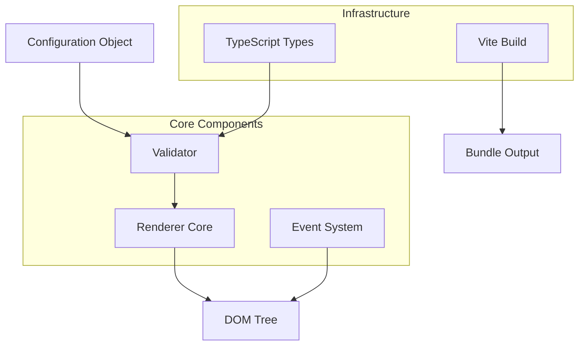
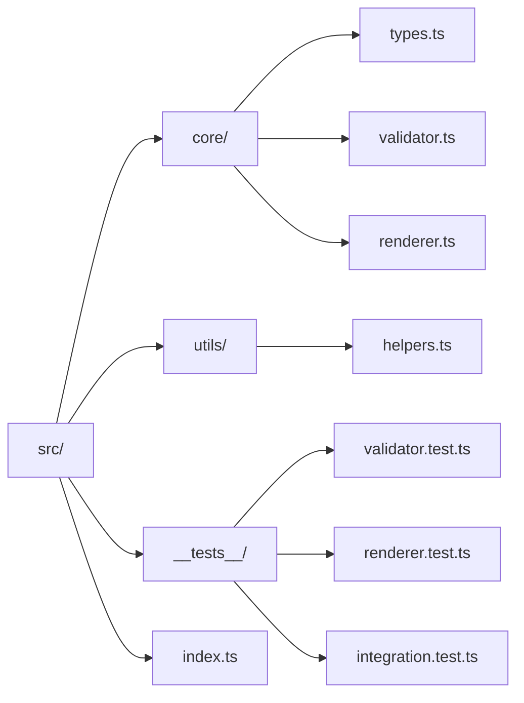
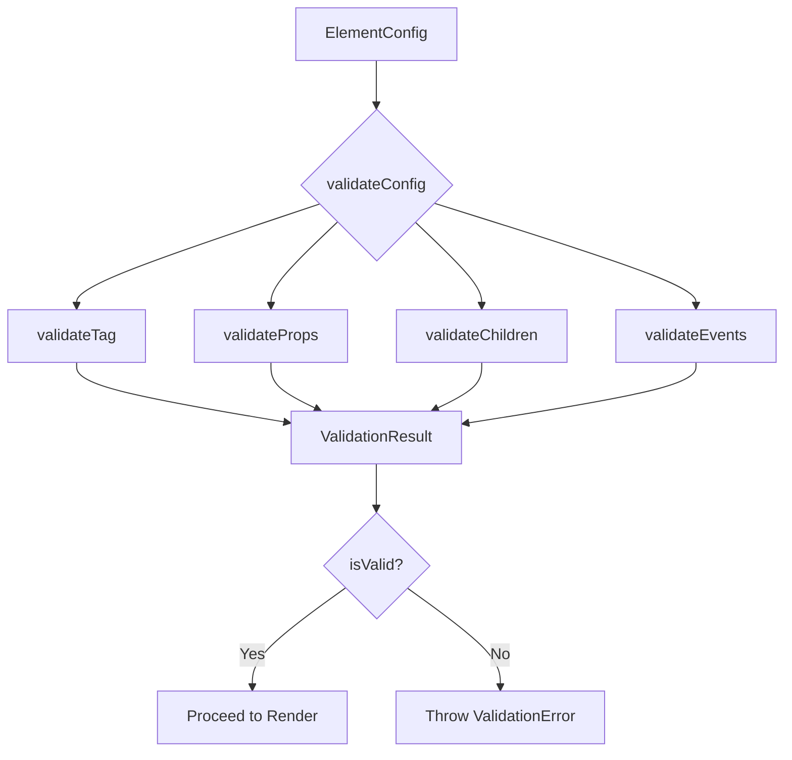
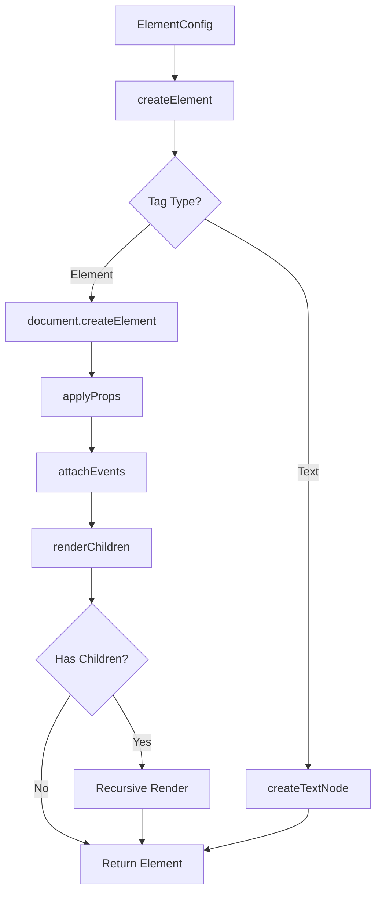

# Техническая документация для реализации Спринта 1: Базовая инфраструктура JS фреймворка

## Обзор

Данный документ описывает архитектуру и техническую реализацию первого спринта JavaScript фреймворка, который обеспечивает базовый рендеринг HTML из конфигурационных объектов с поддержкой TypeScript и Vite сборки.

## Архитектура системы

### Общая архитектура



### Модульная структура



## Система типов (src/core/types.ts)

### Базовые интерфейсы

```typescript
// Основная конфигурация элемента
interface ElementConfig {
  tag: string;
  props?: ElementProps;
  children?: ElementChild[];
  events?: EventHandlers;
}

// Свойства элемента
interface ElementProps {
  class?: string;
  id?: string;
  style?: StyleProperties;
  [key: string]: any;
}

// Стили элемента
interface StyleProperties {
  [property: string]: string | number;
}

// Дочерние элементы
type ElementChild = ElementConfig | string;

// Обработчики событий
interface EventHandlers {
  [eventType: string]: (event: Event) => void;
}
```

### Дополнительные типы

```typescript
// Результат валидации
interface ValidationResult {
  isValid: boolean;
  errors: ValidationError[];
}

// Ошибка валидации
interface ValidationError {
  field: string;
  message: string;
  path?: string;
}

// Контекст рендеринга
interface RenderContext {
  element: HTMLElement;
  config: ElementConfig;
  parentContext?: RenderContext;
}
```

## Система валидации (src/core/validator.ts)

### Архитектура валидатора



### Правила валидации

| Поле | Правила | Ошибки |
|------|---------|---------|
| `tag` | Обязательное, строка, валидный HTML тег | "Tag is required", "Invalid HTML tag" |
| `props.class` | Опциональное, строка | "Class must be string" |
| `props.id` | Опциональное, строка, уникальное | "ID must be string", "Duplicate ID" |
| `props.style` | Опциональное, объект | "Style must be object" |
| `children` | Опциональное, массив | "Children must be array" |
| `events` | Опциональное, объект функций | "Event handlers must be functions" |

### Реализация валидатора

```typescript
class ConfigValidator {
  private validHtmlTags: Set<string>;
  private usedIds: Set<string>;
  
  constructor() {
    this.validHtmlTags = new Set(['div', 'span', 'p', 'h1', 'h2', 'h3', 'button', 'input', 'form']);
    this.usedIds = new Set();
  }
  
  validate(config: ElementConfig): ValidationResult {
    const errors: ValidationError[] = [];
    
    // Валидация тега
    this.validateTag(config, errors);
    
    // Валидация свойств
    this.validateProps(config, errors);
    
    // Валидация дочерних элементов
    this.validateChildren(config, errors);
    
    // Валидация событий
    this.validateEvents(config, errors);
    
    return {
      isValid: errors.length === 0,
      errors
    };
  }
}
```

## Система рендеринга (src/core/renderer.ts)

### Архитектура рендерера



### Основные компоненты рендерера

#### 1. Создание DOM элементов

```typescript
class HTMLRenderer {
  private eventListeners: Map<HTMLElement, EventListenerRecord[]>;
  
  constructor() {
    this.eventListeners = new Map();
  }
  
  render(config: ElementConfig, container: HTMLElement): HTMLElement {
    const element = this.createElement(config);
    container.appendChild(element);
    return element;
  }
  
  private createElement(config: ElementConfig): HTMLElement {
    // Создание HTML элемента
    const element = document.createElement(config.tag);
    
    // Применение свойств
    this.applyProps(element, config.props);
    
    // Привязка событий
    this.attachEvents(element, config.events);
    
    // Рендеринг дочерних элементов
    this.renderChildren(element, config.children);
    
    return element;
  }
}
```

#### 2. Применение свойств

```typescript
private applyProps(element: HTMLElement, props?: ElementProps): void {
  if (!props) return;
  
  Object.entries(props).forEach(([key, value]) => {
    switch (key) {
      case 'class':
        element.className = value as string;
        break;
      case 'id':
        element.id = value as string;
        break;
      case 'style':
        this.applyStyles(element, value as StyleProperties);
        break;
      default:
        element.setAttribute(key, String(value));
    }
  });
}

private applyStyles(element: HTMLElement, styles: StyleProperties): void {
  Object.entries(styles).forEach(([property, value]) => {
    element.style.setProperty(property, String(value));
  });
}
```

#### 3. Система событий

```typescript
private attachEvents(element: HTMLElement, events?: EventHandlers): void {
  if (!events) return;
  
  const listeners: EventListenerRecord[] = [];
  
  Object.entries(events).forEach(([eventType, handler]) => {
    const listenerRecord: EventListenerRecord = {
      type: eventType,
      handler,
      element
    };
    
    element.addEventListener(eventType, handler);
    listeners.push(listenerRecord);
  });
  
  if (listeners.length > 0) {
    this.eventListeners.set(element, listeners);
  }
}
```

#### 4. Очистка ресурсов

```typescript
unmount(element: HTMLElement): void {
  // Очистка обработчиков событий
  this.cleanupEventListeners(element);
  
  // Рекурсивная очистка дочерних элементов
  Array.from(element.children).forEach(child => {
    if (child instanceof HTMLElement) {
      this.unmount(child);
    }
  });
  
  // Удаление из DOM
  element.remove();
}

private cleanupEventListeners(element: HTMLElement): void {
  const listeners = this.eventListeners.get(element);
  if (listeners) {
    listeners.forEach(({ type, handler }) => {
      element.removeEventListener(type, handler);
    });
    this.eventListeners.delete(element);
  }
}
```

## Конфигурация проекта

### TypeScript конфигурация (tsconfig.json)

```json
{
  "compilerOptions": {
    "target": "ES2020",
    "module": "ESNext",
    "lib": ["ES2020", "DOM", "DOM.Iterable"],
    "declaration": true,
    "outDir": "./dist",
    "rootDir": "./src",
    "strict": true,
    "esModuleInterop": true,
    "skipLibCheck": true,
    "forceConsistentCasingInFileNames": true,
    "moduleResolution": "node",
    "resolveJsonModule": true,
    "isolatedModules": true,
    "noEmit": false
  },
  "include": ["src/**/*"],
  "exclude": ["node_modules", "dist", "**/*.test.ts"]
}
```

### Vite конфигурация (vite.config.ts)

```typescript
import { defineConfig } from 'vite';
import { resolve } from 'path';

export default defineConfig({
  build: {
    lib: {
      entry: resolve(__dirname, 'src/index.ts'),
      name: 'JSFramework',
      fileName: (format) => `js-framework.${format}.js`,
      formats: ['iife']
    },
    rollupOptions: {
      output: {
        globals: {}
      }
    },
    minify: 'terser',
    sourcemap: true
  },
  resolve: {
    alias: {
      '@': resolve(__dirname, 'src')
    }
  }
});
```

### Package.json конфигурация

```json
{
  "name": "js-framework",
  "version": "1.0.0",
  "description": "Реактивный JS фреймворк для рендеринга HTML",
  "main": "dist/js-framework.iife.js",
  "types": "dist/index.d.ts",
  "scripts": {
    "build": "tsc && vite build",
    "dev": "vite",
    "test": "jest",
    "test:coverage": "jest --coverage",
    "lint": "eslint src/**/*.ts",
    "format": "prettier --write src/**/*.ts"
  },
  "dependencies": {},
  "devDependencies": {
    "typescript": "^5.0.0",
    "vite": "^4.0.0",
    "jest": "^29.0.0",
    "@types/jest": "^29.0.0",
    "ts-jest": "^29.0.0",
    "eslint": "^8.0.0",
    "@typescript-eslint/eslint-plugin": "^5.0.0",
    "@typescript-eslint/parser": "^5.0.0",
    "prettier": "^2.8.0"
  }
}
```

## Структура тестирования

### Тестирование валидатора

```typescript
// src/__tests__/validator.test.ts
describe('ConfigValidator', () => {
  let validator: ConfigValidator;
  
  beforeEach(() => {
    validator = new ConfigValidator();
  });
  
  describe('validateTag', () => {
    it('должен принимать валидные HTML теги', () => {
      const config = { tag: 'div' };
      const result = validator.validate(config);
      expect(result.isValid).toBe(true);
    });
    
    it('должен отклонять невалидные теги', () => {
      const config = { tag: 'invalid-tag' };
      const result = validator.validate(config);
      expect(result.isValid).toBe(false);
      expect(result.errors[0].message).toContain('Invalid HTML tag');
    });
  });
  
  describe('validateProps', () => {
    it('должен валидировать свойство class', () => {
      const config = { 
        tag: 'div', 
        props: { class: 123 } // неверный тип
      };
      const result = validator.validate(config);
      expect(result.isValid).toBe(false);
    });
  });
});
```

### Тестирование рендерера

```typescript
// src/__tests__/renderer.test.ts
describe('HTMLRenderer', () => {
  let renderer: HTMLRenderer;
  let container: HTMLElement;
  
  beforeEach(() => {
    renderer = new HTMLRenderer();
    container = document.createElement('div');
    document.body.appendChild(container);
  });
  
  afterEach(() => {
    document.body.removeChild(container);
  });
  
  it('должен создавать базовый HTML элемент', () => {
    const config = { tag: 'div' };
    const element = renderer.render(config, container);
    
    expect(element.tagName).toBe('DIV');
    expect(container.contains(element)).toBe(true);
  });
  
  it('должен применять CSS классы', () => {
    const config = { 
      tag: 'div', 
      props: { class: 'test-class' }
    };
    const element = renderer.render(config, container);
    
    expect(element.className).toBe('test-class');
  });
  
  it('должен привязывать обработчики событий', () => {
    const clickHandler = jest.fn();
    const config = { 
      tag: 'button', 
      events: { click: clickHandler }
    };
    const element = renderer.render(config, container);
    
    element.click();
    expect(clickHandler).toHaveBeenCalled();
  });
});
```

## Основное API (src/index.ts)

### Экспорт основных компонентов

```typescript
// Основные классы
export { ConfigValidator } from './core/validator';
export { HTMLRenderer } from './core/renderer';

// Типы
export type { 
  ElementConfig, 
  ElementProps, 
  StyleProperties, 
  ElementChild, 
  EventHandlers,
  ValidationResult,
  ValidationError,
  RenderContext
} from './core/types';

// Утилиты
export { createElement, isValidHtmlTag } from './utils/helpers';

// Основной класс фреймворка
export class JSFramework {
  private renderer: HTMLRenderer;
  private validator: ConfigValidator;
  private mountedElement: HTMLElement | null;
  
  constructor() {
    this.renderer = new HTMLRenderer();
    this.validator = new ConfigValidator();
    this.mountedElement = null;
  }
  
  render(config: ElementConfig, container: HTMLElement | string): HTMLElement {
    const containerElement = typeof container === 'string' 
      ? document.querySelector(container) as HTMLElement
      : container;
    
    if (!containerElement) {
      throw new Error('Контейнер не найден');
    }
    
    // Валидация конфигурации
    const validationResult = this.validator.validate(config);
    if (!validationResult.isValid) {
      throw new Error(`Ошибка валидации: ${validationResult.errors.map(e => e.message).join(', ')}`);
    }
    
    // Рендеринг
    const element = this.renderer.render(config, containerElement);
    this.mountedElement = element;
    
    return element;
  }
  
  unmount(): void {
    if (this.mountedElement) {
      this.renderer.unmount(this.mountedElement);
      this.mountedElement = null;
    }
  }
}

// Создание глобального экземпляра
export const Framework = new JSFramework();

// Экспорт по умолчанию для удобства
export default Framework;
```

## Примеры использования

### Базовый пример (examples/basic.html)

```html
<!DOCTYPE html>
<html lang="ru">
<head>
    <meta charset="UTF-8">
    <meta name="viewport" content="width=device-width, initial-scale=1.0">
    <title>JS Framework - Базовый пример</title>
    <style>
        .container {
            max-width: 800px;
            margin: 0 auto;
            padding: 20px;
        }
        .card {
            border: 1px solid #ddd;
            border-radius: 8px;
            padding: 16px;
            margin: 8px 0;
        }
        .btn {
            padding: 8px 16px;
            border: none;
            border-radius: 4px;
            cursor: pointer;
        }
        .btn-primary {
            background: #007bff;
            color: white;
        }
    </style>
</head>
<body>
    <div id="app"></div>
    
    <script src="../dist/js-framework.iife.js"></script>
    <script>
        // Определение обработчиков событий
        function showAlert(message) {
            alert('Сообщение: ' + message);
        }
        
        function handleFormSubmit(event) {
            event.preventDefault();
            const formData = new FormData(event.target);
            console.log('Отправка формы:', Object.fromEntries(formData));
        }
        
        // Конфигурация приложения
        const appConfig = {
            tag: 'div',
            props: {
                class: 'container'
            },
            children: [
                {
                    tag: 'h1',
                    children: ['Добро пожаловать в JS Framework']
                },
                {
                    tag: 'div',
                    props: {
                        class: 'card'
                    },
                    children: [
                        {
                            tag: 'h2',
                            children: ['Пример кнопки']
                        },
                        {
                            tag: 'button',
                            props: {
                                class: 'btn btn-primary'
                            },
                            events: {
                                click: () => showAlert('Кнопка нажата!')
                            },
                            children: ['Нажми меня']
                        }
                    ]
                },
                {
                    tag: 'div',
                    props: {
                        class: 'card'
                    },
                    children: [
                        {
                            tag: 'h2',
                            children: ['Пример формы']
                        },
                        {
                            tag: 'form',
                            events: {
                                submit: handleFormSubmit
                            },
                            children: [
                                {
                                    tag: 'input',
                                    props: {
                                        type: 'text',
                                        name: 'username',
                                        placeholder: 'Введите имя пользователя'
                                    }
                                },
                                {
                                    tag: 'br'
                                },
                                {
                                    tag: 'button',
                                    props: {
                                        type: 'submit',
                                        class: 'btn btn-primary'
                                    },
                                    children: ['Отправить']
                                }
                            ]
                        }
                    ]
                }
            ]
        };
        
        // Рендеринг приложения
        try {
            JSFramework.Framework.render(appConfig, '#app');
            console.log('Приложение успешно отрендерено');
        } catch (error) {
            console.error('Ошибка рендеринга:', error);
        }
    </script>
</body>
</html>
```

## Метрики и требования производительности

### Целевые показатели

| Метрика | Целевое значение | Измерение |
|---------|------------------|-----------|
| Время рендеринга 1000 элементов | < 100ms | Performance API |
| Размер bundle (минифицированный) | < 50KB | Webpack Bundle Analyzer |
| Покрытие тестами | > 80% | Jest Coverage |
| TypeScript ошибки | 0 | tsc --noEmit |
| Время сборки | < 30s | Vite build time |

### Инструменты профилирования

```typescript
// Утилита для измерения производительности
class PerformanceProfiler {
  static measureRender(config: ElementConfig, container: HTMLElement): number {
    const startTime = performance.now();
    Framework.render(config, container);
    const endTime = performance.now();
    return endTime - startTime;
  }
  
  static measureMemoryUsage(): number {
    if ('memory' in performance) {
      return (performance as any).memory.usedJSHeapSize;
    }
    return 0;
  }
}
```

## Обработка ошибок

### Типы ошибок

```typescript
// Базовый класс ошибок фреймворка
abstract class FrameworkError extends Error {
  abstract readonly code: string;
  constructor(message: string) {
    super(message);
    this.name = this.constructor.name;
  }
}

// Ошибки валидации
class ValidationError extends FrameworkError {
  readonly code = 'VALIDATION_ERROR';
  constructor(field: string, message: string) {
    super(`Ошибка валидации поля "${field}": ${message}`);
  }
}

// Ошибки рендеринга
class RenderError extends FrameworkError {
  readonly code = 'RENDER_ERROR';
  constructor(message: string) {
    super(`Ошибка рендеринга: ${message}`);
  }
}

// Ошибки конфигурации
class ConfigurationError extends FrameworkError {
  readonly code = 'CONFIGURATION_ERROR';
  constructor(message: string) {
    super(`Ошибка конфигурации: ${message}`);
  }
}
```

### Стратегии обработки

```typescript
class ErrorHandler {
  static handle(error: Error): void {
    if (error instanceof FrameworkError) {
      console.error(`[${error.code}] ${error.message}`);
      // Отправка метрик об ошибке
      this.reportError(error);
    } else {
      console.error('Неизвестная ошибка:', error);
    }
  }
  
  private static reportError(error: FrameworkError): void {
    // Логика отправки метрик
    // В будущем может быть интеграция с системами мониторинга
  }
}
```